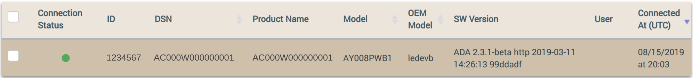

1. Browse to the [Ayla Dashboard Portal](/content/ayla-dashboard-portal), click OEM Users in the sidebar, click your account, and copy your UUID (e.g. ```a0000000-0000-0000-0000-000000000000```). 

1. Click Devices in the sidebar, and find the new device on the list:

    

1. Click the device row. Then, in the Device > Settings table, paste your UUID, and click Register:

    

1. View the device on the Devices list again. Note that the device is registered to you.

    

