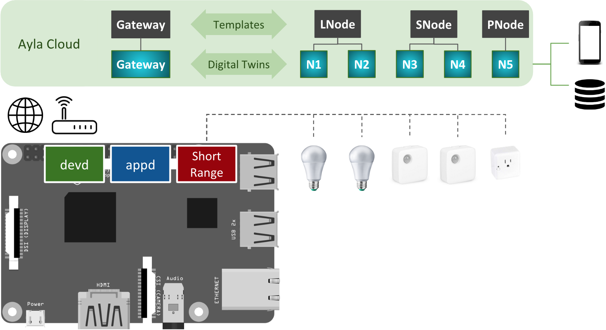

The following diagram presents the essential elements of the Ayla Dynamic Gateway Package for Linux.

1. In the diagram, the Raspberry Pi represents any Linux-based platform.
1. devd is the Ayla Dynamic Gateway Agent. It communicates with the Ayla Cloud via Wi-Fi or Ethernet.
1. appd is the host app that you write based on examples provided by Ayla.
1. "Short Range" represents the interface to a specific short-range wired/wireless protocol (e.g. Bluetooth, Zigbee).
1. The lightbulbs, sensors, and smart plug represent devices with short-distance capability.
1. The black shapes in the Ayla Cloud represent templates.
  1. Developers (via the Developer Portal) create templates to represent specific attributes and properties of devices.  
  1. Gateway template properties enable node control and gateway diagnostics.
  1. In the example, LNode is a lightbulb node template. Its properties deal with the control and state of a lightbulb.
  1. SNode is a sensor template with relevant properties.
  1. PNode is a smart plug node template.
1. The gradient blue shapes are digital twins which inherit properties from templates. They model devices.
1. The mobile app interacts with a digital twin to query and control the corresponding device.
1. The database icon represents an external business system that collects, aggregates, and analyzes device data.
