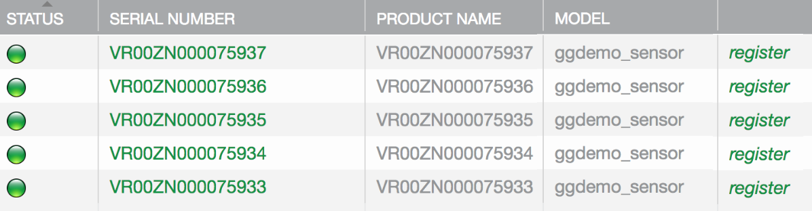

This page shows you how to add sensor and thermostat nodes to your Simulator Gateway. 

## Fast Facts

1. You add/delete nodes by setting the gateway "Add Sensor Nodes" and "Add Thermostat Nodes" (Integer) properties.
1. If you set one of these properties to 3, the Simulator Gateway will add three candidate nodes of that type.
1. If you set one to -3, the gateway will delete three nodes of that type.
1. Candidate nodes appear in the (Devices) Candidates tab. This is where you register them.
1. The registration process associates a node with the appropriate template (that you made).
1. Once registered, a candidate becomes a node, appearing in the (Devices) Nodes tab and on the Devices list.

## Prepare to monitor node activity

Because, upon registration, sensor and thermostat nodes begin immediately to generate datapoints every 15 seconds, it makes sense to prepare to monitor node activity before adding nodes. Below are few ways to monitor node activity.

### Tail the messages log

Secure Shell to your RPi, and tail the messages log:
<pre>
$ tail -f /var/log/messages
</pre>

Here is a sample:

<pre>
Nov 15 10:39:49 rpi appd: [info-app] appd_node_prop_send_handler: batching node property: sensor_sim_01::s1:gg_sens:temp = 55.331
Nov 15 10:39:49 rpi appd: [info-app] appd_node_prop_send_handler: batching node property: sensor_sim_01::s1:gg_sens:humidity = 59.640
Nov 15 10:39:49 rpi appd: [info-app] appd_node_prop_send_handler: batching node property: sensor_sim_01::s1:gg_sens:light_level = 71.107
Nov 15 10:39:49 rpi appd: [info-app] appd_node_ops_confirm_handler: node prop sensor_sim_01::s1:gg_sens:temp sent successfully to dests 01
Nov 15 10:39:49 rpi appd: [info-app] appd_node_ops_confirm_handler: node prop sensor_sim_01::s1:gg_sens:humidity sent successfully to dests 01
Nov 15 10:39:49 rpi appd: [info-app] appd_node_ops_confirm_handler: node prop sensor_sim_01::s1:gg_sens:light_level sent successfully to dests 01
Nov 15 10:40:00 rpi appd: [info-app] appd_node_prop_send_handler: batching node property: thermostat_sim_02::s1:gg_tstat:local_temp = 65.709
Nov 15 10:40:00 rpi appd: [info-app] appd_node_ops_confirm_handler: node prop thermostat_sim_02::s1:gg_tstat:local_temp sent successfully to dests 01
</pre>

### Monitor property datapoints

In the Ayla Developer Portal, browse to View My Devices &gt; A Sim GW Node &gt; A Property &gt; Datapoints. Once registered, a node will generate data every 15 seconds.

### Utilize the Ayla Datastream Service

It takes only a few seconds to utilize the DSS Browser utility in the [Ayla Datastream Service](/content/ayla-datastream-service/).

## Add nodes

### Add a sensor node

1. Browse to the Ayla Developer Portal.
1. Click View My Devices > Sim GW 1.
1. Click Add Sensor Nodes, change Current Value to 1, and click OK.
1. Pause for a few seconds. Current Value changes from 1 to 0.
1. Click OK. Note that Number of Nodes is set to 1.
1. Click (Devices) Nodes. The list is empty.
1. Click (Devices) Candidates. The list contains one new candidate sensor node:

The serial number begin with "V" indicating that the node is a "virtual" device.
1. Click the Register link.
1. Click (Devices) Nodes to view the new node on the list.

1. Click View My Devices. The node appears on this list, too.

1. Click the new sensor node. The node properties list appears:

The red arrows indicate properties from the Sim GW Node template.

The blue arrows indicate properties from the Sim GW SNode template.

The yellow arrow indicates the default oem_host_version property assigned to all devices.

1. Click humidity &gt; Datapoints to view accumulating data.

1. Click Details, and set Product Name to "Sim GW 1 SNode 1".
1. See the periodic updates in <code>/var/log/messages</code>:
<pre>
Nov 15 09:22:03 rpi appd: [info-app] appd_node_prop_send_handler: batching node property: sensor_sim_01::s1:gg_sens:temp = 53.767
Nov 15 09:22:03 rpi appd: [info-app] appd_node_prop_send_handler: batching node property: sensor_sim_01::s1:gg_sens:humidity = 63.059
Nov 15 09:22:03 rpi appd: [info-app] appd_node_prop_send_handler: batching node property: sensor_sim_01::s1:gg_sens:light_level = 56.244
Nov 15 09:22:04 rpi appd: [info-app] appd_node_ops_confirm_handler: node prop sensor_sim_01::s1:gg_sens:temp sent successfully to dests 01
Nov 15 09:22:04 rpi appd: [info-app] appd_node_ops_confirm_handler: node prop sensor_sim_01::s1:gg_sens:humidity sent successfully to dests 01
Nov 15 09:22:04 rpi appd: [info-app] appd_node_ops_confirm_handler: node prop sensor_sim_01::s1:gg_sens:light_level sent successfully to dests 01
</pre>

### Add a thermostat node

1. Add a thermostat node in the same way you added a sensor node. Expect to find these properties.

The red arrows indicate properties from the Sim GW Node template.

The blue arrows indicate properties from the Sim GW TNode template.

The yellow arrow indicates the default oem_host_version property assigned to all devices.

1. Set the temp_setpoint property to a value (e.g. 70). Watch for datapoints from local_temp.
1. Set vacation_mode to 1. heat_on changes to 0. Watch local_temp decrease:

### Add multiple nodes

1. In the Ayla Developer Portal, click View My Devices &gt; Sim GW 1.
1. Click the Add Sensor Nodes property.
1. Change the Current Value to 5, and click OK.
1. Click (Devices) Candidates. You may have to refresh because candidate creation takes a few seconds.

1. Click the register link for each candidate. Refresh the page (and click Candidates tab) between each registration.
1. Click (Devices) Nodes. See the new nodes. 

## Startup files

For startup purposes, the gateway keeps track of nodes in two startup files: <code>devd.conf.startup</code> and <code>appd.conf.startup</code>. Both are located in <code>&sim;/ayla/config</code>. A node is composed of one or more subdevices identified by a key (e.g. s1). One or more templates contribute properties to a subdevice. See the diagram.

The <node>device ~ node ~ subdevice ~ template ~ property</node> hierarchy explains property names. Consider <code>s1:gg_sim:battery_charge</code>:

* <code>s1</code> is the subdomain name.
* <code>gg_sim</code> is the template key name.
* <code>battery_charge</code> is the property name as defined in the application.

To inspect the origin of <code>gg_sim</code>, <code>gg_sens</code>, and <code>gg_tstat</code> property names, browse to [node_sim.c](https://github.com/AylaNetworks/device_linux_gw_public/blob/master/app/gatewayd/node_sim.c), and search for the <code>sim_template_sim</code>, <code>sim_template_sensor</code>, and <code>sim_template_tstat</code> arrays:

<pre>
static const struct sim_node_prop_def const sim_template_sim[] = {
  {{"enable", PROP_BOOLEAN, PROP_TO_DEVICE}, sim_node_prop_init_enable},
  {{"battery_enable", PROP_BOOLEAN, PROP_TO_DEVICE}, NULL, sim_node_prop_battery_enable_set},
  {{"battery_charge", PROP_INTEGER, PROP_FROM_DEVICE}, sim_node_prop_init_battery_charge }
};

static const struct sim_node_prop_def const sim_template_tstat[] = {
  {{"temp_setpoint",  PROP_INTEGER, PROP_TO_DEVICE}, sim_node_prop_init_temp_setpoint, sim_node_prop_update_tstat},
  {{"vacation_mode",  PROP_BOOLEAN, PROP_TO_DEVICE}, NULL, sim_node_prop_update_tstat},
  {{"local_temp", PROP_DECIMAL, PROP_FROM_DEVICE}, sim_node_prop_init_local_temp},
  {{"heat_on",  PROP_BOOLEAN, PROP_FROM_DEVICE}},
  {{"ac_on",  PROP_BOOLEAN, PROP_FROM_DEVICE}}
};

static const struct sim_node_prop_def const sim_template_sensor[] = {
  {{"temp", PROP_DECIMAL, PROP_FROM_DEVICE}},
  {{"humidity", PROP_DECIMAL, PROP_FROM_DEVICE}},
  {{"light_level", PROP_DECIMAL, PROP_FROM_DEVICE}},
};
</pre>
