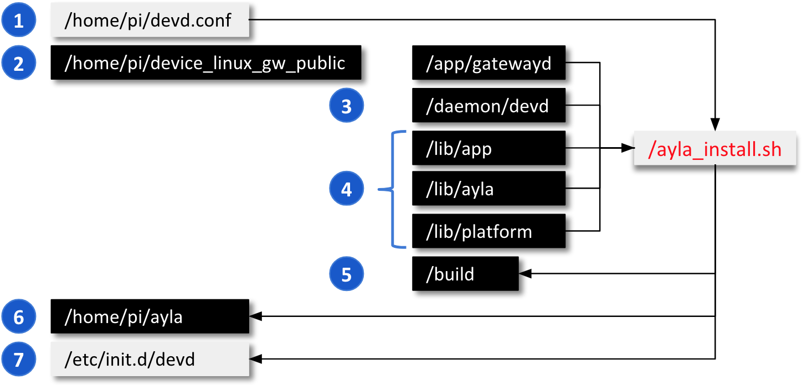

This page shows you how to build and install all gateway components including your simulator gateway, and how to register your gateway.

### Perform the installation

1. In your RPi Secure Shell, change to your home directory (e.g. <code>/home/pi</code>).
1. Verify that <code>ayla_install.sh</code> and <code>devd.conf</code> reside there. If not, complete the steps in [Getting Started](../../getting-started).
1. Use the <code>-h</code> or <code>--help</code> flag to view ayla_install.sh options:
<pre>
$ ./ayla_install.sh -h
&nbsp;
OPTIONS:
  -d, --dryrun        Tests script configuration and exits without modifying the system
  -u, --upgrade       Modifies install to avoid overwriting existing config
  -b, --build_env     Just installs the packages required to compile Ayla modules
  -p, --package PATH  Path of Ayla source tarball, or URL to GIT repo (default: device_linux_public.git)
  -c, --config DIR    Directory to find required config files (default: /home/pi/)
  -a, --app APP_NAME  Appd to build (default: appd)
  -n, --no_wifi       Omits installing and configuring Wi-Fi-specific components
  -g, --gpio          Adds Wiring Pi library for Raspberry Pi
  -m, --modem         Adds usb-modeswitch library to support USB connected [cellular] modems
  -z, --ble           Installs BlueZ Bluetooth daemon from source to enable full BLE support
  -e, --zigbee        Installs libreadline-dev/libncurses-dev to enable full ZigBee support
  -t, --multi         Installs BlueZ Bluetooth daemon/libreadline-dev/libncurses-dev to enable BLE/ZigBee support
  -l, --log PATH      Dump installation details to a log file
  -v, --version       Print script version
  -h, --help          Print usage
</pre>

Use the <code>-a</code> flag to build and install the Simulator Gateway <code>gatewayd</code>. It will be renamed <code>appd</code>.

Use the <code>-n</code> flag if your RPi is connected via Ethernet. The <code>cond</code> daemon will not run.

Use the <code>-u</code> flag to reinstall over a previous installation. Your gateway and node digital twins are untouched.

1. Perform the installation. Here are some examples:
<pre>
$ sudo ./ayla_install.sh -a gatewayd        # Your RPi is using Wi-Fi
$ sudo ./ayla_install.sh -a gatewayd -n     # Your RPi is using Ethernet
</pre>

You may be required to enter your Github credentials during the process.

### Inspect the installation

The following diagram provides an overview of components involved in the building and installing the Ayla Dynamic Gateway Package.

1. Review [How to create a configuration file for the Ayla Linux Agent](/articles/how-to-create-a-configuration-file-for-the-ayla-linux-agent/).
1. Source code for the Simulator Gateway (gatewayd). The installation process renames it to appd in <code>&sim;/ayla/bin</code>.
1. Source code for the Ayla Gateway Agent (devd). 
1. Source code for the libraries which become libapp.a, libayla.a, and libplatform.a in <code>build</code>.
1. The make process puts all daemons, libraries, and utilities here. 
1. The install process copies artifacts from <code>build</code> to <code>&sim;/ayla</code>.
1. This the devd startup file. Startup files for logd and (optionally) cond are here, too.

The following diagram provides details about the <code>/home/pi/ayla</code> installation directory.

1. This is the Ayla Gateway Agent daemon (devd) and your gateway application (appd).
1. Startup files contain simulator node configuration details. See [Add Nodes](../add-nodes).
1. These are the libraries used by devd and appd.

### Register the gateway

1. Reboot the RPi with <code>sudo reboot</code>.
1. Using a computer connected to the same LAN as your RPi, browse to the Ayla Developer Portal.
1. Click Register New Device. 

If the Device Registration page does not contain a Registration Code textbox, reboot your RPi, and refresh the page.

1. Click the link on the page to reveal a device registration code (e.g. e224a1) in a new tab.
1. Copy and paste the code into the Registration Code textbox, and click Register. The Ayla Cloud registers the gateway to your Ayla user account, and associates the RPi gateway with the Sim GW template you created earlier.

### View gateway in Ayla Developer Portal

1. In the Ayla Developer Portal, click View My Devices. A list of devices appears.
1. Click the Serial Number of your gateway. A list of properties appears. <u>Do not update current values at this time</u>.
1. Click (Devices) Details, change Product Name to "Sim GW 1", peruse other attributes, and click OK.
1. Click (Devices) Template, and verify that Current Template is "Sim GW".
1. Click (Devices) Nodes, and verify that this gateway does not yet have any nodes.
1. Click (Devices) Candidates, and verify that it does not have any candidate nodes, either.

### View gateway in Ayla Dashboard Portal

1. Browse to the Ayla Dashboard Portal.
1. Click OEM Users (in the sidebar), click on your user, click Devices (at the top), and view your gateway. 
1. Click Devices (in the sidebar), find "Sim GW 1", click on it, and peruse without modifying anything.
1. Click Templates (in the sidebar), find "Sim GW", click on it, and peruse.

