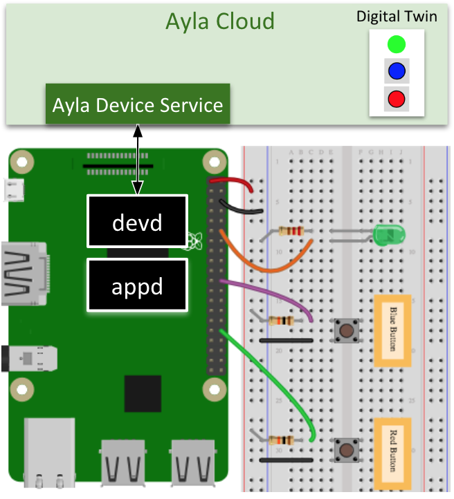

The Ayla Linux Agent (devd) securely connects a Linux-based host application (appd) to the Ayla Cloud. 

Related guides and references

<ul>
<li><a href="/content/ayla-linux-agent">Ayla Linux Agent</a></li>
</ul>

Both devd and appd (can) run as daemons:

In the diagram, <code>appd</code> is the sample host application (supplied by Ayla) running on Raspian. Programmers can modify <code>appd</code> to control peripherals represented by the LED and buttons on the breadboard. They can also create, in the Ayla Cloud, a digital twin representing the LED and the buttons as properties. Then, by interfacing with <code>devd</code> via sockets, <code>appd</code> keeps the digital twin and the peripherals in sync, sending and receiving property updates.
