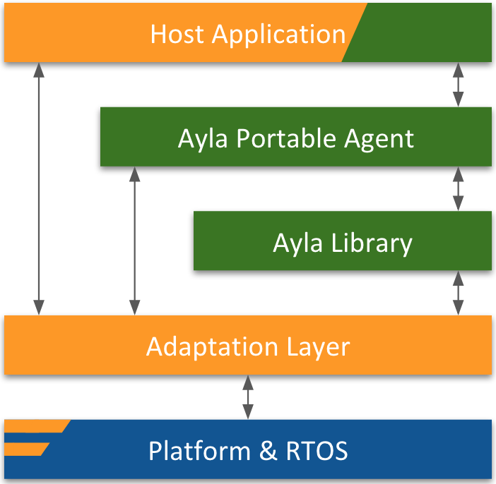

The Ayla Portable Agent consists of software libraries not tied to any specific communication module SDK or chipset. It enables OEMs to extend Ayla connectivity to communication modules not supported by [Ayla Integrated Agents](../integrated-agents), and to pick and choose features to incorporate or omit (e.g. OTA, LAN mode, Wi-Fi setup).

The Ayla Portable Agent requires device host application developers to modify the sample host application, link to the Ayla Portable Agent and other Ayla libraries, implement an Adaptation Layer, and create RTOS drivers. In the following diagram, green represents Ayla and orange represents customer:

Ayla also offers two test suites:

1. The Adaptation Layer Test Suite enables developers to test memory management, threads, locks, timers, networking, Wi-Fi core functionality, configuration.
1. The Host Application Test Suite enables developers to test setup, registration, properties, schedules, LAN mode, OTA, etc.
