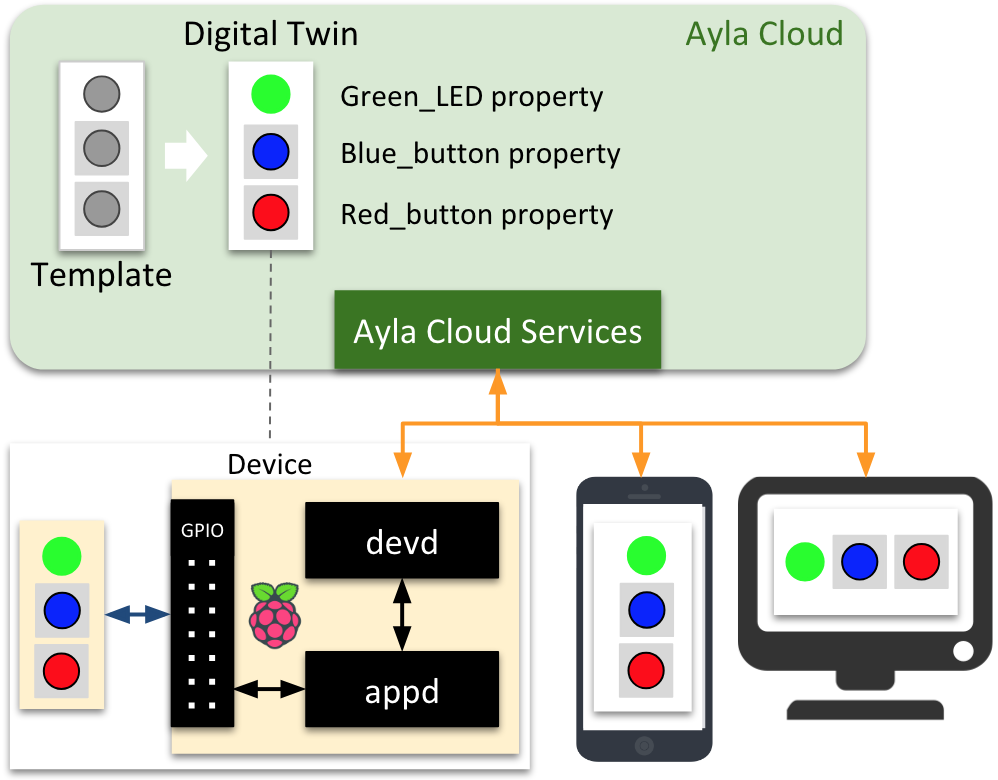

The following diagram shows the Ayla Linux Agent (devd) and the sample host application (appd) within the context of the Ayla Platform.

1. The Raspberry Pi, devd, appd, the green LED, and the two buttons form the IoT device.
1. The digital twin is a model of the device instantiated from a template.
1. The digital twin is how web and mobile apps see the device. 
1. These applications send commands to the device via "To Device" properties like the green LED.
1. They remain aware of device state via "From Device" properties like the buttons.
1. devd provides connectivity and security.

The video below shows devd and appd in action on a Raspbery Pi:

<iframe 
  width="560" 
  height="315" 
  src="https://www.youtube.com/embed/aDdyFeo2A5E?rel=0&amp;showinfo=0" 
  frameborder="0" 
  allow="autoplay; 
  encrypted-media" 
  allowfullscreen>
</iframe>

### Transcript

A Host Application called appd (written in C) is running on the CPU of this Raspberry Pi 3, and it is controlling this green LED, this blue button, and this red button. Together, the Raspberry Pi, the host application, the LED, and the buttons form our Raspberry Pi Device.

An Ayla Linux Agent called devd (also written in C) is also running on this CPU.

Now, appd uses devd to talk to the Ayla Cloud which maintains a digital twin of our Raspberry Pi Device that includes a Green_LED property, a Blue_button property, and a Red-button property.

Mobile and web applications (like the Aura Mobile App shown here) send commands to, and receive events from, our Raspberry Pi Device by interacting with the digital twin in the cloud. So, for example, we can send a command, via the digital twin, to illumindate the LED, and we can receive press and release events from the blue and red buttons.
