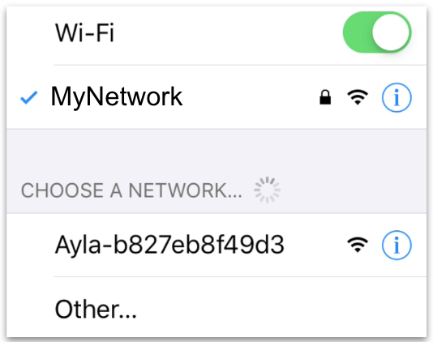
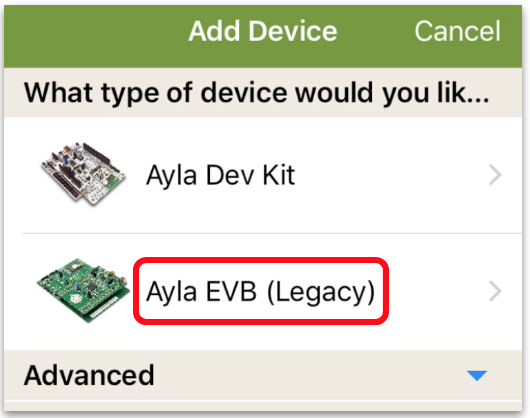
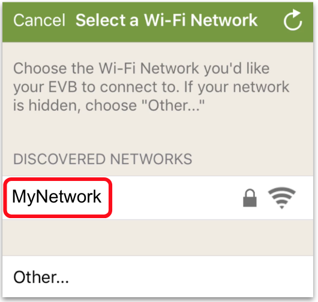
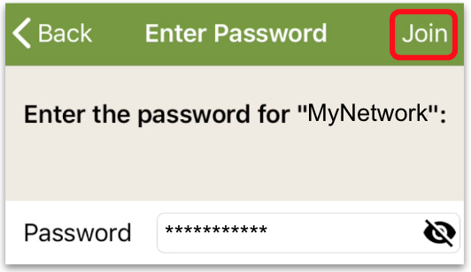
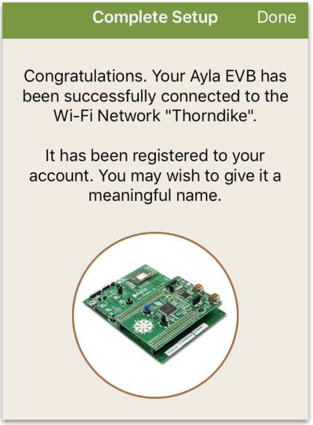
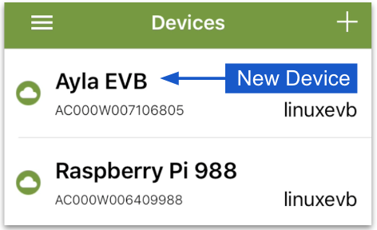

This page shows you how to use the Aura Mobile App to connect the RPi to the Ayla Cloud, and register it to your user account:

<ol>
<li>Tap Aura, and log into your Ayla account.</li>
<li>Exit Aura, and tap Settings > Wi-Fi. You should be connected to your LAN, and you should see another LAN with an <code>Ayla-</code> prefix:</li>

<li>Tap the Ayla LAN:</li>

<li>Exit Settings > Wi-Fi, and tap Aura.</li>
<li>On the Devices screen, tap the plus sign at top-right.</li>

<li>Tap Ayla EVB (Legacy):</li>

<li>Tap "I have the code", and, then, "I've powered the EVB":</li>

<li>Tap your network:</li>

<li>Enter the password, and tap Join:</li>

<li>After approx. 30 seconds, the following screen should appear:</li>

(The image does not show a Raspberry Pi.)
<li>Tap Done. The Devices screen appears with the new Raspberry Pi:</li>

</ol>