This page shows you how to change the Product Name and test the properties of your new Linux device using the Ayla Developer Portal. It also shows you how to get started doing the same with the Ayla Dashboard Portal and the Aura mobile app.

## Ayla Developer Portal

### Change the Product Name

1. Browse to the [Ayla Developer Portal](/archive/ayla-developer-portal/), log in, and click <code>View My Devices</code>. The Devices list appears. 
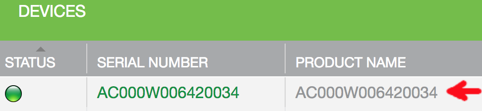
The Product Name is, by default, the Serial Number.
1. Click the Serial Number, and then click the <code>Details</code> tab:
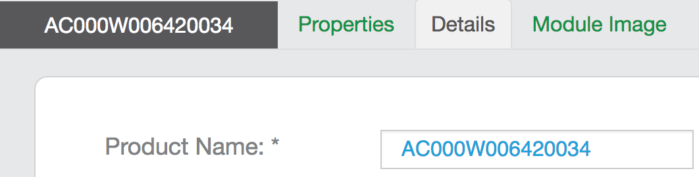
1. Change the <code>Product Name</code>, and click OK.
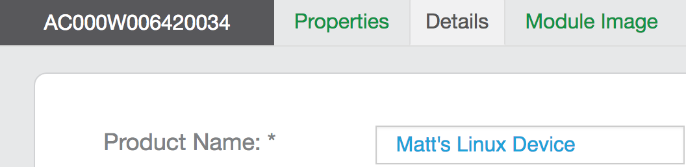
1. Click the Properties tab. All but one of these are the properties you defined in [Templates](../templates). The exception is <code>oem_host_version</code>. Ayla created this property for you. It represents the template version. The steps below show you how to test these properties.
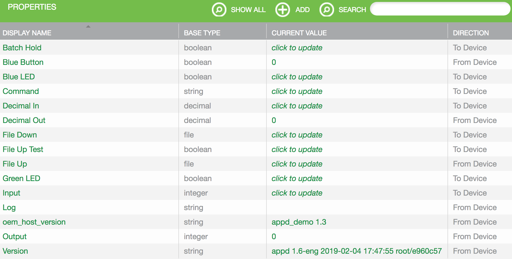

### Test boolean properties

The sample host application (appd) has three boolean properties: Blue_LED, Green_LED, and Blue_button. By default, your RPi is not connected to a breadboard, so the two LED properties do not represent real LEDs, and the button property does not represent a real button. (Instructions for connecting appd to real peripherals can be found in the [Tutorials](../../tutorials).) When you set both Blue_LED and Green_LED to one, appd sets Blue_button to one. You can test this.

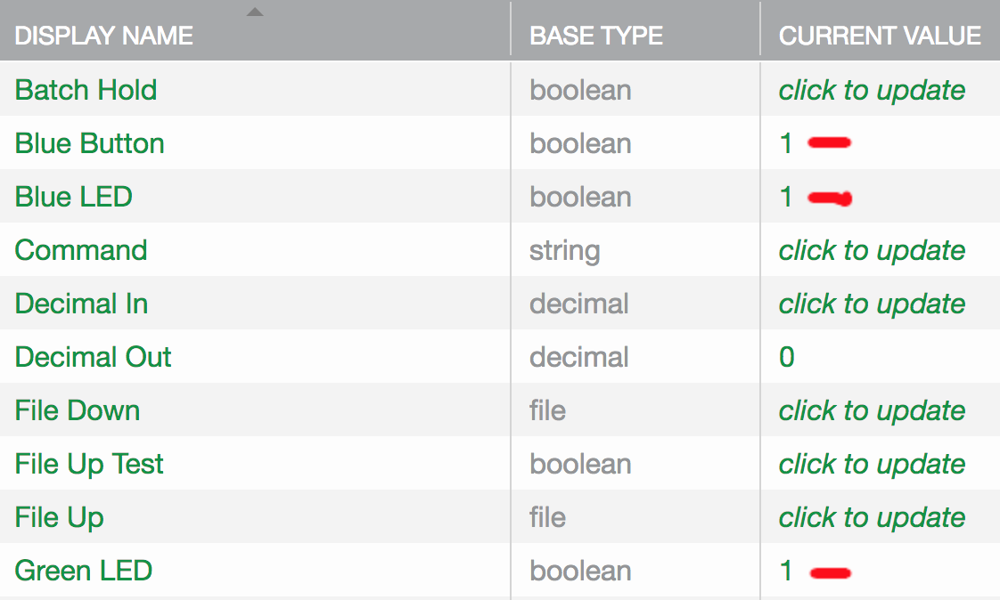

### Test integer properties 

appd has two integer properties: input and output. When you set the input property to a value, the Ayla Cloud sends the value to appd which sets the output value to the square of the input value, and sends the new output value back to the Ayla Cloud. If the square of the input value overflows a 32-bit number, appd sets the output to -1. You can test this.

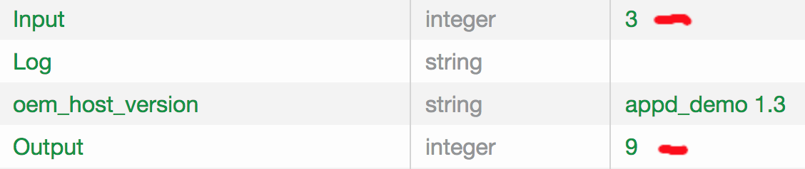

### Testing string properties

appd has two string properties: cmd and log. When you set cmd to a value, the Ayla Cloud sends the value to appd which copies the value to the log property, and sends the new log value back to the Ayla Cloud. You can test this.

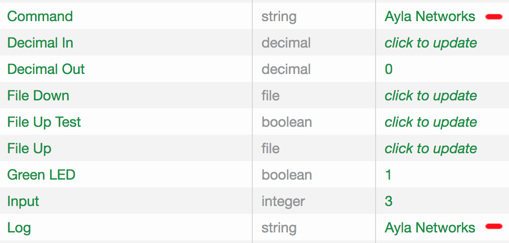

### Test decimal properties

appd has two decimal properties: decimal_in and decimal_out. When you set decimal_in to a value, the Ayla Cloud sends the value to appd which copies the value to the decimal_out property, and sends the new decimal_out value back to the Ayla Cloud. You can test this.

### Test file properties

appd has two file properties: file_up and file_down. Useful for large data blobs such as log files and images, file properties can be of any size. Of the two file properties, appd enables you to test file_up only. When you set the boolean property file_up_test to one, appd uploads a file to file_up, and resets file_up_test to 0.

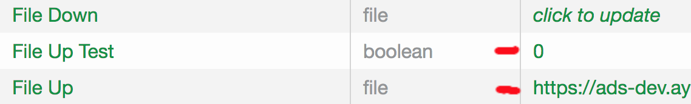

### Test the version property

appd has a version property where it stores the current appd software version. The Ayla Cloud reads and display this version. A user who needs to initiate an OTA update may find the version property useful.

## Ayla Dashboard Portal

### Change the Product Name

1. Browse to the [Ayla Dashboard Portal](/archive/ayla-dashboard-portal/), and log in.
1. Click Devices in the sidebar.
1. Click your newly registered device on the All Devices list to view device details:
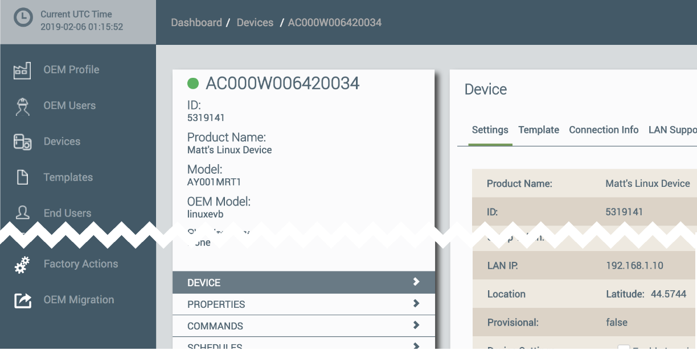
1. Scroll to the bottom of the Device pane, and click Edit. 
1. Modify the Product Name as needed.

### Change the properties

1. Click Devices &gt; Properties.
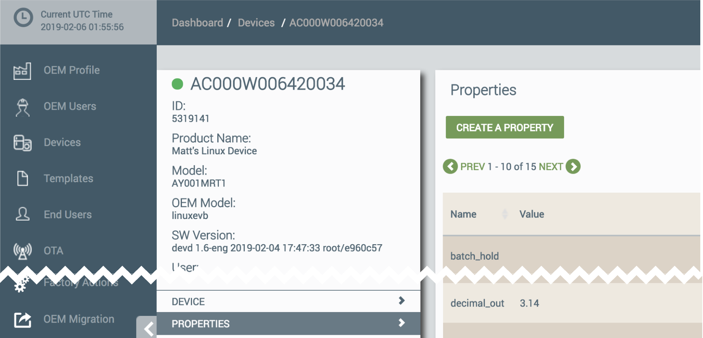
1. Click on an individual property, edit, and change the value.

## Aura Mobile App

### Change the Product Name

1. Log into Aura (see [Access to Ayla](../access-to-ayla) for help).
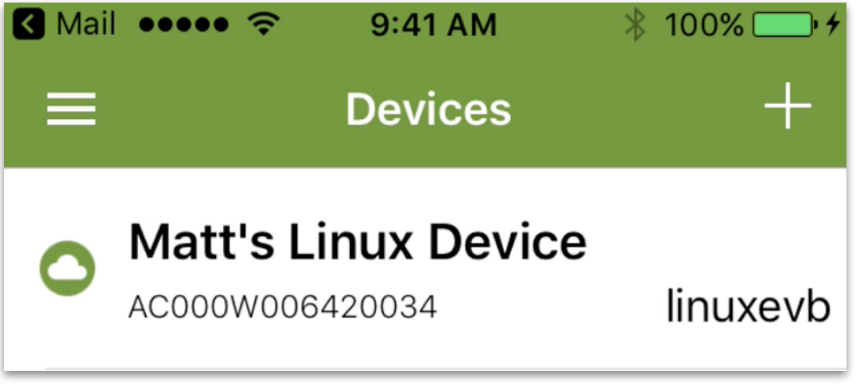
1. Touch the device name.
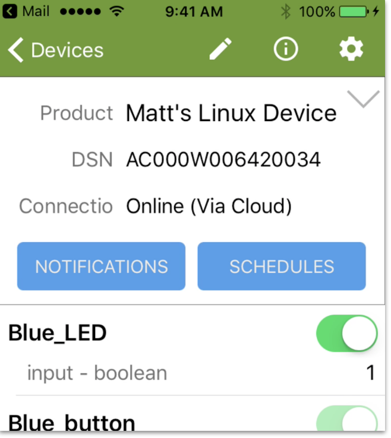
1. Touch the Pencil Edit icon to edit the product name.
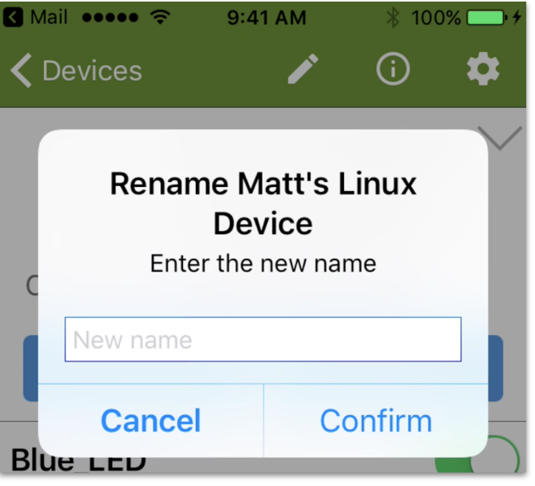

### Change the properties

1. Scroll to find a property.
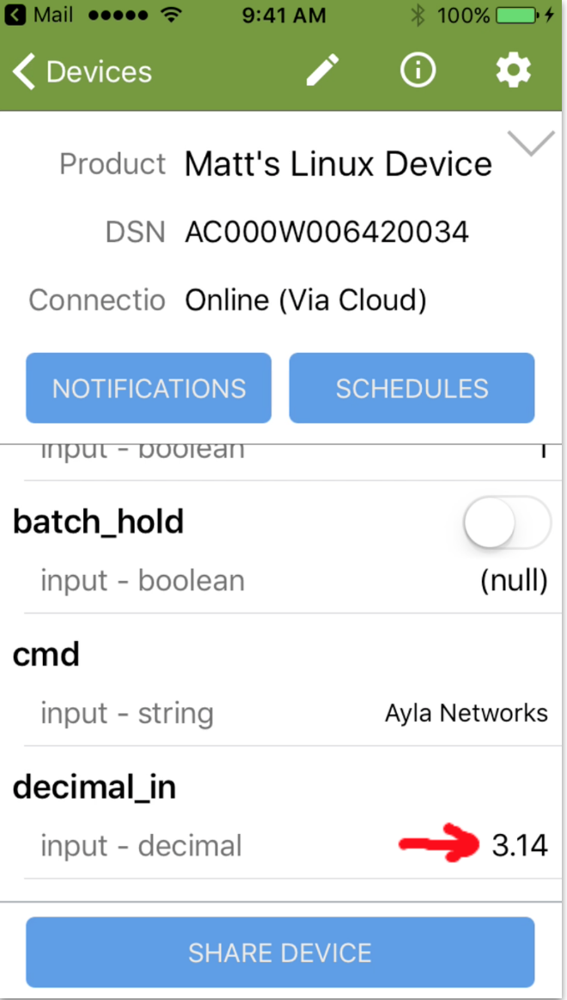
1. Click on the property value, enter the new value, and press Update Value.
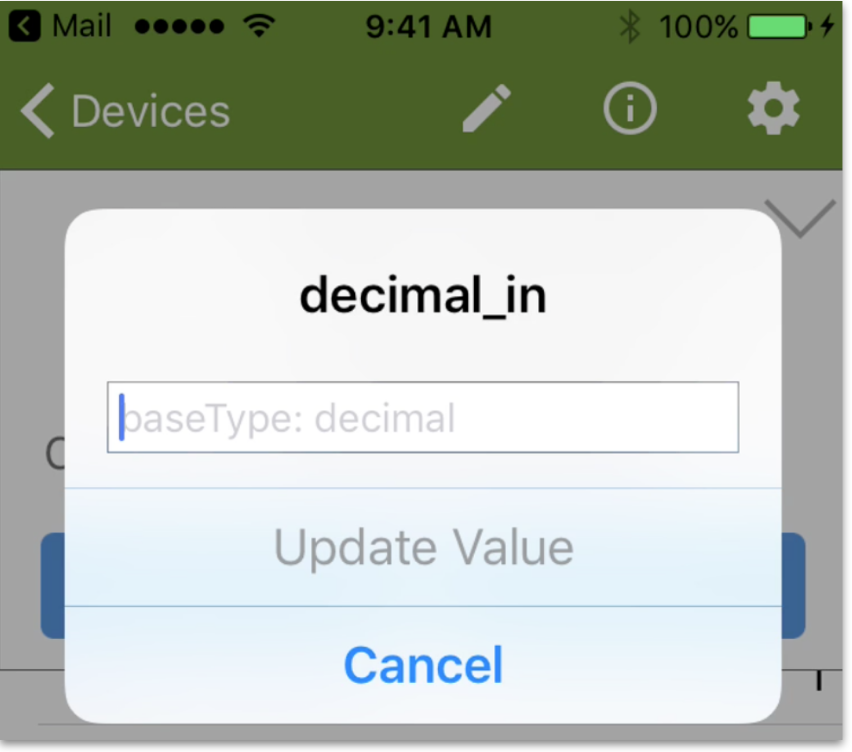
