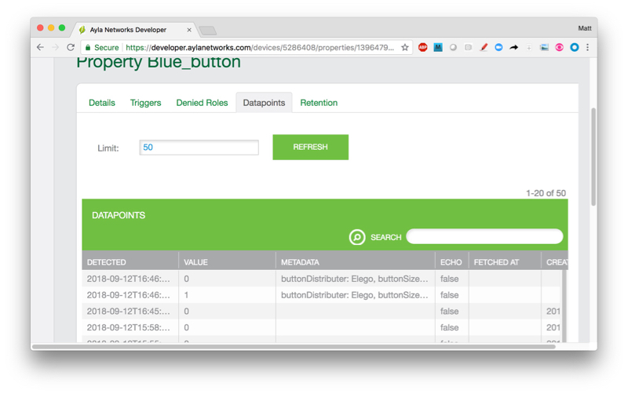

This tutorial shows you how to associate the following metadata with the Blue_button property:

* buttonSize: small
* buttonDistributer: Elego

Property metadata is information in the form of key:value pairs associated with properties. 

Limits, defined in <code>&#126;/device_linux_public/lib/app/props_internal.h.</code>, include the following:

* PROP_METADATA_MAX_ENTRIES - The maximum number of key/value pairs is 10.
* PROP_METADATA_KEY_MAX_LEN - The maximum key length is 255 bytes.

Here are the directions for implementing metadata:

<ol>
<li>Browse to the Developer Portal.</li>
<li>Click View My Devices &gt; Raspberry Pi &gt; Blue_button &gt; Datapoints, and note the absence of Metadata.

</li>
<li>Open <code>&#126;/device_linux_public/app/appd/appd.c</code> for editing.</li>
<li>Scroll to the <code>blue_button_isr</code> function, and modify it like this:
<pre>
void blue_button_isr(void) {
  struct op_options opts = {.confirm = 1};

  if(digitalRead(BLUE_BUTTON) == LOW) {blue_button = 1;}
  else {blue_button = 0;}

  struct prop_metadata \*metadata = prop_metadata_alloc();
  prop_metadata_add(metadata, "buttonSize", "small");
  prop_metadata_add(metadata, "buttonDistributer", "Elego");
  opts.metadata = metadata;

  struct prop \*prop = prop_lookup("Blue_button");
  prop->send(prop, 0, &opts);
  prop_metadata_free(metadata);
}
</pre>
</li>
<li>Make and run the host app in debug mode.</li>
<li>Click the Blue Button on your breadboard.</li>
<li>View the output in the debug terminal:
<pre>
2018-09-12T16:46:21.950 [DBG] appd::prop_val_send()  Blue_button
2018-09-12T16:46:21.950 [DBG] appd::data_send_json()  {"cmd":{"proto":"data","id":8,"op":"prop_send","opts":{"confirm":true},"args":[{"property":{"name":"Blue_button","base_type":"boolean","value":1,"metadata":{"buttonSize":"small","buttonDistributer":"Elego"},"dev_time_ms":1536770781950}}]}}
2018-09-12T16:46:21.951 [DBG] appd::data_recv()  {"cmd":{"proto":"data","id":8,"op":"ack"}}
2018-09-12T16:46:21.951 [DBG] appd::data_cmd_parse()  {"proto":"data","id":8,"op":"ack"}, protocol data
2018-09-12T16:46:21.951 [DBG] appd::data_recv_data()  {"proto":"data","id":8,"op":"ack"}, recv_request_id 8
2018-09-12T16:46:22.108 [DBG] appd::data_recv()  {"cmd":{"proto":"data","id":8,"op":"confirm_true"}}
2018-09-12T16:46:22.242 [DBG] appd::prop_val_send()  Blue_button
2018-09-12T16:46:22.242 [DBG] appd::data_send_json()  {"cmd":{"proto":"data","id":9,"op":"prop_send","opts":{"confirm":true},"args":[{"property":{"name":"Blue_button","base_type":"boolean","value":0,"metadata":{"buttonSize":"small","buttonDistributer":"Elego"},"dev_time_ms":1536770782242}}]}}
2018-09-12T16:46:22.243 [DBG] appd::data_recv()  {"cmd":{"proto":"data","id":9,"op":"ack"}}
2018-09-12T16:46:22.243 [DBG] appd::data_cmd_parse()  {"proto":"data","id":9,"op":"ack"}, protocol data
2018-09-12T16:46:22.243 [DBG] appd::data_recv_data()  {"proto":"data","id":9,"op":"ack"}, recv_request_id 9
2018-09-12T16:46:22.386 [DBG] appd::data_recv()  {"cmd":{"proto":"data","id":9,"op":"confirm_true"}}
</pre>
Note the metadata: <code>"metadata":{"buttonSize":"small","buttonDistributer":"Elego"}</code>.
</li>
<li>View the Blue_button property in the Developer Portal:

</li>
<li>Note the metadata. Can you modify the blue_button_isr function so that metadata is sent for press events, but not release events?</li>
</ol>