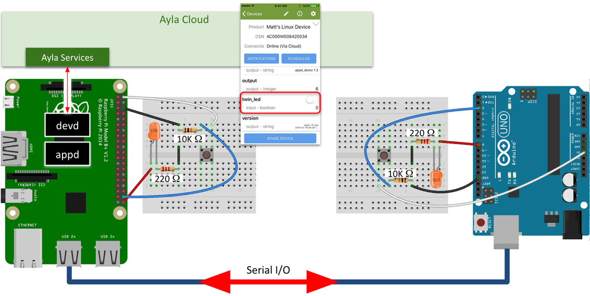
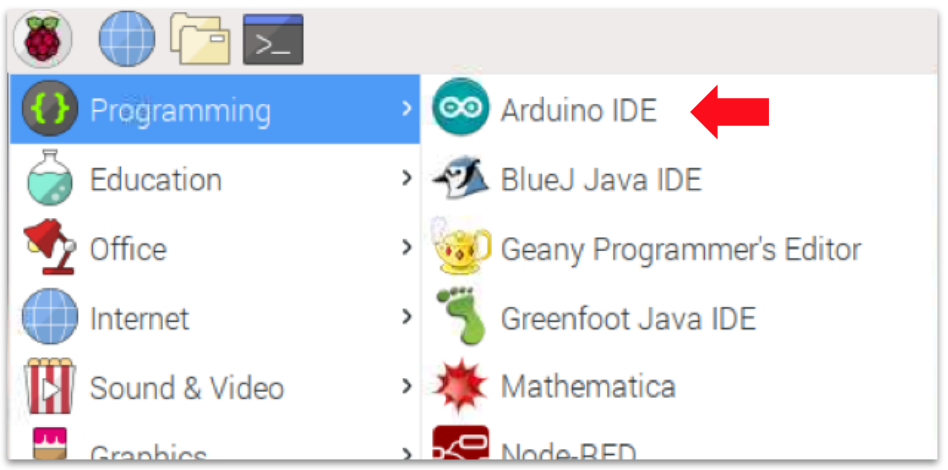
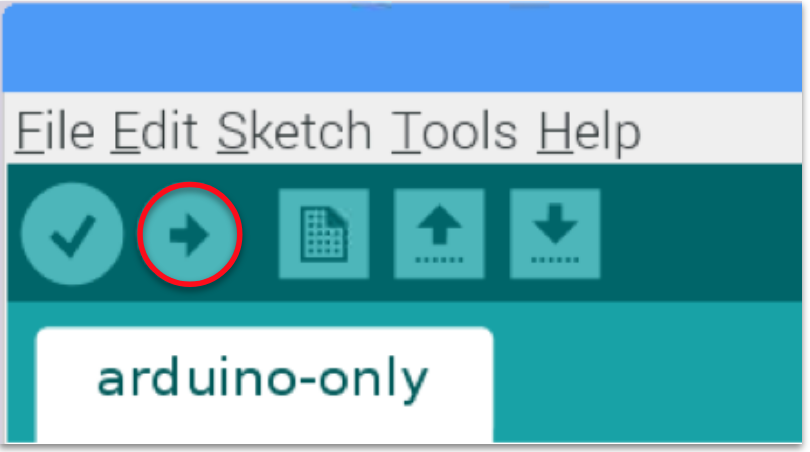
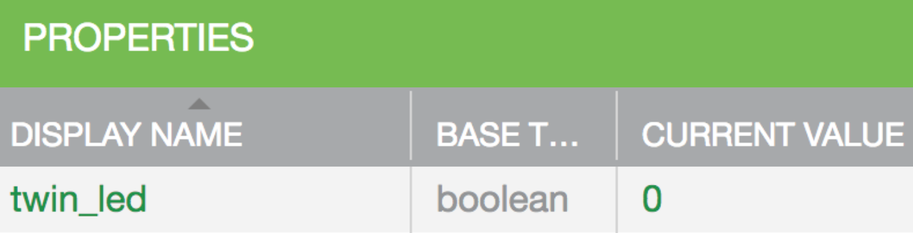

To demonstrates serial I/O between your host application (appd) running on your Raspberry Pi and a small program running on an Arduino board, this tutorial implements the following use case: When a user clicks either of the buttons on the breadboards, or toggles the <code>twin_led</code> property in the Ayla Cloud, both orange LEDs turn on or off in unison:

The following video demonstrates:

<iframe 
  width="560"
  height="315" 
  src="https://www.youtube.com/embed/vhugySJ9kXA?rel=0&amp;showinfo=0" 
  frameborder="0" 
  allow="autoplay; encrypted-media" 
  allowfullscreen>
</iframe>

The tutorial builds the use case in three phases:

1. Build an Arduino program that turns the Arduino LED on/off.
1. Build an Arduino program and an RPi program that coordinate turning both LEDs on/off in unison.
1. Merge parts of the RPi program into appd to accomplish the full use case.

<a data-toggle="collapse" href="#install-arduino-ide">Click here to learn how to install the Arduino IDE onto your RPi</a>.

<ol>
<li>Connect to your RPi via VNC Viewer.</li>
<li>In the terminal, run <code>sudo apt-get update</code>.</li>
<li>In the browser, browse to [Arduino Software](https://www.arduino.cc/en/Main/Software).</li>
<li>Download the Linux ARM version.</li>
<li>In File Manager, navigate to the Downloads folder.</li>
<li>Right-click on <code>arduino-1.8.8-linuxarm.tar.xz</code>, and click <code>Extract Here</code>.</li>
<li>Right-click on the extracted folder, and click <code>Open in Terminal</code>.</li>
<li>Run <code>sudo ./install.sh</code>.
Ignore the following error:
<pre>
$ sudo ./install.sh
Adding desktop shortcut, menu item and file associations for Arduino IDE...touch: cannot touch '/root/.local/share/applications/mimeapps.list': No such file or directory
/usr/bin/xdg-mime: 803: /usr/bin/xdg-mime: cannot create /root/.local/share/applications/mimeapps.list.new: Directory nonexistent
 done!
</pre>
Note that the installation process also creates the following work directory: <code>/home/pi/Arduino</code>. You can use this directory to store your Arduino sketches.
</li>
<li>From the Desktop, start the Arduino IDE:

</li>
</ol>

## Arduino Only

<ol>
<li>Wire the Arduino side of the diagram above. Click the image to enlarge.</li>
<li>Create an Arduino sketch called <code>arduino-only</code>:
<pre>
const int LED = 8;
const int BUTTON = 2;
volatile unsigned char led_val = LOW;
volatile bool led_changed = false; 

void setup() {
  pinMode(LED, OUTPUT);
  pinMode(BUTTON, INPUT);
  attachInterrupt(digitalPinToInterrupt(BUTTON), button_isr, CHANGE);
  Serial.begin(9600);
}

void loop() {  
  delay(1000);
}

void button_isr() {
  if(digitalRead(BUTTON) == HIGH) {
    led_val = (led_val == HIGH) ? (LOW) : (HIGH);
    digitalWrite(LED, led_val);
  }
}
</pre>
</li>
<li>Compile, load, and run the sketch:

</li>
<li>Test by pressing and releasing the button. The LED should turn on. Repeat. The LED should turn off:
<iframe 
  width="560" 
  height="315" 
  src="https://www.youtube.com/embed/ejlnBJJxWHg?rel=0&amp;showinfo=0" 
  frameborder="0" 
  allow="autoplay; 
  encrypted-media" 
  allowfullscreen>
</iframe>
</li>
</ol>

## Arduino and RPi

<ol>
<li>Wire the RPi side of the diagram at the top of the page. Click the image to enlarge.</li>
<li>Create an Arduino sketch called <code>arduino-side</code>:
<pre>
const int LED = 8;
const int BUTTON = 2;
volatile unsigned char led_val = LOW;
volatile bool led_changed = false; 

void setup() {
  pinMode(LED, OUTPUT);
  pinMode(BUTTON, INPUT);
  attachInterrupt(digitalPinToInterrupt(BUTTON), button_isr, CHANGE);
  Serial.begin(9600);
}

void loop() {
  
  if(led_changed) {
    led_changed = false;
    Serial.write(led_val);
    Serial.write("/n");
  }

  while (Serial.available() > 0) {
    int val = Serial.read();
    if(val == LOW || val == HIGH) {
      led_val = val;
      digitalWrite(LED, led_val);
    }
  }
}

void button_isr() {
  if(digitalRead(BUTTON) == HIGH) {
    led_val = (led_val == HIGH) ? (LOW) : (HIGH);
    digitalWrite(LED, led_val);
    led_changed = true;
  }
}
</pre>
</li>
<li>Compile, load, and run the sketch.</li>
<li>Create a C program for the RPi called <code>rpi-side</code>:
<pre>
#include <stdio.h>
#include <wiringPi.h>
#include <wiringSerial.h>
#include <stdbool.h>
#define LED 29
#define BUTTON 28

unsigned char led_val = LOW;
int serialFileDesc = 0;

void button_isr(void) {
  if(digitalRead(BUTTON) == HIGH) {
    led_val = (led_val == HIGH) ? (LOW) : (HIGH);
    digitalWrite(LED, led_val);
    serialPutchar(serialFileDesc, led_val);
  }
}

int main(void) {
  printf("Starting program\n");
  wiringPiSetup();
  pinMode(LED, OUTPUT);
  pinMode(BUTTON, INPUT);
  serialFileDesc = serialOpen("/dev/ttyACM0", 9600);
  wiringPiISR(BUTTON, INT_EDGE_BOTH, &button_isr);

  for(;;) {
    unsigned char val = serialGetchar(serialFileDesc);
    if(val == LOW || val == HIGH) {
      led_val = val;
      digitalWrite(LED, led_val);
    }
  }

  serialClose(serialFileDesc);
  return 0;
}
</pre>
</li>
<li>Compile and run:
<pre>
$ gcc -Wall -o rpi-side rpi-side.c -lwiringPi
$ ./rpi-side
</pre>
Alternately, you can run the program in the background with <code>./rpi-side & disown</code>, and stop it with <code>killall rpi-side</code>.
</li>
<li>Test by pressing and releasing either button. Both LEDs should turn on. Repeat. Both LEDs should turn off:
<iframe 
  width="560" 
  height="315" 
  src="https://www.youtube.com/embed/E8ZBXUGqDhA?rel=0&amp;showinfo=0" 
  frameborder="0" 
  allow="autoplay; 
  encrypted-media" 
  allowfullscreen>
</iframe>
</li>
<li>Use <code>Ctl-C</code> to exit <code>rpi-side</code>.</li>
</ol>

## Arduino, RPi, and Ayla

### Modify Makefile

<ol>
<li>Open <code>&#126;/device_linux_public/app/appd/Makefile</code> for editing.</li>
<li>Scroll to the section called "List of libraries to link."</li>
<li>Add wiringPi and pthread:
<pre>
LIBS = ssl crypto curl jansson wiringPi pthread
</pre>
</li>
<li>Save the file.</li>
</ol>

### Create the twin_led property

<ol>
<li>Browse to the [Ayla Devloper Portal](/ayla-developer-portal/), and log in.</li>
<li>Click View My Devices.</li>
<li>Click the serial number of your device.</li>
<li>Click Add, and create a property with the following attributes:
<table>
<tr><th>Attribute</th><th>Value</th></tr>
<tr><td>Property Type</th><th>Property</td></tr>
<tr><td>Name</td><td>twin_led</td></tr>
<tr><td>Display Name</td><td>twin_led</td></tr>
<tr><td>Base Type</td><td>Boolean</td></tr>
<tr><td>Direction</td><td>To Device</td></tr>
<tr><td>Scope</td><td>user</td></tr>
</table>
The new property looks like this:

</li>
</ol>

### Modify appd.c

<ol>
<li>Open <code>&#126;/device_linux_public/app/appd/appd.c</code> for editing.</li>
<li>Include the following header files:
<pre>
#include &lt;wiringPi.h&gt;
#include &lt;wiringSerial.h&gt;
#include &lt;pthread.h&gt;
</pre>
<li>Add the following constants:
<pre>
#define TWIN_RPI_LED 29
#define TWIN_RPI_BUTTON 28
</pre>
</li>
<li>Add the following variables:
<pre>
static u8 twin_led_val;
int serialFileDesc = 0;
pthread_t twin_led_serial_rx_thread_id;
</pre>
</li>
<li>Scroll to <code>app_prop_table</code>, and add the following <code>prop</code> struct instance:
<pre>
{
  .name = "twin_led",
  .type = PROP_BOOLEAN,
  .set = appd_twin_led_set,
  .send = prop_arg_send,
  .arg = &twin_led_val,
  .len = sizeof(twin_led_val),
  .ads_failure_cb = appd_prop_ads_failure_cb,
},
</pre>
</li>
<li>Add an <code>appd_twin_led_set</code> function to the file <u>before</u> <code>app_prop_table</code>:
<pre>
static int appd_twin_led_set(struct prop &#42;prop, const void &#42;val, size_t len, const struct op_args &#42;args)
{
  if (prop_arg_set(prop, val, len, args) != ERR_OK) {
    return -1;
  }
  digitalWrite(TWIN_RPI_LED, twin_led_val);
  serialPutchar(serialFileDesc, twin_led_val);
  return 0;
}
</pre>
This function receives the new value for twin_led_val from the cloud, applies it to the LED, and sends it to the Arduino board.
</li>
<li>Add an <code>appd_twin_rpi_button_isr</code> function:
<pre>
void appd_twin_rpi_button_isr(void) {
  if(digitalRead(TWIN_RPI_BUTTON) == HIGH) {
    twin_led_val = (twin_led_val == HIGH) ? (LOW) : (HIGH);
    digitalWrite(TWIN_RPI_LED, twin_led_val);
    serialPutchar(serialFileDesc, twin_led_val);
    prop_send_by_name("twin_led");
  }
}
</pre>
This function receives the new value for twin_led_val from the button, applies it to the LED, sends it to the Arduino board and the cloud.
</li>
<li>Add an <code>appd_twin_led_serial_rx</code> function:
<pre>
void &#42;appd_twin_led_serial_rx(void &#42;ptr) {
  for(;;) {
    unsigned char val = serialGetchar(serialFileDesc);
    if(val == LOW || val == HIGH) {
      twin_led_val = val;
      digitalWrite(TWIN_RPI_LED, twin_led_val);
      prop_send_by_name("twin_led");
    }
  }
}
</pre>
This function receives the new value for twin_led_val from the Arduino board, applies it to the LED, and sends it to the cloud.
</li>
<li>Scroll to the <code>appd_start</code> function, and change as follows:
<pre>
int appd_start(void)
{
  log_info("application starting");

  app_set_template_version(appd_template_version);

  wiringPiSetup();
  pinMode(TWIN_RPI_LED, OUTPUT);
  pinMode(TWIN_RPI_BUTTON, INPUT);
  wiringPiISR(TWIN_RPI_BUTTON, INT_EDGE_BOTH, &appd_twin_rpi_button_isr);
  serialFileDesc = serialOpen("/dev/ttyACM0", 9600);
  pthread_create(&twin_led_serial_rx_thread_id, NULL, appd_twin_led_serial_rx, NULL);

  return 0;
}
</pre>
</li>
<li>Scroll to the <code>appd_exit</code> function, and change as follows:
<pre>
void appd_exit(int status)
{
  log_info("application exiting with status: %d", status);
  serialClose(serialFileDesc);
  pthread_cancel(twin_led_serial_rx_thread_id);
}
</pre>
</li>
<li>Save the file.</li>
<li>Make <code>appd</code>, and run <code>devd</code> and <code>appd</code>:</li>
<pre>
$ cd ~/device_linux_public/
$ sudo make
$ sudo systemctl stop devd
$ sudo cp ~/device_linux_public/build/native/obj/app/appd/appd ~/ayla/bin/appd
$ sudo systemctl start devd
</pre>
Your modified <code>appd</code> interacts with the <code>arduino-side</code> sketch you ran in the previous section on this page.
<li>Test the new functionality by toggling the twin_led property on/off in Aura, and verifying that the actual LEDs on the breadboards turns on/off. Clicking the buttons on either breadboard should do the same.
<iframe 
  width="560" 
  height="315" 
  src="https://www.youtube.com/embed/2pwZxI7TSJQ?rel=0&amp;showinfo=0" 
  frameborder="0" 
  allow="autoplay; 
  encrypted-media" 
  allowfullscreen>
</iframe>
</li>
</ol>

## See also

* [Control Arduino using Raspberry Pi | Arduino Raspberry Pi Serial Communication](https://electronicshobbyists.com/control-arduino-using-raspberry-pi-arduino-and-raspberry-pi-serial-communication/)
* [Multithreading in C](https://www.geeksforgeeks.org/multithreading-c-2/)
