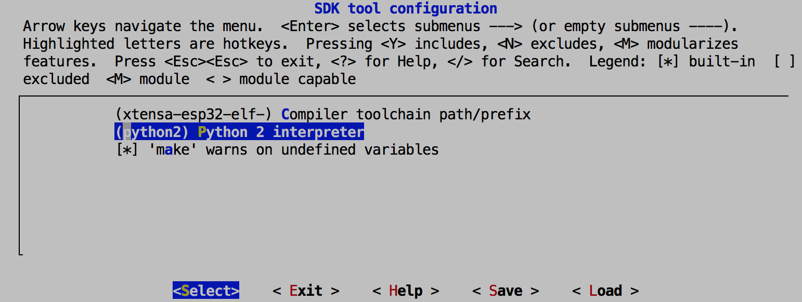
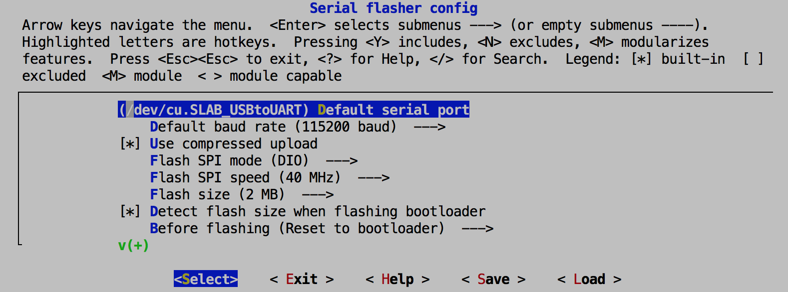

Because Ayla Integrated Agents are software libraries that extend chipset SDKs, you must set up your chipset development environment before working with Ayla software. To set up the Espressif ESP32 Dev Kit C on Linux, Mac OS, or Windows, refer to the [ESP-IDF Programming Guide](https://docs.espressif.com/projects/esp-idf/en/latest/).

## Sample toolchain installation

The steps below, which are based on the [ESP-IDF Programming Guide](https://docs.espressif.com/projects/esp-idf/en/latest/), and happen to target Mac OS, also include Ayla-specific information pertinent to installations for all operating systems. So, even if you are installing on Windows or Linux, please review these steps first.

### Install python

Python is necessary because the ESP-IDF ROM bootloader utility is a python app called <code>esptool.py</code>.

<ol>
<li>Install xcode command-line tools:
<pre>
$ xcode-select --install
</pre>
</li>
<li>Install [homebrew](https://www.howtogeek.com/211541/homebrew-for-os-x-easily-installs-desktop-apps-and-terminal-utilities/):
<pre>
$ ruby -e "$(curl -fsSL https&colon;//raw.githubusercontent.com/Homebrew/install/master/install)"
$ brew doctor
</pre>
</li>
<li>Install python2:
<pre>
$ brew install python@2
...
Pip and setuptools have been installed. To update them
  pip install --upgrade pip setuptools

You can install Python packages with
  pip install &lt;package&gt;

They will install into the site-package directory
  /usr/local/lib/python2.7/site-packages
</pre>
</li>
<li>Check locations:
<pre>
$ which pip2
/usr/local/bin/pip2
$ which python2
/usr/local/bin/python2
</pre>
<li>Check versions:
<pre>
$ python2 --version
Python 2.7.16
$ pip2 --version
pip 19.0.3 from /usr/local/lib/python2.7/site-packages/pip (python 2.7)
</pre>
</li>
</ol>

### Install ESP32 toolchain

The ESP32 toolchain establishes a baseline of libraries and tools for your ESP-IDF development environment.

<ol>
<li>Download [ESP32 toolchain for macOS](https://dl.espressif.com/dl/xtensa-esp32-elf-osx-1.22.0-80-g6c4433a-5.2.0.tar.gz), and extract:
<pre>
$ mkdir -p ~/esp
$ cd ~/esp
$ tar -xzf ~/Downloads/xtensa-esp32-elf-osx-1.22.0-80-g6c4433a-5.2.0.tar.gz
</pre>
This command creates <code>&#126;/esp/xtensa-esp32-elf</code>.
</li>
<li>Update PATH variable in <code>.bash_profile</code>:
<pre>
export PATH=$HOME/esp/xtensa-esp32-elf/bin:$PATH
</pre>
</li>
<li>Verify the modified path:
<pre>
$ source &#126;/.bash_profile
$ printenv PATH
</pre>
</li>
</ol>

### Install ESP-IDF and Python libraries

ESP-IDF stands for Espressif IoT Development Framework.

<ol>
<li>Clone the ESP-IDF libraries:
<pre>
$ cd ~/esp
$ git clone --recursive https&colon;//github.com/espressif/esp-idf.git
</pre>
</li>
<li>Add IDF_PATH variable to <code>.bash_profile</code>:
<pre>
export IDF_PATH=~/esp/esp-idf
</pre>
</li>
<li>Verify the new environment variable:
<pre>
$ source &#126;/.bash_profile
$ printenv IDF_PATH
</pre>
</li>
<li>Install required Python packages
<pre>
$ pip2 install -r $IDF_PATH/requirements.txt
</pre>
</li>
<li>Revert to version needed for Ayla software:
<pre>
$ cd ~/esp/esp-idf
$ git branch                 # master
$ git checkout v3.1-beta1    # Deletes $IDF_PATH/requirements.txt. Does not delete directories.
$ git branch                 # (HEAD detached at v3.1-beta1) master
$ git submodule update       # Updates about five submodules.
$ git show                   # Shoes id, author, date.
</pre>
</li>

</ol>

### Determine serial port

Determine the serial port to use for flashing code from the Mac to the ESP32 dev kit via your USB A-to-Micro USB B cable.

<ol>
<li>Run the following command, connect the Mac to the kit, and run the command again. The port that appears the second time (e.g. <code>/dev/cu.SLAB_USBtoUART</code>) is the one to use.
<pre>
$ ls /dev/cu.&#42;
</pre>
</li>
<li>Test the serial connection by running the following command, and pressing <code>Enter</code> a second time:
<pre>
$ screen /dev/cu.SLAB_USBtoUART 115200
</pre>
You should see a prompt:
<pre>
&colon;&gt;
</pre>
<li>Exit by pressing <code>Ctl + A</code> then <code>Ctl + K</code> then <code>y</code>.</li>
</li>
</ol>

## Example applications

Espressif provides several example applications to use with the ESP32 Dev Kit C. In your installation, they reside in <code>&#126;/esp/esp-idf/examples</code>. You can also find them on [Github](https://github.com/espressif/esp-idf/tree/master/examples). We have included a small subset of the examples below. Completing them will ensure that your development environment is working properly before adding Ayla to the mix. See the Espressif [Build System](https://docs.espressif.com/projects/esp-idf/en/latest/api-guides/build-system.html) pages to learn more about setting up and configuring an ESP-IDF build system.

### hello_world

<ol>
<li>Change directory to <code>hello_world</code>:
<pre>
$ cd &#126;/esp/esp-idf/examples/get-started/hello_world
</pre>
</li>
<li>Configure the app by running <code>menuconfig</code>:
<pre>
$ make menuconfig
</pre>
</li>
<ol>
<li>Navigate to <code>SDK tool configuration</code> to specify the python version you want to use.

</li>
<li>Navigate to <code>Serial flasher config</code> to configure and save serial communication parameters.

</li>
</ol>
<li>Build the app:
<pre>
$ make
</pre>
</li>
<li>Flash the app to the ESP32 Dev Kit:
<pre>
$ make flash
</pre>
</li>
<li>Monitor the app. (Press <code>Ctl</code> + <code>]</code> to exit the monitor).
<pre>
$ make monitor
</pre>

<a data-toggle="collapse" href="#hello-world-results">Click to view output that repeats in your terminal</a>.

<pre class="collapse" id="hello-world-results">
rst:0xc (SW_CPU_RESET),boot:0x13 (SPI_FAST_FLASH_BOOT)
configsip: 0, SPIWP:0xee
clk_drv:0x00,q_drv:0x00,d_drv:0x00,cs0_drv:0x00,hd_drv:0x00,wp_drv:0x00
mode:DIO, clock div:2
load:0x3fff0018,len:4
load:0x3fff001c,len:6324
load:0x40078000,len:11308
load:0x40080400,len:6680
entry 0x40080760
I (29) boot: ESP-IDF v3.3-beta1-504-g6c49f1924 2nd stage bootloader
I (29) boot: compile time 10:03:59
I (29) boot: Enabling RNG early entropy source...
I (35) boot: SPI Speed      : 40MHz
I (39) boot: SPI Mode       : DIO
I (43) boot: SPI Flash Size : 4MB
I (47) boot: Partition Table:
I (51) boot: ## Label            Usage          Type ST Offset   Length
I (58) boot:  0 nvs              WiFi data        01 02 00009000 00006000
I (66) boot:  1 phy_init         RF data          01 01 0000f000 00001000
I (73) boot:  2 factory          factory app      00 00 00010000 00100000
I (81) boot: End of partition table
I (85) esp_image: segment 0: paddr=0x00010020 vaddr=0x3f400020 size=0x0765c ( 30300) map
I (104) esp_image: segment 1: paddr=0x00017684 vaddr=0x3ffb0000 size=0x01e98 (  7832) load
I (108) esp_image: segment 2: paddr=0x00019524 vaddr=0x40080000 size=0x00400 (  1024) load
0x40080000: _WindowOverflow4 at /Users/matt/esp/esp-idf/components/freertos/xtensa_vectors.S:1779

I (112) esp_image: segment 3: paddr=0x0001992c vaddr=0x40080400 size=0x066e4 ( 26340) load
I (132) esp_image: segment 4: paddr=0x00020018 vaddr=0x400d0018 size=0x125e0 ( 75232) map
0x400d0018: &#95;flash_cache_start at ??&colon;?

I (158) esp_image: segment 5: paddr=0x00032600 vaddr=0x40086ae4 size=0x01570 (  5488) load
0x40086ae4: multi_heap_assert at /Users/matt/esp/esp-idf/components/heap/multi_heap_platform.h:52
 (inlined by) multi_heap_malloc_impl at /Users/matt/esp/esp-idf/components/heap/multi_heap.c:431

I (166) boot: Loaded app from partition at offset 0x10000
I (166) boot: Disabling RNG early entropy source...
I (168) cpu_start: Pro cpu up.
I (171) cpu_start: Application information:
I (176) cpu_start: Project name:     hello-world
I (181) cpu_start: App version:      1
I (186) cpu_start: Compile time:     Mar  1 2019 10:04:02
I (192) cpu_start: ELF file SHA256:  e4d1830e9a2f4340...
I (198) cpu_start: ESP-IDF:          v3.3-beta1-504-g6c49f1924
I (204) cpu_start: Starting app cpu, entry point is 0x40080e60
0x40080e60: call_start_cpu1 at /Users/matt/esp/esp-idf/components/esp32/cpu_start.c:267

I (197) cpu_start: App cpu up.
I (215) heap_init: Initializing. RAM available for dynamic allocation:
I (222) heap_init: At 3FFAE6E0 len 00001920 (6 KiB): DRAM
I (228) heap_init: At 3FFB2EE0 len 0002D120 (180 KiB): DRAM
I (234) heap_init: At 3FFE0440 len 00003AE0 (14 KiB): D/IRAM
I (240) heap_init: At 3FFE4350 len 0001BCB0 (111 KiB): D/IRAM
I (247) heap_init: At 40088054 len 00017FAC (95 KiB): IRAM
I (253) cpu_start: Pro cpu start user code
I (271) cpu_start: Starting scheduler on PRO CPU.
I (0) cpu_start: Starting scheduler on APP CPU.
Hello world!
This is ESP32 chip with 2 CPU cores, WiFi/BT/BLE, silicon revision 1, 4MB external flash
Restarting in 10 seconds...
Restarting in 9 seconds...
Restarting in 8 seconds...
Restarting in 7 seconds...
Restarting in 6 seconds...
Restarting in 5 seconds...
Restarting in 4 seconds...
Restarting in 3 seconds...
Restarting in 2 seconds...
Restarting in 1 seconds...
Restarting in 0 seconds...
Restarting now.
ets Jun  8 2016 00:22:57
</pre>
</li>
</ol>

### console

<ol>
<li>Change directory to <code>console</code>:
<pre>
$ cd &#126;/esp/esp-idf/examples/system/console
</pre>
</li>
<li>Configure, make, flash, and monitor the app. The following prompt appears:
<pre>
esp32&gt;
</pre>
</li>
<li>Type <code>help</code> to display a list of commands:
<pre>
esp32> help
help 
  Print the list of registered commands

free 
  Get the total size of heap memory available

restart 
  Restart the program

...
</pre>
</li>
</ol>

## See also

* [Getting Started with the ESP32 Development Board](https://randomnerdtutorials.com/getting-started-with-esp32/)
* [Configuration Options](https://docs.espressif.com/projects/esp-idf/en/latest/api-reference/kconfig.html)
