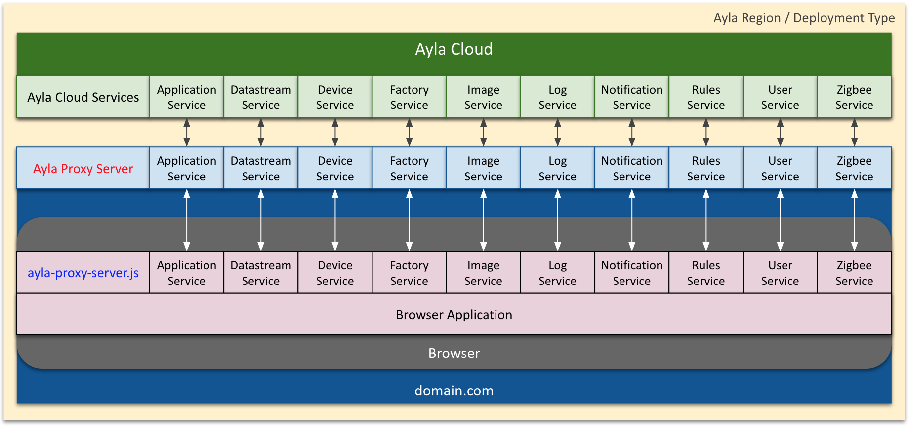
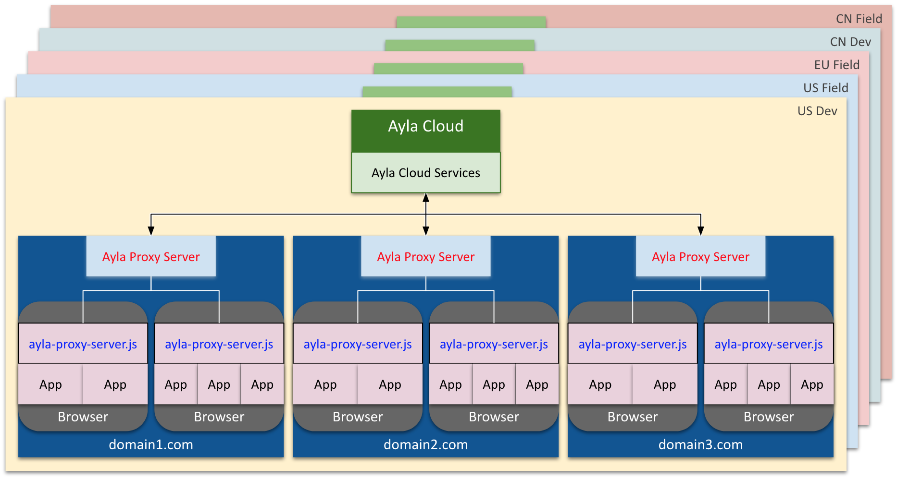

Deployed in your domain, and configured for your Ayla region and deployment type (e.g. US Dev), the Ayla Proxy Server accesses Ayla services on behalf of browser applications running in your domain that are prevented by [CORS](https://en.wikipedia.org/wiki/Cross-origin_resource_sharing) from accessing the Ayla REST API directly as depicted in the following diagram:

Ayla divides the world into three service regions: China (CN), Europe (EU), and United States (US). Each region includes an instance of the Ayla Cloud for field operations. The CN and US regions also include an instance each for development. That's a total of five Ayla Cloud instances. The following diagrams shows several instances of the Ayla Proxy Server deployed in domains across Ayla regions:

