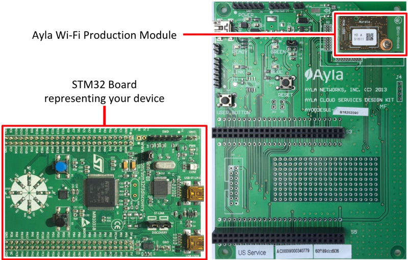

This guide introduces you to the code and concepts needed to connect your device to the Ayla Cloud using an [Ayla Wi-Fi Production Module](/content/glossary/ayla-wi-fi-production-module.html).

To do so, the guide focuses on the [Ayla Design Kit](/content/glossary/ayla-design-kit.html) which includes two circuit boards usually connected with pin heads (although the diagram shows them disconnected):

1. A [STM32 Board](https://www.st.com/en/evaluation-tools/stm32f3discovery.html?sc=stm32f3discovery) representing your device.
1. An Ayla Board with an Ayla Wi-Fi Production Module affixed.

The guide is organized as follows:

* Chapter 2 describes the Ayla Platform from a firmware engineer's point of view.
* Chapters 3 and 4 show how to set up and test the Design Kit from an end-user's point of view.
* Chapters 5 - 15 focus on modifying various versions of the Host MCU application (written in C).
* Chapter 16 demonstrates how to migrate a Design Kit from a default Ayla account to an OEM account.
* Chapter 17 shows how to port a host application from the STM32 board to other hardware. 

The guide will show you how to use the following tools:

