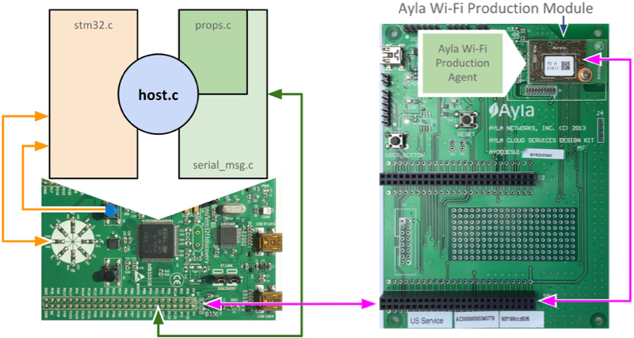
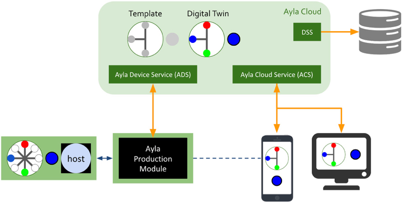
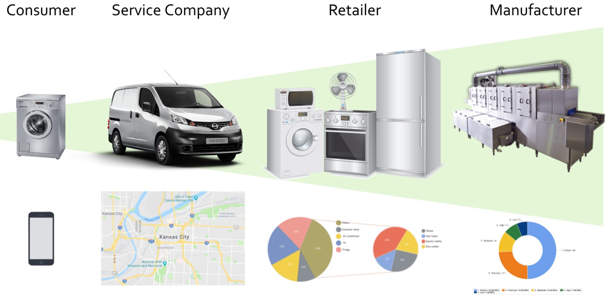

This guide introduces you to the code and concepts needed to connect devices to the Ayla Cloud using the Ayla Wi-Fi Production Module resident on the Ayla Design Kit. Figure 1 illustrates most of the tools you will use.

<figure class="figure">

<figcaption class="figure-caption">Figure 1: Tools.</figcaption>
</figure>

The Ayla Design Kit consists of an Ayla circuit board, a ST Microelectronics [STM32F3Discovery Board](https://www.st.com/en/evaluation-tools/stm32f3discovery.html?sc=stm32f3discovery), and a 5v USB power cable. See Figure 2. (The [Setup](/content/devices/adk/setup.html) chapter includes instructions for purchasing and registering the kit.)

<figure class="figure">

<figcaption class="figure-caption">Figure 2: Ayla Design Kit.</figcaption>
</figure>

The STM32 board represents any device that includes (1) a microcontroller (Host MCU) composed of a CPU, memory, and peripheral support functions, and (2) peripherals that send input to the MCU (e.g. Blue Button) and receive output from the MCU (e.g. LED Circle). See Figure 3.

<figure class="figure">

<figcaption class="figure-caption">Figure 3: Device with MCU and peripherals.</figcaption>
</figure>

Ayla provides three approaches to connecting devices to the cloud (see Figure 4):
<figure class="figure">

<figcaption class="figure-caption">Figure 4: Ayla approaches to connectivity.</figcaption>
</figure>

1. **Ayla Production Module/Agent**. The device is physically connected (via SPI or UART) to an Ayla Production Module running Ayla Production Agent firmware, the MCU host application (host.c) is modified, and then it is linked to an Ayla library that knows how to talk to the module/agent.
1. **Ayla Integrated Agent**. The Host MCU application on the device is linked directly with an Ayla Software Agent.
1. **Ayla Gateway Agent**. The device is connected (often with other devices) to an Ayla Gateway Agent.

The Ayla Design kit represents the first approach. See Figure 5.

<figure class="figure">

<figcaption class="figure-caption">Figure 5: Ayla Design Kit host application.</figcaption>
</figure>

In Figure 5, host.c is the host application. (This guide demostrates how to write several versions of host.c.) The other three source files, stm32.c, props.c, and serial_msg.c, are part of the Ayla host-based library. The first, stm32.c, interfaces with the STM32 board, handling interrupts from the Blue Button, and outputting on/off states to the LED Circle. The other two, props.c and serial_msg.c, perform I/O via serial interface to the Ayla Production Module/Agent which is the intermediary between the device and the Ayla Cloud. See Figure 6.

<figure class="figure">

<figcaption class="figure-caption">Figure 6: Ayla Platform.</figcaption>
</figure>

Figure 6 depicts the Ayla Design Kit (bottom-left) with the STM32 board on the left and the Ayla board (carrying the Ayla Production Module running the Ayla Agent) on the right connected by serial interface. The Ayla Agent communicates with the cloud via the Ayla Device Service API. The Ayla Cloud instantiates a user-defined template to create a digital twin of the real-world device. The red, blue, and green circles of the digital twin represent LEDs on the actual device, and the larger blue circle represents the Blue Button. Mobile and web apps built with libraries wrapping API calls to the Ayla Cloud Service RESTful API interact with the digital twin to query and control the device. The dotted line indicates that when an application and the device are connected to the same LAN, they can communicate directly. Finally, the Data Streaming Service (DSS) underscores the Ayla Cloud's ability to integrate with other business systems in real-time.

Connecting a device to the Ayla Cloud benefits several stakeholders. See Figure 7.

<figure class="figure">

<figcaption class="figure-caption">Figure 7: Ayla Platform value.</figcaption>
</figure>

Remote control is only one small part. Depending on how consumer data is aggregated and analyzed, consumers, service technicians, retailers, and manufacturers can leverage insights to improve efficiencies and performance. 
