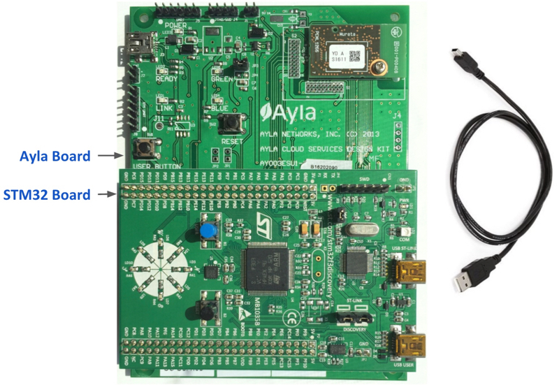
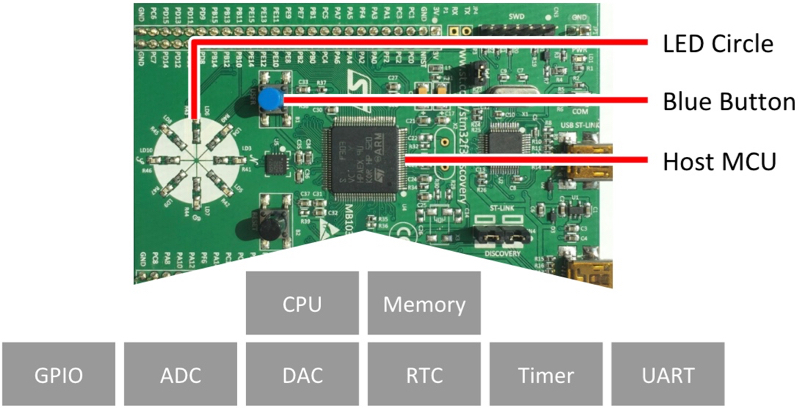
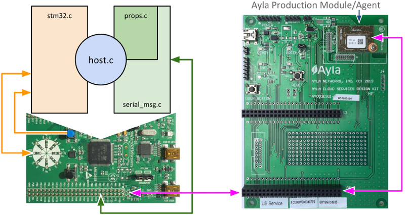
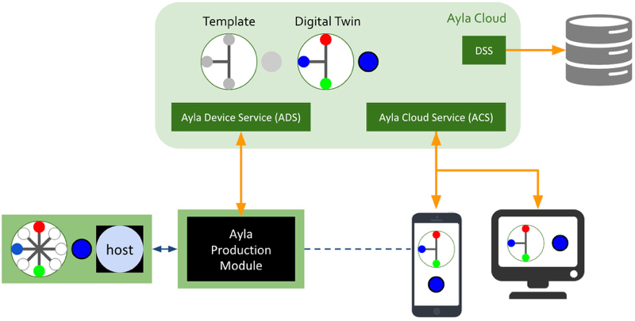
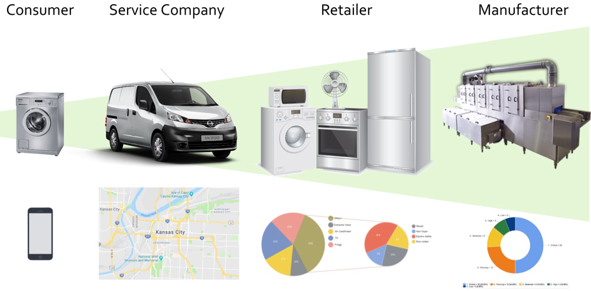

This chapter provides a view of the Ayla Platform from a firmware engineer's perspective. As stated, the Ayla Design Kit consists of a [STM32 Board](https://www.st.com/en/evaluation-tools/stm32f3discovery.html?sc=stm32f3discovery) representing your device, and an Ayla Board with an Ayla Wi-Fi Production Module affixed to provide cloud connectivity. It also includes a 5v USB power cable. The [Setup](/content/devices/adk/setup.html) chapter gives instructions for purchasing and registering the kit. Here is another view of the Discovery Kit:

It's important to note that, in this guide, the STM32 board represents *any device* that you want to connect to the Ayla Cloud, any device with (1) a microcontroller (Host MCU) composed of a CPU, memory, and peripheral support functions, and (2) peripherals that send input to the MCU (e.g. Blue Button) and receive output from the MCU (e.g. LED Circle).

Pairing this device with an Ayla Wi-Fi Production Module is a good first step in connecting the device to the Ayla Cloud because the module runs a production-ready Ayla Software Agent designed to handle connectivity, security, and several other functions. But, pairing the device with the module is not enough. You also need to modify the application running on the Host MCU. This application is labeled host.c in the following diagram:

In fact, host.c is the only code you need to modify. The other three source files in the diagram, stm32.c, props.c, and serial_msg.c, are part of the Ayla host-based library. 
The first, stm32.c, interfaces with the STM32 board, handling interrupts from the Blue Button, and writing/reading on and off states to/from the LED Circle. The other two, props.c and serial_msg.c, perform I/O via serial interface to the Ayla Production Module, the intermediary between host.c and the Ayla Cloud. 

<strong>Note:</strong> Using an Ayla Production Module is just one way to connect a device to the Ayla Cloud. See the [Devices](/content/devices/) page for all connectivity solutions.

The following diagram illustrates the Design Kit in the broader context of the Ayla Platform.

The Design Kit appears in the lower left of the diagram, with the STM32 board on the left connected via SPI or UART to the Ayla Production Module on the right. The module communicates with the Ayla Cloud via the Ayla Device Service API. The Ayla Cloud instantiates a user-defined template to create a digital twin of the real-world device. The red, blue, and green circles of the digital twin represent LEDs on the actual device, and the larger blue circle represents the Blue Button. Mobile and web apps built with libraries wrapping API calls to the Ayla Cloud Service RESTful API interact with the digital twin to query and control the device. The dotted line indicates that when an application and the device are connected to the same LAN, they can communicate directly. Finally, the Data Streaming Service (DSS) underscores the Ayla Cloud's ability to integrate with other business systems in real-time.

Connecting a device to the Ayla Cloud benefits several stakeholders, and remote control is only one of the benefits. See the diagram below.

Depending on how consumer data is aggregated and analyzed, consumers, service technicians, retailers, and manufacturers can leverage insights to improve efficiencies and performance. 
