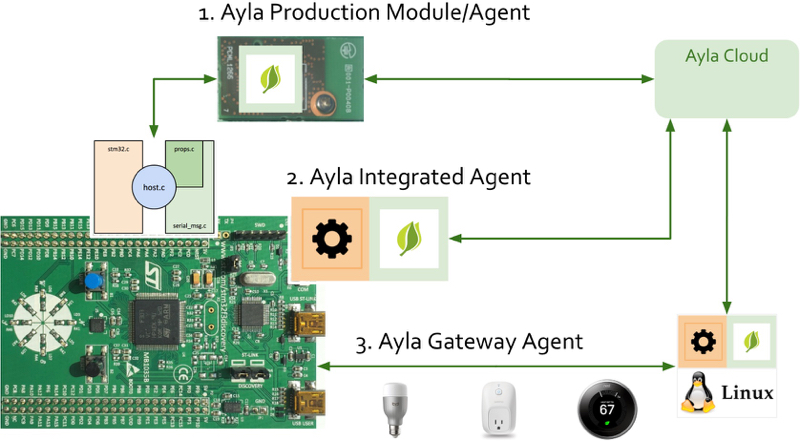

Ayla provides three approaches to connecting devices to the cloud:

1. **Ayla Production Module/Agent**. The device is physically connected (via SPI or UART) to an Ayla Production Module running Ayla Production Agent firmware, the MCU host application (host.c) is modified, and then it is linked to an Ayla library that knows how to talk to the module/agent.
1. **Ayla Integrated Agent**. The Host MCU application on the device is linked directly with an Ayla Software Agent.
1. **Ayla Gateway Agent**. The device is connected (often with other devices) to an Ayla Gateway Agent.
