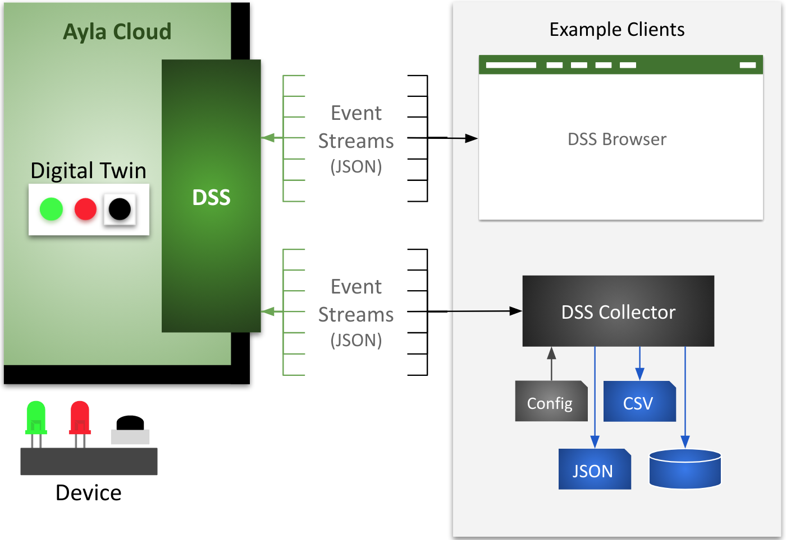

<aside id="pagebar" class="d-xl-block collapse">
  <ul>
    <li><a href="#core-title">Datastream Service</a></li>
    <li><a href="#events">Events</a>
      <ul>
        <li><a href="#connectivity">Connectivity</a></li>
        <li><a href="#datapoint">Datapoint</a></li>
        <li><a href="#datapointack">Datapointack</a></li>
        <li><a href="#location">Location</a></li>
        <li><a href="#registration">Registration</a></li>
      </ul>
    </li>
    <li><a href="#security">Security</a></li>
    <li><a href="#technology">Technology</a>
      <ul>
        <li><a href="#websockets">WebSockets</a></li>
        <li><a href="#messages">Messages</a></li>
        <li><a href="#heartbeats">Heartbeats</a></li>
      </ul>
    </li>
    <li><a href="#dss-browser">DSS Browser</a></li>
    <li><a href="#dss-collector">DSS Collector</a>
      <ul>
        <li><a href="#install-dss-collector">Install DSS Collector</a></li>
        <li><a href="#run-dss-collector">Run DSS Collector</a></li>
        <li><a href="#run-with-forever">Run with Forever</a></li>
        <li><a href="#save-to-json-file">Save to JSON file</a></li>
        <li><a href="#save-to-database">Save to database</a></li>
      </ul>
    </li>
    <li><a href="#api">API</a>
      <ul>
        <li><a href="#create-access-rule">Create Access Rule</a></li>
        <li><a href="#create-subscription">Create Subscription</a></li>
        <li><a href="#delete-access-rule">Delete Access Rule</a></li>
        <li><a href="#delete-subscription">Delete Subscription</a></li>
        <li><a href="#get-access-rule">Get Access Rule</a></li>
        <li><a href="#get-access-rules">Get Access Rules</a></li>
        <li><a href="#get-subscription">Get Subscription</a></li>
        <li><a href="#get-subscriptions">Get Subscriptions</a></li>
      </ul>
    </li>
    <li><a href="#regional-domains">Regional Domains</a></li>
  </ul>
</aside>

The Ayla Datastream Service (DSS) is a WebSocket server that pushes device-related event notifications (in near real-time) from the Ayla Cloud to subscribing WebSocket clients. See the diagram:

The diagram shows the following:

1. An example device with a green LED, red LED, and black button.
1. A digital twin in the Ayla Cloud representing the device.
1. A browser-based client ([DSS Browser](#dss-browser)) receiving/displaying events and sending acknowledgements. 
1. A Node.js DSS client ([DSS Collector](#dss-collector)) receiving/persisting events and sending acks.

## Events

The DSS WebSocket server sends notifications of the following events to subscribed clients:

|Event|Description|
|-|-|
|connectivity|The Ayla Cloud is able/not able to interact with a registered device.|
|datapoint|A digital twin property value changed.|
|datapointack|A device-based Ayla Agent confirmed to the Ayla Cloud that a device property value changed.|
|location|A digital twin latitute/longitude value changed.|
|registration|The Ayla Cloud registered/unregistered a device.|

The JSON formats of the notifications are seen below:

## Connectivity

<pre>
{
  "seq": "1",
  "metadata": {
    "oem_id": "0dfc7900",
    "oem_model": "ledevb",
    "dsn": "AC000W000340649",
    "resource_tags": [],
    "event_type": "connectivity"
  },
  "connection": {
    "event_time": "2018-09-24T10:26:37Z",
    "user_uuid": "00000000-0000-0000-0000-000000000000",
    "status": "Online"
  }
} 
</pre>

## Datapoint

<pre>
{
  "seq": "13",
  "metadata": {
    "oem_id": "0dfc7900",
    "oem_model": "linuxevb",
    "dsn": "AC000W005606115",
    "property_name": "Blue_LED",
    "display_name": "Blue_LED",
    "base_type": "boolean",
    "resource_tags": [],
    "event_type": "datapoint"
  },
  "datapoint": {
    "id": "1ff9b91c-bfe4-11e8-1261-67d251d3ec96",
    "created_at_from_device": null,
    "updated_at": "2018-09-24T10:25:14Z",
    "created_at": "2018-09-24T10:25:14Z",
    "user_uuid": "00000000-0000-0000-0000-000000000000",
    "echo": true,
    "closed": false,
    "value": 0,
    "metadata": {}
  }
}
</pre>

## Datapointack

<pre>
{
  "seq": "2",
  "metadata": {
    "oem_id": "0dfc7900",
    "oem_model": "linuxevb",
    "dsn": "AC000W005606115",
    "property_name": "Blue_LED",
    "display_name": "Blue_LED",
    "base_type": "boolean",
    "resource_tags": [],
    "event_type": "datapointack"
  },
  "datapoint": {
    "id": "15af3cfc-bfe4-11e8-f2f0-9aab1d61f636",
    "created_at_from_device": null,
    "updated_at": "2018-09-24T10:24:57Z",
    "created_at": "2018-09-24T10:24:57Z",
    "user_uuid": "00000000-0000-0000-0000-000000000000",
    "echo": false,
    "closed": false,
    "value": 1,
    "ack_message": 0,
    "ack_status": 200,
    "ack_id": "160c8c90-bfe4-11e8-87f4-8d732085e587",
    "acked_at": "2018-09-24T10:24:57Z",
    "metadata": {}
  }
}
</pre>

## Location

<pre>
{
  "seq": "1",
  "metadata": {
    "oem_id": "0dfc7900",
    "oem_model": "ledevb",
    "dsn": "AC000W000340779",
    "resource_tags": [],
    "event_type": "location"
  },
  "location_event": {
    "dsn": "AC000W000340779",
    "ip": "67.255.234.73",
    "lat": " 44.769500",
    "long": "-69.428300",
    "provider": "ip-based",
    "user_uuid": "00000000-0000-0000-0000-000000000000",
    "created_at": "2018-09-24T11:04:07Z"
  }
}
</pre>

## Registration

<pre>
{
  "seq": "1",
  "metadata": {
    "oem_id": "0dfc7900",
    "oem_model": "ledevb",
    "dsn": "AC000W000340649",
    "resource_tags": [],
    "event_type": "registration"
  },
  "registration_event": {
    "dsn": "AC000W000340649",
    "user_uuid": null,
    "registered": false,
    "registration_type": "AP-Mode",
    "unregistered_at": "2018-09-24T10:29:50Z"
  }
}
</pre>

## Security

Lorem ipsum dolor sit amet, consectetur adipiscing elit, sed do eiusmod tempor incididunt ut labore et dolore magna aliqua. Ut enim ad minim veniam, quis nostrud exercitation ullamco laboris nisi ut aliquip ex ea commodo consequat. Duis aute irure dolor in reprehenderit in voluptate velit esse cillum dolore eu fugiat nulla pariatur. Excepteur sint occaecat cupidatat non proident, sunt in culpa qui officia deserunt mollit anim id est laborum.

# Technology

## WebSockets

A WebSocket enables sustained, bidirectional communication over HTTP. Ayla DSS is a WebSocket server that sends events and heartbeats to WebSocket clients that receive the events and acknowledge the heartbeats. A Javascript client might instantiate a WebSocket in this manner: 

<pre>
let socket = new WebSocket(url + '?stream_key=' + key)
</pre>

There are several instances of Ayla DSS throughout the world, and the <code>url</code> parameter indicates the appropriate instance for your region and deployment type (see [Regional Domains](#regional-domains)). The <code>key</code> parameter specifies the subscription key. Once constructed, a WebSocket client listens for events with a set of callback functions similar to the following:

<pre>
socket.onopen = function(msg){}
socket.onerror = function(msg){}
socket.onmessage = function(msg){}
socket.onclose = function(msg){}
</pre>

See [DSS Browser](#dss-browser) or [DSS Collector](#dss-collector) for examples of full implementations.

## Messages

A WebSocket onmessage function receives MessageEvent objects that encapsulate heartbeats or DSS events. A MessageEvent object might include key/value pairs similar to the following: 

<pre>
bubbles: false
cancelBubble: false
cancelable: false
composed: false
currentTarget: WebSocket {}
data: "1|Z"
defaultPrevented: false
eventPhase: 0
isTrusted: true
lastEventId: ""
origin: "wss://stream.aylanetworks.com"
path: []
ports: []
returnValue: true
source: null
srcElement: WebSocket {}
target: WebSocket {}
timeStamp: 192795.29999988154
type: "message"
</pre>

The key/value pair of interest is <code>data:"1&#124;Z"</code>. The key is <code>data</code>. The value, <code>"1&#124;Z"</code>, indicates that this MessageEvent is a DSS heartbeat. If the MessageEvent had been an actual event (connectivity, datapoint, etc.), the value would have been similar to <code>data:"481&#124;{}"</code>. The number <code>481</code> represents the length of the JSON event string within the curly braces. The "&#124;" is useful for splitting the string into length and event. And, the curly braces, <code>{}</code>, encapsulate the actual JSON event string which might look like this:

<pre>
{
  "seq": "13",
  "metadata": {
    "oem_id": "0dfc7900",
    "oem_model": "linuxevb",
    "dsn": "AC000W005606115",
    "property_name": "Blue_LED",
    "display_name": "Blue_LED",
    "base_type": "boolean",
    "resource_tags": [],
    "event_type": "datapoint"
  },
  "datapoint": {
    "id": "1ff9b91c-bfe4-11e8-1261-67d251d3ec96",
    "created_at_from_device": null,
    "updated_at": "2018-09-24T10:25:14Z",
    "created_at": "2018-09-24T10:25:14Z",
    "user_uuid": "00000000-0000-0000-0000-000000000000",
    "echo": true,
    "closed": false,
    "value": 0,
    "metadata": {}
  }
}
</pre>

## Heartbeats

A DSS client onmessage function must, therefore, (1) determine if a MessageEvent is a heartbeat or a DSS event, (2) respond if it's a heartbeat, and (3) process if it's a DSS event: 

<pre>
socket.onmessage = function(msg) {
  if(msg.data.includes('|Z')) {
    stream.socket.send('Z')
  }
  else {
    var arr = msg.data.split('|')
    let event = JSON.parse(arr[1])
    process(event)
  }
}
</pre>

# DSS Browser

Complete the following steps to generate and monitor DSS events:

1. Log into your Ayla account using the Login item in the top menu bar.
1. Select an existing device, or create a virtual device.

  <h3>Devices</h3>
  

    Create Virtual
    Delete Virtual
    Refresh
    Details
  

  

    <form id="create-virtual-device-form" class="steps" action="javascript:void(0);">
      <ol>
        <li>
          
Name the virtual device.

          <input id="create-virtual-device-name" type="text" class="form-control form-control-sm" value="Virtual Device" required>
        </li>
        <li>
          
Enter an OEM model.

          <input id="create-virtual-device-oem-model" type="text" class="form-control form-control-sm" value="virtual-device" required>
        </li>
        <li>
          
Select a template.

          <select id="" class="form-control form-control-sm ayla-data populate-at-init" style="min-width:200px;"></select>
        </li>
        <li>
          
Create the virtual devicer, reset the fields, or close the form.

          <button type="submit" class="btn btn-outline-secondary btn-sm">Create</button>
          <button type="reset" class="btn btn-outline-secondary btn-sm">Reset</button>
          <button type="reset" class="btn btn-outline-secondary btn-sm" onclick="$('#create-virtual-device-form-collapse').collapse('hide')">Close</button>
        </li>
      </ol>
    </form>
  

  

    

      <select id="" class="form-control form-control-sm ayla-data populate-at-init" style="min-width:200px;"></select>
    

  

  <pre id="devicex-details" class="collapse">sss</pre>

Before creating a virtual device, you may need to create a template:

  <h3>Templates</h3>
  

    Create
    Delete
    Refresh
    Details
  

  

    <form id="create-template-form" class="steps" action="javascript:void(0);">
      <ol>
        <li>
          
Name the template.

          <input id="create-template-name" type="text" class="form-control form-control-sm" value="Virtual Device v1.0" required>
        </li>
        <li>
          
Write a description.

          <input id="create-template-description" type="text" class="form-control form-control-sm" value="Template for virtual devices." required>
        </li>
        <li>
          
Enter an OEM model.

          <input id="create-template-oem-model" type="text" class="form-control form-control-sm" value="virtual-device" required>
        </li>
        <li>
          
Enter a template version.

          <input id="create-template-version" type="text" class="form-control form-control-sm" value="virtual-device-v1.0" required>
        </li>
        <li>
          
Choose registration method.

          <select id="create-template-registration-method" class="form-control form-control-sm">
            <option value='AP-Mode'>AP Mode</option>
            <option value='Button-Push'>Button Push</option>
            <option value='Display'>Display</option>
            <option value='Dsn' selected>DSN</option>
            <option value='Same-LAN'>Same LAN</option>
            <option value='None' selected>None</option>
          </select>
        </li>
        <li>
          
Choose visibility.

          <select id="create-template-visibility" class="form-control form-control-sm">
            <option value='oem'>OEM</option>
            <option value='private'>Private</option>
          </select>
        </li>
        <li>
          
Choose template type.

          <select id="create-template-type" class="form-control form-control-sm">
            <option value='sss'>Cluster</option>
            <option value='sss'>Gateway</option>
            <option value='sss'>Node</option>
            <option value='sss'>Sensor</option>
            <option value='wifi' selected>Wi-Fi</option>
          </select>
        </li>
        <li>
          
Enter properties (one per row) in CSV format. Include a header row.

          <textarea id="template-properties" class="form-control" rows="5" value="test">
base_type,direction,name,scope
boolean,input,Green_LED,user
boolean,input,Red_LED,user
boolean,output,Blue_button,user
integer,input,input,user
integer,output,output,user
string,input,cmd,user
string,output,log,user
decimal,input,decimal_in,user
decimal,output,decimal_out,user
string,output,version,user</textarea>
        </li>
        <li>
          
Create the template, reset the fields, or close the form.

          <button type="submit" class="btn btn-outline-secondary btn-sm">Create</button>
          <button type="reset" class="btn btn-outline-secondary btn-sm">Reset</button>
          <button type="reset" class="btn btn-outline-secondary btn-sm" onclick="$('#create-template-form-collapse').collapse('hide')">Close</button>
        </li>
      </ol>
    </form>
  

  

    

      <select id="select-template" class="form-control form-control-sm ayla-data populate-at-init" style="min-width:200px;"></select>
    

  

  <pre id="template-details" class="collapse"></pre>

1. Create access rules.

  <h3>Access Rules</h3>
  

    Create
    Delete
    Refresh
  

  

    <form id="create-access-rule-form" class="steps" action="javascript:void(0);">
      <ol>
        <li>
          
Choose a role.

          <select id="create-access-rule-role" class="form-control form-control-sm">
            <option value='OEM::Admin'>OEM::Admin</option>
            <option value='OEM::Staff'>OEM::Staff</option>
            <option value='OEM::SupportEngineer'>OEM::SupportEngineer</option>
            <option value='OEM::SupportManager'>OEM::SupportManager</option>
          </select>
        </li>
        <li>
          
Choose a subscription type.

          <select id="create-access-rule-subscription-type" class="form-control form-control-sm">
            <option value='connectivity'>connectivity</option>
            <option value='datapoint' selected>datapoint</option>
            <option value='datapointack'>datapointack</option>
            <option value='location'>location</option>
            <option value='registration'>registration</option>
          </select>
        </li>
        <li>
          
Choose a client type.

          <select id="create-access-rule-client-type" class="form-control form-control-sm">
            <option value='cloud'>cloud</option> 
            <option value='user_opt_in'>user_opt_in</option> 
          </select>
        </li>
        <li>
          
Enter an OEM model.

          <input id="create-access-rule-oem-model" type="text" class="form-control form-control-sm" required>
        </li>
        <li>
          
Enter a property name, or enter &#42; to target all properties.

          <input id="create-access-rule-property-name" type="text" class="form-control form-control-sm" placeholder="*">
        </li>
        <li>
          
Create the access rule, reset the fields, or close the form.

          <button type="submit" class="btn btn-outline-secondary btn-sm">Create</button>
          <button type="reset" class="btn btn-outline-secondary btn-sm">Reset</button>
          <button type="reset" class="btn btn-outline-secondary btn-sm" onclick="$('#create-access-rule-form-collapse').collapse('hide')">Close</button>
        </li>
      </ol>
    </form>
  

  <table id="aylax-access-rules" class="ayla-data populate-at-init">
    <thead>
      <tr>
        <th><input type="checkbox"></th>
        <th>OEM Model</th>
        <th>Property</th>
        <th>Type</th>
      </tr>
    </thead>
    <tbody></tbody>
  </table>

1. Create subscriptions.

  <h3>Subscriptions</h3>
  

    Create
    Deploy
    Promote
    Delete
    Refresh
  

  

    <form id="create-subscription-form" class="steps" action="javascript:void(0);">
      <ol>
        <li>
          
Name the subscription. Spaces and special characters are acceptable.

          <input id="create-subscription-name" type="text" class="form-control form-control-sm" placeholder="New Subscription">
        </li>
        <li>
          
Write an optional description.

          <input id="create-subscription-description" type="text" class="form-control form-control-sm" placeholder="This is a description.">
        </li>
        <li>
          
Choose a subscription type.

          <select id="create-subscription-subscription-type" class="form-control form-control-sm">
            <option value='connectivity'>connectivity</option>
            <option value='datapoint' selected>datapoint</option>
            <option value='datapointack'>datapointack</option>
            <option value='location'>location</option>
            <option value='registration'>registration</option>
          </select>
        </li>
        <li>
          
Choose a client type.

          <select id="create-subscription-client-type" class="form-control form-control-sm">
            <option value='cloud'>cloud</option> 
            <option value='user_opt_in'>user_opt_in</option> 
          </select>
        </li>
        <li>
          
Enter a DSN. Or, enter &#42; to target all DSNs, and specify an OEM model in the next step.

          <input id="create-subscription-dsn" type="text" class="form-control form-control-sm" placeholder="*">
        </li>
        <li>
          
Enter an OEM model. Or, enter &#42; to target all models, and specify a DSN in the previous step.

          <input id="create-subscription-oem-model" type="text" class="form-control form-control-sm" required>
        </li>
        <li>
          
Enter a property name, or enter &#42; to target all properties.

          <input id="create-subscription-property-name" type="text" class="form-control form-control-sm" placeholder="*">
        </li>
        <li>
          
Create the subscription, reset the fields, or close the form.

          <button type="submit" class="btn btn-outline-secondary btn-sm">Create</button>
          <button type="reset" class="btn btn-outline-secondary btn-sm">Reset</button>
          <button type="reset" class="btn btn-outline-secondary btn-sm" onclick="$('#create-subscription-form-collapse').collapse('hide')">Close</button>
        </li>
      </ol>
    </form>
  

  <table id="aylax-subscriptions" class="ayla-data populate-at-init">
    <thead>
      <tr>
        <th><input type="checkbox" value="0"></th>
        <th>Name</th>
      </tr>
    </thead>
    <tbody></tbody>
  </table>

1. Create event streams.

  <h3>Event Streams</h3>
  

    Create
    Delete
  

  

    <form id="create-event-stream-form" class="steps" action="javascript:void(0);">
      <ol>
        <li>
          
Name the event stream. Spaces and special characters are acceptable.

          <input id="event-stream-name" type="text" class="form-control form-control-sm" placeholder="New Event Stream">
        </li>
        <li>
          
Enter a DSS stream key.

          <input id="stream-key" type="text" class="form-control form-control-sm" required>
        </li>
        <li>
          
Enter a beginning sequence number.

          <input id="create-event-stream-beginning-seqid" type="text" class="form-control form-control-sm">
        </li>
        <li>
          
Enter an ending sequence number.

          <input id="create-event-stream-ending-seqid" type="text" class="form-control form-control-sm">
        </li>
        <li>
          
Create the event stream, reset the fields, or close the form.

          <button type="submit" class="btn btn-outline-secondary btn-sm">Create</button>
          <button type="reset" class="btn btn-outline-secondary btn-sm">Reset</button>
          <button type="reset" class="btn btn-outline-secondary btn-sm" onclick="$('#create-event-stream-form-collapse').collapse('hide')">Close</button>
        </li>
      </ol>
    </form>
  

  <table id="aylax-event-streams" class="ayla-data">
    <thead>
      <tr>
        <th><input type="checkbox"></th>
        <th class="es">ES</th>
        <th>Name</th>
        <th>Events</th>
        <th>HBs</th>
      </tr>
    </thead>
    <tbody></tbody>
  </table>

1. Generate events.

  <h3 id="device-tool">Device Tool</h3>
  

    

      

        Device Details
      

      <select id="dt-device-selector" class="form-control form-control-sm ayla-data populate-at-init"></select>
    

    

      

        Property Details
      

      <select id="dt-property-selector" class="form-control form-control-sm ayla-data"></select>
    

    

      

        Value
      

      

        

          

        

        

          <button id="dt-save-value-btn" type="button" class="btn btn-info btn-sm">Save</button>
        

      

    

  

  

    

      

        <pre id="dt-device-details" class="collapse" data-parent="#dt-group"></pre>
      

    

    

      

      

        <pre id="dt-property-details" class="collapse" data-parent="#dt-group"></pre>
      

    

  

1. Monitor events.

  <h3>Events</h3>
  

    Delete
  

  <table id="aylax-events" class="ayla-data">
    <thead>
      <tr>
        <th><input type="checkbox"></th>
        <th class="es">ES</th>
        <th>Seq</th>
        <th>Type</th>
        <th>DSN</th>
        <th>Value</th>
      </tr>
    </thead>
    <tbody></tbody>
  </table>

# DSS Collector

DSS Collector is an example Node.js WebSocket client that detects and displays DSS events. It consists of one source file (<a href="dss-collector/collector.js" target="_blank">collector.js</a>) and one configuration file (<a href="dss-collector/config.json" target="_blank">config.json</a>). The directions below show you how to install, run, and modify DSS Collector:

## Install DSS Collector

1. Create a project directory, and change to the new directory:
<pre>$ mkdir dss-collector
$ cd dss-collector</pre>
1. Initialize the project, install the [ws](https://www.npmjs.com/package/ws), [fs-extra](https://github.com/jprichardson/node-fs-extra), [mysql](https://www.npmjs.com/package/mysql) modules, and create a subdirectory:
<pre>$ npm init -y
$ npm install --save ws fs-extra mysql
$ mkdir events</pre>
1. Create a <a href="dss-collector/collector.js" target="_blank">collector.js</a> file in the current directory.</li>
1. Create a <a href="dss-collector/config.json" target="_blank">config.json</a> file in the current directory, and replace the two placeholder stream keys with your own.</li>

## Run DSS Collector

<ol>
</li>
<li>Run DSS Collector:
<pre>$ node collector.js</pre>

DSS Collector displays the config file, opens two streams, and begins to receive heartbeats from Ayla DSS:

<pre>Running DSS Collector
CONFIG.JSON:
[
  {
    "id": "ES1",
    "name": "Freezer too_warm for DSS Collector",
    "url": "wss://stream.aylanetworks.com/stream",
    "key": "abcdef01234567890000000000000001",
    "persistence": {
      "json": false,
      "relational": false
    }
  },
  {
    "id": "ES2",
    "name": "Freezer max_temp for DSS Collector",
    "url": "wss://stream.aylanetworks.com/stream",
    "key": "abcdef01234567890000000000000002",
    "persistence": {
      "json": false,
      "relational": false
    }
  }
]
onopen for stream key abcdef01234567890000000000000001
onopen for stream key abcdef01234567890000000000000002
--> HEARTBEAT: Freezer max_temp for DSS Collector
--> HEARTBEAT: Freezer too_warm for DSS Collector
</pre>
</li>
<li>Use Developer Portal to modify the too_warm property value of the Freezer device several times.</li>
<li>View DSS Collector output:
<pre>--> DATAPOINT
Data: {"seq":"81","metadata":{"oem_id":"0bbb112e","oem_model":"freezer-model","dsn":"VD0bbb112e0000011","property_name":"too_warm","display_name":"Too Warm","base_type":"boolean","event_type":"datapoint"},"datapoint":{"id":"858ec04e-d5e0-11e8-0cb4-cf62cbb7102b","created_at_from_device":null,"updated_at":"2018-10-22T09:54:52Z","created_at":"2018-10-22T09:54:52Z","user_uuid":"00000000-0000-0000-0000-000000000000","echo":false,"closed":false,"value":0,"metadata":{"key1":"","key2":""}}}
--> DATAPOINT
Data: {"seq":"82","metadata":{"oem_id":"0bbb112e","oem_model":"freezer-model","dsn":"VD0bbb112e0000011","property_name":"too_warm","display_name":"Too Warm","base_type":"boolean","event_type":"datapoint"},"datapoint":{"id":"85ce5826-d5e0-11e8-a7f6-245134964eb9","created_at_from_device":null,"updated_at":"2018-10-22T09:54:52Z","created_at":"2018-10-22T09:54:52Z","user_uuid":"00000000-0000-0000-0000-000000000000","echo":false,"closed":false,"value":1,"metadata":{"key1":"","key2":""}}}
--> DATAPOINT
Data: {"seq":"83","metadata":{"oem_id":"0bbb112e","oem_model":"freezer-model","dsn":"VD0bbb112e0000011","property_name":"too_warm","display_name":"Too Warm","base_type":"boolean","event_type":"datapoint"},"datapoint":{"id":"861c4dc4-d5e0-11e8-aa46-f866d707a973","created_at_from_device":null,"updated_at":"2018-10-22T09:54:53Z","created_at":"2018-10-22T09:54:53Z","user_uuid":"00000000-0000-0000-0000-000000000000","echo":false,"closed":false,"value":0,"metadata":{"key1":"","key2":""}}}
</pre>
</li>
<li>Do the same with the max_temp property:
<pre>--> DATAPOINT
Data: {"seq":"10","metadata":{"oem_id":"0bbb112e","oem_model":"freezer-model","dsn":"VD0bbb112e0000011","property_name":"max_temp","display_name":"Max Temp","base_type":"integer","event_type":"datapoint"},"datapoint":{"id":"ba239578-d5e0-11e8-8766-b73b1765d576","created_at_from_device":null,"updated_at":"2018-10-22T09:56:20Z","created_at":"2018-10-22T09:56:20Z","user_uuid":"00000000-0000-0000-0000-000000000000","echo":false,"closed":false,"value":-5,"metadata":{}}}
--> HEARTBEAT: Freezer too_warm for DSS Collector
--> DATAPOINT
Data: {"seq":"11","metadata":{"oem_id":"0bbb112e","oem_model":"freezer-model","dsn":"VD0bbb112e0000011","property_name":"max_temp","display_name":"Max Temp","base_type":"integer","event_type":"datapoint"},"datapoint":{"id":"bddb9ed6-d5e0-11e8-b35c-ff397f60f4a0","created_at_from_device":null,"updated_at":"2018-10-22T09:56:26Z","created_at":"2018-10-22T09:56:26Z","user_uuid":"00000000-0000-0000-0000-000000000000","echo":false,"closed":false,"value":-6,"metadata":{}}}
--> DATAPOINT
Data: {"seq":"12","metadata":{"oem_id":"0bbb112e","oem_model":"freezer-model","dsn":"VD0bbb112e0000011","property_name":"max_temp","display_name":"Max Temp","base_type":"integer","event_type":"datapoint"},"datapoint":{"id":"c11eb01a-d5e0-11e8-67d7-066dff484cc1","created_at_from_device":null,"updated_at":"2018-10-22T09:56:32Z","created_at":"2018-10-22T09:56:32Z","user_uuid":"00000000-0000-0000-0000-000000000000","echo":false,"closed":false,"value":-7,"metadata":{}}}
</pre>
</li>
<li>Stop DSS Collector using <code>Ctl-c</code>.</li>
</ol>

## Run with Forever

If <a href="https://www.npmjs.com/package/forever" target="_blank">forever</a> is installed in your runtime environment, you can use the following commands:

Start the service:

<pre>
$ forever -o output.log -e error.log --minUptime 1000ms --spinSleepTime 1000ms start collector.js
</pre>

View the service:

<pre>
$ forever list
info:    Forever processes running
data:        uid  command                                          script       forever pid   id logfile                         uptime     
data:    [0] WsJb /home/bitnami/.nvm/versions/node/v9.8.0/bin/node collector.js 22736   22746    /home/bitnami/.forever/WsJb.log 0:0:0:8.52
</pre>

Tail the service log files with the forever utility:

<pre>
$ forever logs 0
...
</pre>

Tail the service log files with tail:

<pre>
$ tail -f output.log
...
</pre>

Stop the service:

<pre>
$ forever stop &lt;Id|Uid|Pid|Index|Script&gt;
</pre>

## Save to JSON file

<ol>
<li>Open config.json, and change <code>false</code> to <code>true</code> for both <code>json</code> keys.
<pre>
"persistence": {
  "json": true,
  "relational": false
}
</pre>
</li>
<li>Run DSS Collector, and generate max_temp and too_warm events.</li>
<li>In a second terminal, change directory to <code>events</code>.
<pre>$ cd events/</pre>
</li>
<li>List the directory contents:
<pre>
$ ls -1
ES1-datapoint.json
ES2-datapoint.json
</pre>
</li>
<li><code>cat</code> or <code>tail</code> one of the files:
<pre>
$ tail ES1-datapoint.json 
{"seq":"86","metadata":{"oem_id":"0bbb112e","oem_model":"freezer-model","dsn":"VD0bbb112e0000011","property_name":"too_warm","display_name":"Too Warm","base_type":"boolean","event_type":"datapoint"},"datapoint":{"id":"497868f0-d5e8-11e8-0e75-3f195033d92c","created_at_from_device":null,"updated_at":"2018-10-22T10:50:27Z","created_at":"2018-10-22T10:50:27Z","user_uuid":"b95384c0-8165-11e8-929b-0a27c1b236f4","echo":false,"closed":false,"value":1,"metadata":{"key1":"","key2":""}}}
{"seq":"87","metadata":{"oem_id":"0bbb112e","oem_model":"freezer-model","dsn":"VD0bbb112e0000011","property_name":"too_warm","display_name":"Too Warm","base_type":"boolean","event_type":"datapoint"},"datapoint":{"id":"499b5a90-d5e8-11e8-6118-87a6f989b19f","created_at_from_device":null,"updated_at":"2018-10-22T10:50:27Z","created_at":"2018-10-22T10:50:27Z","user_uuid":"b95384c0-8165-11e8-929b-0a27c1b236f4","echo":false,"closed":false,"value":0,"metadata":{"key1":"","key2":""}}}
{"seq":"88","metadata":{"oem_id":"0bbb112e","oem_model":"freezer-model","dsn":"VD0bbb112e0000011","property_name":"too_warm","display_name":"Too Warm","base_type":"boolean","event_type":"datapoint"},"datapoint":{"id":"49cfb376-d5e8-11e8-5ffb-d412e49bfd18","created_at_from_device":null,"updated_at":"2018-10-22T10:50:28Z","created_at":"2018-10-22T10:50:28Z","user_uuid":"b95384c0-8165-11e8-929b-0a27c1b236f4","echo":false,"closed":false,"value":1,"metadata":{"key1":"","key2":""}}}
{"seq":"89","metadata":{"oem_id":"0bbb112e","oem_model":"freezer-model","dsn":"VD0bbb112e0000011","property_name":"too_warm","display_name":"Too Warm","base_type":"boolean","event_type":"datapoint"},"datapoint":{"id":"49f9dc8c-d5e8-11e8-64b2-2c35b108a89e","created_at_from_device":null,"updated_at":"2018-10-22T10:50:28Z","created_at":"2018-10-22T10:50:28Z","user_uuid":"b95384c0-8165-11e8-929b-0a27c1b236f4","echo":false,"closed":false,"value":0,"metadata":{"key1":"","key2":""}}}
</pre>
</li>
</ol>

## Save to database

<ol>
<li>Create a database table:
<pre>
DROP TABLE IF EXISTS too_warm;
CREATE TABLE too_warm(
  id int NOT NULL AUTO_INCREMENT,
  sequence_id INT,
  creation_date VARCHAR(24),
  value BOOLEAN,
  PRIMARY KEY (id)
);
</pre>
</li>
<li>Test the table by adding a fake record:
<pre>
INSERT INTO too_warm (sequence_id, creation_date, value) VALUES ('0', '2018-10-21T21:46:22Z', '1');
</pre>
</li>
<li>Open collector.js, and modify <code>mysql.createPool</code> appropriately:
<pre>
const pool = mysql.createPool({
  connectionLimit : 10,
  host: 'localhost',
  user: 'root',
  password: 'abc123',
  database: 'dss'
})
</pre>
</li>
<li>Open config.json, and change <code>false</code> to <code>true</code> for the <code>relational</code> key of the <code>too_warm</code> entry.
<pre>
{
  "id" : "ES1",
  "name": "Freezer too_warm for DSS Collector",
  "url": "wss://stream.aylanetworks.com/stream",
  "key": "abcdef01234567890000000000000001",
  "persistence": {
    "json": true,
    "relational": true
  }
}
</pre>
</li>
<li>Run DSS Collector, and generate too_warm events.</li>
<li>Use phpMyAdmin (or similar) to check results:

</li>
</ol>

# API

In addition to the WebSocket service for streaming events (described in the preceding sections), DSS provides a REST API for managing DSS subscriptions programmatically. Operations include the following:

* [Create Access Rule](#create-access-rule)
* [Create Subscription](#create-subscription)
* [Delete Access Rule](#delete-access-rule)
* [Delete Subscription](#delete-subscription)
* [Get Access Rule](#get-access-rule)
* [Get Access Rules](#get-access-rules)
* [Get Subscription](#get-subscription)
* [Get Subscriptions](#get-subscriptions)

## Create Access Rule

Creates a DSS access rule which is required before obtaining a DSS subscription.

### Request

<pre>POST https://&lt;DSS Domain&gt;/api/v1/oemAccessRules</pre>

<table>
  <tr>
    <th>Authorization</th>
    <td>auth_token abcdef0123456789abcdef0123456789</td>
  </tr>
  <tr>
    <th>Content-Type</th>
    <td>application/json</td>
  </tr>
  <tr>
    <th>Accept</th>
    <td>application/json</td>
  </tr>
</table>

<pre>
{
  "role": "",
  "oem_model": "",
  "property_name": "",
  "client_type": "",
  "subscription_type": ""
}
</pre>

|Parameter|Type|Necessity|Description|
|-|-|-|
|role|string|Required|OEM::Admin, OEM::Staff, OEM::SupportEngineer, OEM::SupportManager|
|oem_model|string|&nbsp;|* or a comma-separated list of oem models|
|property_name|string|&nbsp;|* or a comma-separated list of property names|
|client_type|string|Required|cloud or user_opt_in|
|subscription_type|string|Required|connectivity, datapoint, datapointack, location, or registration|

### Response

<table>
  <tr>
    <th>201</th>
    <td>Created</td>
  </tr>
</table>

<pre>
{
  "OemAccessRule": {
    "id": 755,
    "role": "OEM::Admin",
    "oem": "abcd1234",
    "property_name": "*",
    "oem_model": "*",
    "client_type": "cloud",
    "subscription_type": "datapoint",
    "access_grant": true,
    "created_at": "2019-09-11T15:37:47Z",
    "updated_at": "2019-09-11T15:37:47Z"
  }
}
</pre>

### Example

<pre>
curl -X POST \
  https://stream.aylanetworks.com/api/v1/oemaccessrules \
  -H 'Accept: application/json' \
  -H 'Authorization: auth_token abcdef0123456789abcdef0123456789' \
  -H 'Content-Type: application/json' \
  -H 'cache-control: no-cache' \
  -d '{
  "role": "OEM::Admin",
  "oem_model": "*",
  "property_name": "*",
  "client_type": "cloud",
  "subscription_type": "datapoint"
}'
</pre>

## Create Subscription

Creates a DSS subscription including a stream key which is requred by a client to open a WebSocket.

### Request

<pre>POST https://&lt;DSS Domain&gt;/api/v1/subscriptions.json</pre>

<table>
  <tr>
    <th>Authorization</th>
    <td>auth_token abcdef0123456789abcdef0123456789</td>
  </tr>
  <tr>
    <th>Content-Type</th>
    <td>application/json</td>
  </tr>
</table>

<pre>
{
  "name": "",
  "description": "",
  "oem_model": "",
  "dsn": "",
  "property_name": "",
  "client_type": "",
  "subscription_type": ""
}
</pre>

<table>
  <tr>
    <th>Parameter</th>
    <th>Type</th>
    <th>Necessity</th>
    <th>Description</th>
  </tr>
  <tr>
    <td>name</td>
    <td>string</td>
    <td>&nbsp;</td>
    <td>A name meaningful to the user</td>
  </tr>
  <tr>
    <td>description</td>
    <td>string</td>
    <td>&nbsp;</td>
    <td>A description meaningful to user</td>
  </tr>
  <tr>
    <td>oem_model</td>
    <td>string</td>
    <td>Required</td>
    <td>&#42; or a comma-separated list of oem models</td>
  </tr>
  <tr>
    <td>dsn</td>
    <td>string</td>
    <td>Required</td>
    <td>&#42; or a comma-separated list of dsns. Required if oem_model == &#42;</td>
  </tr>
  <tr>
    <td>property_name</td>
    <td>string</td>
    <td>Required</td>
    <td>&#42; or a comma-separated list of property names</td>
  </tr>
  <tr>
    <td>client_type</td>
    <td>string</td>
    <td>Required</td>
    <td>cloud or user_opt_in</td>
  </tr>
  <tr>
    <td>subscription_type</td>
    <td>string</td>
    <td>Required</td>
    <td>connectivity, datapoint, datapointack, location, or registration</td>
  </tr>
</table>

### Response

<table>
  <tr>
    <th>201</th>
    <td>Created</td>
  </tr>
</table>

<pre>
{
  "subscription": {
    "id": 50155,
    "oem": "abcd1234",
    "dsn": "*",
    "name": "Test",
    "description": "",
    "property_name": "*",
    "connection_status": "Offline",
    "batch_size": 1,
    "is_suspended": false,
    "created_at": "2018-10-24T14:40:56Z",
    "updated_at": "2018-10-24T14:40:56Z",
    "date_suspended": null,
    "user_uuid": "00000000-0000-0000-0000-000000000000",
    "oem_model": "freezer-model",
    "stream_key": "abcdef01234567890000000000000001",
    "client_type": "cloud",
    "subscription_type": "datapoint"
  }
}
</pre>

### Example

<pre>
curl -X POST \
  https://stream.aylanetworks.com/api/v1/subscriptions.json \
  -H 'Accept: application/json' \
  -H 'Authorization: auth_token abcdef0123456789abcdef0123456789' \
  -H 'Cache-Control: no-cache' \
  -H 'Content-Type: application/json'
  -d '{
  "name": "Test",
  "description": "",
  "oem_model": "freezer-model",
  "dsn": "*",
  "property_name": "*",
  "client_type": "cloud",
  "subscription_type": "datapoint"
}'
</pre>

## Delete Access Rule

Deletes the access rule specified by a access rule id.

### Request

<pre>DELETE https://&lt;DSS Domain&gt;/api/v1/oemAccessRules/:accessRuleId</pre>

<table>
  <tr>
    <th>Authorization</th>
    <td>auth_token abcdef0123456789abcdef0123456789</td>
  </tr>
</table>

No request data.

### Response

<table>
  <tr>
    <th>204</th>
    <td>No Content</td>
  </tr>
</table>

No response data.

### Example

<pre>
curl -X DELETE \
  https://stream.aylanetworks.com/api/v1/oemAccessRules/567 \
  -H 'Accept: application/json' \
  -H 'Authorization: auth_token abcdef0123456789abcdef0123456789' \
  -H 'cache-control: no-cache'
</pre>

## Delete Subscription

Deletes the subscription specified by a subscription id.

### Request

<pre>DELETE https://&lt;DSS Domain&gt;/api/v1/subscriptions/:subscriptionId.json</pre>

<table>
  <tr>
    <th>Authorization</th>
    <td>auth_token abcdef0123456789abcdef0123456789</td>
  </tr>
</table>

No request data.

### Response

<table>
  <tr>
    <th>204</th>
    <td>No Content</td>
  </tr>
</table>

No response data.

### Example

<pre>
curl -X DELETE \
  https://stream.aylanetworks.com/api/v1/subscriptions/50155.json \
  -H 'Accept: application/json' \
  -H 'Authorization: auth_token abcdef0123456789abcdef0123456789' \
  -H 'Cache-Control: no-cache' \
  -H 'Content-Type: application/json'
</pre>

## Get Access Rule

Gets the access rule specified by an access rule Id.

### Request

<pre>GET https://&lt;DSS Domain&gt;/api/v1/oemAccessRules/:accessRuleId</pre>

<table>
  <tr>
    <th>Authorization</th>
    <td>auth_token abcdef0123456789abcdef0123456789</td>
  </tr>
  <tr>
    <th>Accept</th>
    <td>application/json</td>
  </tr>
</table>

No request data.

### Response

<table>
  <tr>
    <th>200</th>
    <td>OK</td>
  </tr>
</table>

<pre>
{
  "OemAccessRule": {
      "id": 567,
      "role": "OEM::Admin",
      "oem": "abcd1234",
      "property_name": "*",
      "oem_model": "linuxevb",
      "client_type": "cloud",
      "subscription_type": "datapoint",
      "access_grant": true,
      "created_at": "2018-11-20T15:36:59Z",
      "updated_at": "2018-11-20T15:36:59Z"
  }
}
</pre>

### Example

<pre>
curl -X GET \
  https://stream.aylanetworks.com/api/v1/oemAccessRules/567 \
  -H 'Accept: application/json' \
  -H 'Authorization: auth_token abcdef0123456789abcdef0123456789' \
  -H 'cache-control: no-cache'
</pre>

## Get Access Rules

Gets all access rules for the user associated with the auth token.

### Request

<pre>GET https://&lt;DSS Domain&gt;/api/v1/oemAccessRules</pre>

<table>
  <tr>
    <th>Authorization</th>
    <td>auth_token abcdef0123456789abcdef0123456789</td>
  </tr>
  <tr>
    <th>Accept</th>
    <td>application/json</td>
  </tr>
</table>

No request data.

### Response

<table>
  <tr>
    <th>200</th>
    <td>OK</td>
  </tr>
</table>

<pre>
[
  {
    "OemAccessRule": {
        "id": 567,
        "role": "OEM::Admin",
        "oem": "abcd1234",
        "property_name": "*",
        "oem_model": "linuxevb",
        "client_type": "cloud",
        "subscription_type": "datapoint",
        "access_grant": true,
        "created_at": "2018-11-20T15:36:59Z",
        "updated_at": "2018-11-20T15:36:59Z"
    }
  },
  {
    "OemAccessRule": {
        "id": 757,
        "role": "OEM::Admin",
        "oem": "abcd1234",
        "property_name": "*",
        "oem_model": "*",
        "client_type": "cloud",
        "subscription_type": "connectivity",
        "access_grant": true,
        "created_at": "2019-09-11T15:44:52Z",
        "updated_at": "2019-09-11T15:44:52Z"
    }
  }
]
</pre>

### Example

<pre>
curl -X GET \
  https://stream.aylanetworks.com/api/v1/oemAccessRules \
  -H 'Accept: application/json' \
  -H 'Authorization: auth_token abcdef0123456789abcdef0123456789' \
  -H 'cache-control: no-cache' \
  -d ''
</pre>

## Get Subscription

Gets the subscription specified by a subscription id.

### Request

<pre>GET https://&lt;DSS Domain&gt;/api/v1/subscriptions/:subscriptionId.json</pre>

<table>
  <tr>
    <th>Authorization</th>
    <td>auth_token abcdef0123456789abcdef0123456789</td>
  </tr>
  <tr>
    <th>Accept</th>
    <td>application/json</td>
  </tr>
</table>

No request data.

### Response

<table>
  <tr>
    <th>200</th>
    <td>OK</td>
  </tr>
</table>

<pre>
{
  "subscription": {
    "id": 50155,
    "oem": "abcd1234",
    "dsn": "*",
    "name": "Test",
    "description": "",
    "property_name": "*",
    "connection_status": "Offline",
    "batch_size": 1,
    "is_suspended": false,
    "created_at": "2018-10-24T14:40:57Z",
    "updated_at": "2018-10-24T14:40:57Z",
    "date_suspended": null,
    "user_uuid": "00000000-0000-0000-0000-000000000000",
    "oem_model": "freezer-model",
    "stream_key": "abcdef01234567890000000000000001",
    "client_type": "cloud",
    "subscription_type": "datapoint"
  }
}
</pre>

### Example

<pre>
curl -X GET \
  https://stream.aylanetworks.com/api/v1/subscriptions/50155.json \
  -H 'Accept: application/json' \
  -H 'Authorization: auth_token abcdef01234567890000000000000001' \
  -H 'Cache-Control: no-cache' \
  -H 'Content-Type: application/json'
</pre>

## Get Subscriptions

Gets all subscriptions for the user associated with the auth token.

### Request

<pre>GET https://&lt;DSS Domain&gt;/api/v1/subscriptions.json</pre>

<table>
  <tr>
    <th>Authorization</th>
    <td>auth_token abcdef0123456789abcdef0123456789</td>
  </tr>
  <tr>
    <th>Accept</th>
    <td>application/json</td>
  </tr>
</table>

No request data.

### Response

<table>
  <tr>
    <th>200</th>
    <td>OK</td>
  </tr>
</table>

<pre>
[
  {
    "subscription": {
      "id": 50135,
      "oem": "abcd1234",
      "dsn": "*",
      "name": "Freezer too_warm for DSS Browser",
      "description": null,
      "property_name": "too_warm",
      "connection_status": "Offline",
      "batch_size": 1,
      "is_suspended": false,
      "created_at": "2018-10-21T14:38:55Z",
      "updated_at": "2018-10-21T14:38:55Z",
      "date_suspended": null,
      "user_uuid": "00000000-0000-0000-0000-000000000000",
      "oem_model": "freezer-model",
      "stream_key": "abcdef01234567890000000000000002",
      "client_type": "cloud",
      "subscription_type": "datapoint"
    }
  },
  {
    "subscription": {
      "id": 50155,
      "oem": "abcd1234",
      "dsn": "*",
      "name": "Test",
      "description": "",
      "property_name": "*",
      "connection_status": "Offline",
      "batch_size": 1,
      "is_suspended": false,
      "created_at": "2018-10-24T14:40:57Z",
      "updated_at": "2018-10-24T14:40:57Z",
      "date_suspended": null,
      "user_uuid": "00000000-0000-0000-0000-000000000000",
      "oem_model": "freezer-model",
      "stream_key": "abcdef01234567890000000000000001",
      "client_type": "cloud",
      "subscription_type": "datapoint"
    }
  }
]
</pre>

### Example

<pre>
curl -X GET \
  https://stream.aylanetworks.com/api/v1/subscriptions.json \
  -H 'Accept: application/json' \
  -H 'Authorization: auth_token abcdef01234567890000000000000001' \
  -H 'Cache-Control: no-cache' \
  -H 'Content-Type: application/json'
</pre>

# Regional Domains

Use <code>wss</code> for WebSockets, and <code>https</code> for the REST API.

<table>
<tr>
<th>client-type</th>
<th>region</th>
<th>deployment</th>
<th>protocol</th>
<th>datastream-domain</th>
</tr>
<tr>
<td rowspan="10">cloud</td>
<td rowspan="4">cn</td>
<td rowspan="2">dev</td>
<td>wss</td>
<td>stream.ayla.com.cn</td>
</tr>
<tr>
<td>https</td>
<td><a href="https://stream.ayla.com.cn/stream" target="_blank">stream.ayla.com.cn</a></td>
</tr>
<tr>
<td rowspan="2">field</td>
<td>wss</td>
<td>stream-field.ayla.com.cn</td>
</tr>
<tr>
<td>https</td>
<td><a href="https://stream-field.ayla.com.cn/stream" target="_blank">stream-field.ayla.com.cn</a></td>
</tr>
<tr>
<td rowspan="2">eu</td>
<td rowspan="2">field</td>
<td>wss</td>
<td>stream-field-eu.aylanetworks.com</td>
</tr>
<tr>
<td>https</td>
<td><a href="https://stream-field-eu.aylanetworks.com/stream" target="_blank">stream-field-eu.aylanetworks.com</a></td>
</tr>
<tr>
<td rowspan="4">us</td>
<td rowspan="2">dev</td>
<td>wss</td>
<td>stream.aylanetworks.com</td>
</tr>
<tr>
<td>https</td>
<td><a href="https://stream.aylanetworks.com/stream" target="_blank">stream.aylanetworks.com</a></td>
</tr>
<tr>
<td rowspan="2">field</td>
<td>wss</td>
<td>stream-field.aylanetworks.com</td>
<tr>
<td>https</td>
<td><a href="https://stream-field.aylanetworks.com/stream" target="_blank">stream-field.aylanetworks.com</a></td>
</tr>
</tr>
<tr>
<td rowspan="10">mobile</td>
<td rowspan="4">cn</td>
<td rowspan="2">dev</td>
<td>https</td>
<td><a href="https://mdss-dev.ayla.com.cn/" target="_blank">mdss-dev.ayla.com.cn</a></td>
</tr>
<tr>
<td>wss</td>
<td>mstream-dev.ayla.com.cn</td>
</tr>
<tr>
<td rowspan="2">field</td>
<td>https</td>
<td><a href="https://mdss-field.ayla.com.cn/" target="_blank">mdss-field.ayla.com.cn</a></td>
</tr>
<tr>
<td>wss</td>
<td>mstream-field.ayla.com.cn</td>
</tr>
<tr>
<td rowspan="2">eu</td>
<td rowspan="2">field</td>
<td>https</td>
<td>mdss-field-eu.aylanetworks.com</td>
</tr>
<tr>
<td>wss</td>
<td>mstream-field-eu.aylanetworks.com</td>
</tr>
<tr>
<td rowspan="4">us</td>
<td rowspan="2">dev</td>
<td>https</td>
<td>mdss-dev.aylanetworks.com</td>
</tr>
<tr>
<td>wss</td>
<td>mstream-dev.aylanetworks.com</td>
</tr>
<tr>
<td rowspan="2">field</td>
<td>https</td>
<td>mdss-field.aylanetworks.com</td>
<tr>
<td>wss</td>
<td>mstream-field.aylanetworks.com</td>
</tr>
</tr>
</table>

