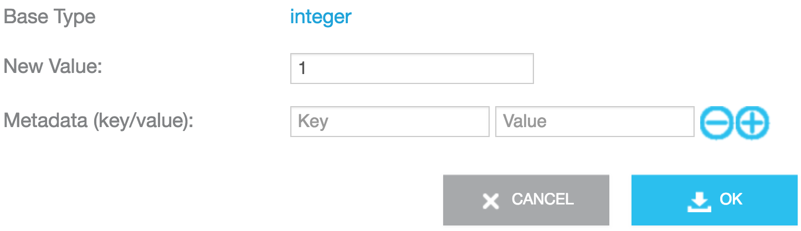

This page shows you how to create node-specific templates, test RPi-to-device communication, add the Grillright node to the Gateway, and test node properties.

### Create an Info Node Template

1. Create a template with the following attributes. See <code>bt_gatt_init_info</code> in [bt_gatt.c](https://github.com/AylaNetworks/device_linux_gw_public/blob/master/app/bt_gatewayd/bt_gatt.c).
<table>
<tr><th>Field</th><th>Value</th></tr>
<tr><td>Visibility</td><td>oem</td></tr>
<tr><td>Name</td><td>BT GW Info</td></tr>
<tr><td>Description</td><td>Info</td></tr>
<tr><td>Registration Type</td><td>None</td></tr>
<tr><td>Model</td><td>linuxevb</td></tr>
<tr><td>Template Key</td><td>info</td></tr>
<tr><td>Version</td><td>\*</td></tr>
<tr><td>Type</td><td>Node</td></tr>
</table>
1. Add the following properties to the template. See <code>bt_gatt_init_info</code> in [bt_gatt.c](https://github.com/AylaNetworks/device_linux_gw_public/blob/master/app/bt_gatewayd/bt_gatt.c).
<table>
<tr><th>Name</th><th>Display Name</th><th>Type</th><th>Direction</th><th>Scope</th></tr>
<tr><td>mfg_name</td><td>mfg_name</td><td>String</td><td>From Device</td><td>user</td></tr>
<tr><td>model_num</td><td>model_num</td><td>String</td><td>From Device</td><td>user</td></tr>
<tr><td>serial_num</td><td>serial_num</td><td>String</td><td>From Device</td><td>user</td></tr>
<tr><td>hw_revision</td><td>hw_revision</td><td>String</td><td>From Device</td><td>user</td></tr>
<tr><td>fw_revision</td><td>fw_revision</td><td>String</td><td>From Device</td><td>user</td></tr>
<tr><td>sw_revision</td><td>sw_revision</td><td>String</td><td>From Device</td><td>user</td></tr>
<tr><td>system_id</td><td>system_id</td><td>String</td><td>From Device</td><td>user</td></tr>
</table>

### Create a Grillright Node Template

1. Create a template with the following attributes. See <code>bt_gatt_init_grillright</code> in [bt_gatt.c](https://github.com/AylaNetworks/device_linux_gw_public/blob/master/app/bt_gatewayd/bt_gatt.c).
<table>
<tr><th>Field</th><th>Value</th></tr>
<tr><td>Visibility</td><td>oem</td></tr>
<tr><td>Name</td><td>BT GW Grillright</td></tr>
<tr><td>Description</td><td>Grillright</td></tr>
<tr><td>Registration Type</td><td>None</td></tr>
<tr><td>Model</td><td>linuxevb</td></tr>
<tr><td>Template Key</td><td>grillrt</td></tr>
<tr><td>Version</td><td>1.2</td></tr>
<tr><td>Type</td><td>Node</td></tr>
</table>
1. Add the following properties to the template. See <code>bt_gatt_init_grillright</code> in [bt_gatt.c](https://github.com/AylaNetworks/device_linux_gw_public/blob/master/app/bt_gatewayd/bt_gatt.c).
<table>
<tr><th>Name</th><th>Display Name</th><th>Type</th><th>Direction</th><th>Scope</th></tr>
<tr><td>ALARM</td><td>ALARM</td><td>Integer</td><td>From Device</td><td>user</td></tr>
<tr><td>COMMAND</td><td>COMMAND</td><td>String</td><td>To Device</td><td>user</td></tr>
<tr><td>CONTROL_MODE</td><td>CONTROL_MODE</td><td>Integer</td><td>From Device</td><td>user</td></tr>
<tr><td>COOKING</td><td>COOKING</td><td>Boolean</td><td>From Device</td><td>user</td></tr>
<tr><td>TIME</td><td>TIME</td><td>String</td><td>From Device</td><td>user</td></tr>
<tr><td>DONENESS</td><td>DONENESS</td><td>Integer</td><td>From Device</td><td>user</td></tr>
<tr><td>MEAT</td><td>MEAT</td><td>Integer</td><td>From Device</td><td>user</td></tr>
<tr><td>PCT_DONE</td><td>PCT_DONE</td><td>Integer</td><td>From Device</td><td>user</td></tr>
<tr><td>TARGET_TEMP</td><td>TARGET_TEMP</td><td>Integer</td><td>From Device</td><td>user</td></tr>
<tr><td>TARGET_TIME</td><td>TARGET_TIME</td><td>String</td><td>From Device</td><td>user</td></tr>
<tr><td>TEMP</td><td>TEMP</td><td>Decimal</td><td>From Device</td><td>user</td></tr>
</table>

### Reset the Grillright

1. Remove the batteries.1. Wait a minute. 1. Reinstall the batteries. 1. Use a paperclip to reset the device.</ol> 

### Test RPi-to-device communication

1. In your RPi Secure Shell, run the following:
<pre>
$ sudo bluetoothctl
# help
Menu main:
Available commands:
advertise                                         Advertise Options Submenu
scan                                              Scan Options Submenu
gatt                                              Generic Attribute Submenu
list                                              List available controllers
show [ctrl]                                       Controller information
select &lt;ctrl&gt;                                     Select default controller
devices                                           List available devices
paired-devices                                    List paired devices
system-alias &lt;name&gt;                               Set controller alias
reset-alias                                       Reset controller alias
power &lt;on/off&gt;                                    Set controller power
pairable &lt;on/off&gt;                                 Set controller pairable mode
discoverable &lt;on/off&gt;                             Set controller discoverable mode
agent &lt;on/off/capability&gt;                         Enable/disable agent with given capability
default-agent                                     Set agent as the default one
advertise &lt;on/off/type&gt;                           Enable/disable advertising with given type
set-alias &lt;alias&gt;                                 Set device alias
scan &lt;on/off&gt;                                     Scan for devices
info [dev]                                        Device information
pair [dev]                                        Pair with device
trust [dev]                                       Trust device
untrust [dev]                                     Untrust device
block [dev]                                       Block device
unblock [dev]                                     Unblock device
remove &lt;dev&gt;                                      Remove device
connect &lt;dev&gt;                                     Connect device
disconnect [dev]                                  Disconnect device
menu &lt;name&gt;                                       Select submenu
version                                           Display version
quit                                              Quit program
exit                                              Quit program
help                                              Display help about this program
</pre>
1. Scan for nearby Bluetooth devices, and verify that the MAC address of your Grillright device is returned.
<pre>
&#x23; agent on
&#x23; default-agent
&#x23; scan on
Discovery started
[CHG] Controller B8:27:EB:80:7B:CC Discovering: yes
[CHG] Device E6:E5:C0:FA:A0:ED RSSI: -49
&#x23; scan off
</pre>

In this case, <code>E6:E5:C0:FA:A0:ED</code> is a Grillright Mac address.

1. Exit the utility.

### Add the Grillright node

1. In your RPi Secure Shell, prepare to monitor your progress by tailing the syslog file:
<pre>
$ sudo tail -f /var/log/syslog
</pre>
1. In the Ayla Developer Portal, click View My Devices. A list of devices appears.1. Click the Serial Number of your gateway. A list of properties appears.

1. Click the Current Value column of the bt_scan_enable property.1. Set New Value to 1, click OK:

The bt_scan_results property value should return the MAC addresses of bluetooth devices near your Raspberry Pi. One of these MAC addresses represents your Grillright. Sometimes, the results display. Often then don't.

If the results do display, they disappear quickly as the bt_scan_results property value updates to an empty array:

1. Identify the MAC address of your Grillright. There are two quick ways to do this: (1) Search for "bd_addr" in syslog, or (2) use the Ayla Dashboard Portal to view the Datapoints for the bt_scan_results property.1. In the Ayla Developer Portal, , click the Current Value column of the bt_connect_id property.1. Set New Value to the discovered MAC address, and click OK.

1. Verify that the num_nodes property value is 1:

1. Click the Candidates tab, verify that the Grillright candidate exists, and click Register:

1. Click the Nodes tab to see the new node on the list.

1. Click the Serial Number to display the Grillright node properties:

Many of the properties appear to be duplicates (e.g. ALARM, CONTROL_MODE). This is not the case. The Grillright has two sensors, and each sensor requires its own set of properties. The property names on the list are Display Names. The actual Name of each property (e.g. <code>00:grillrt:ALARM</code>) is unique.

1. Click one of the ALARM properties to see the actual name:

1. Change the Display Name, and save:

1. Rename the other properties as needed.

### Test node properties

1. In the Ayla Developer Portal, click View My Devices. A list of devices appears.1. Click the DSN of the Grillright node.1. Click the <code>Sensor 1: Temp</code> property, and click Datapoints.1. Connect the probe to the Grillright

1. Put the probe into cold/hot water, and observe the new datapoints.

1. Click the <code>Sensor 1: Control Mode</code> property, and click Datapoints.1. On the Grillright device, touch <code>Set</code>, and then touch <code>+</code> several times to rotate through the control modes.1. Observe the new datapoints.1. Click the <code>Sensor 1: Alarm</code> property, and click Datapoints.1. On the Grillright device, touch <code>Set</code>.1. Touch <code>+</code> until the control mode is <code>Timer</code>.1. Set the timer for a short duration, and start the timer.1. When the timer beeps, observe the new datapoints.

### Startup files

For startup purposes, the gateway keeps track of nodes in two startup files: <code>devd.conf.startup</code> and <code>appd.conf.startup</code>. Both are located in <code>&sim;/ayla/config</code>. A node is composed of one or more subdevices identified by a key (e.g. 00). One or more templates contribute properties to a subdevice. See the diagram.

The <node>device ~ node ~ subdevice ~ template ~ property</node> hierarchy explains property names. Consider <code>00:grillrt:ALARM</code>:

* <code>00</code> is the subdomain name.
* <code>grillrt</code> is the template key name.
* <code>ALARM</code> is the property name as defined in the application.

To inspect the origin of <code>grillrt</code> property names, browse to [bt_gatt.c](https://github.com/AylaNetworks/device_linux_gw_public/blob/master/app/bt_gatewayd/bt_gatt.c), and search for the <code>bt_gatt_init_grillright</code> function:

<pre>
static int bt_gatt_init_grillright(void)
{
  int rc = 0;

  struct bt_gatt_prop_table_entry sensor_props[] = {
    { "ALARM", PROP_INTEGER, PROP_FROM_DEVICE, NULL, bt_gatt_val_send_grillright_alarm },
    { "CONTROL_MODE", PROP_INTEGER, PROP_FROM_DEVICE, NULL, bt_gatt_val_send_grillright_control_mode },
    { "COOKING", PROP_BOOLEAN, PROP_FROM_DEVICE, NULL, bt_gatt_val_send_grillright_cooking },
    { "TIME", PROP_STRING, PROP_FROM_DEVICE, NULL, bt_gatt_val_send_grillright_time },
    { "DONENESS", PROP_INTEGER, PROP_FROM_DEVICE, NULL, bt_gatt_val_send_grillright_doneness },
    { "MEAT", PROP_INTEGER, PROP_FROM_DEVICE, NULL, bt_gatt_val_send_grillright_meat },
    { "PCT_DONE", PROP_INTEGER, PROP_FROM_DEVICE, NULL, bt_gatt_val_send_grillright_pct_done },
    { "TARGET_TEMP", PROP_INTEGER, PROP_FROM_DEVICE, NULL, bt_gatt_val_send_grillright_target_temp },
    { "TARGET_TIME", PROP_STRING, PROP_FROM_DEVICE, NULL, bt_gatt_val_send_grillright_target_time },
    { "TEMP", PROP_DECIMAL, PROP_FROM_DEVICE, NULL, bt_gatt_val_send_grillright_temp }
  };

  rc |= bt_gatt_db_add_template("2899fe00-c277-48a8-91cb-b29ab0f01ac4", "grillrt", "1.2");

  rc |= bt_gatt_db_add_prop("28998e03-c277-48a8-91cb-b29ab0f01ac4", "ctl", "COMMAND", PROP_STRING, PROP_TO_DEVICE, NULL, NULL);
  rc |= bt_gatt_add_prop_table("28998e10-c277-48a8-91cb-b29ab0f01ac4", "00", sensor_props, ARRAY_LEN(sensor_props));
  rc |= bt_gatt_add_prop_table("28998e11-c277-48a8-91cb-b29ab0f01ac4", "01", sensor_props, ARRAY_LEN(sensor_props));
  return rc;
}
</pre>
