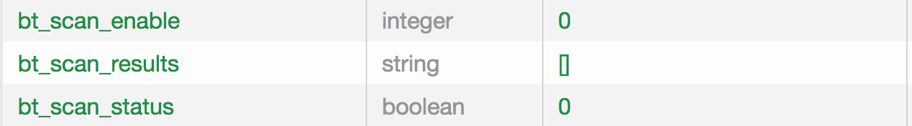

This page shows you how to create a node-specific template, test RPi-to-device communication, add the Magic Blue node to the Gateway, and test node properties.

### Create a Bulb RGB Node Template
<ol>
<li>Create a template with the following attributes. See <code>bt_gatt_init_bulb_rgb</code> in [bt_gatt.c](https://github.com/AylaNetworks/device_linux_gw_public/blob/master/app/bt_gatewayd/bt_gatt.c).
<table class="key-value-table">
<tr><th>Field</th><th>Value</th></tr>
<tr><td>Visibility</td><td>oem</td></tr>
<tr><td>Name</td><td>BT GW Magic Blue</td></tr>
<tr><td>Description</td><td>Magic Blue</td></tr>
<tr><td>Registration Type</td><td>None</td></tr>
<tr><td>Model</td><td>linuxevb</td></tr>
<tr><td>Template Key</td><td>bulb_rgb</td></tr>
<tr><td>Version</td><td>1.5</td></tr>
<tr><td>Type</td><td>Node</td></tr>
</table>
</li>
<li>Add the following properties to the template. See <code>bt_gatt_init_bulb_rgb</code> in [bt_gatt.c](https://github.com/AylaNetworks/device_linux_gw_public/blob/master/app/bt_gatewayd/bt_gatt.c).
<table class="key-value-table">
<tr><th>Name</th><th>Display Name</th><th>Type</th><th>Direction</th><th>Scope</th></tr>
<tr><td>mode</td><td>mode</td><td>Integer</td><td>To Device</td><td>user</td></tr>
<tr><td>onoff</td><td>onoff</td><td>Boolean</td><td>To Device</td><td>user</td></tr>
<tr><td>rgb</td><td>rgb</td><td>Integer</td><td>To Device</td><td>user</td></tr>
<tr><td>white</td><td>white</td><td>Integer</td><td>To Device</td><td>user</td></tr>
<tr><td>fade</td><td>fade</td><td>Integer</td><td>To Device</td><td>user</td></tr>
<tr><td>fade_rate</td><td>fade_rate</td><td>Integer</td><td>To Device</td><td>user</td></tr>
</table>
</li>
</ol>

### Turn on the bulb

Verify that the bulb is screwed into a lamp socket, and that the lamp is turned on.

### Test RPi-to-device communication

<ol>
<li>In your RPi Secure Shell, run the following:
<pre class="light">
$ sudo bluetoothctl
# help
Menu main:
Available commands:
-------------------
advertise                                         Advertise Options Submenu
scan                                              Scan Options Submenu
gatt                                              Generic Attribute Submenu
list                                              List available controllers
show [ctrl]                                       Controller information
select &lt;ctrl&gt;                                     Select default controller
devices                                           List available devices
paired-devices                                    List paired devices
system-alias &lt;name&gt;                               Set controller alias
reset-alias                                       Reset controller alias
power &lt;on/off&gt;                                    Set controller power
pairable &lt;on/off&gt;                                 Set controller pairable mode
discoverable &lt;on/off&gt;                             Set controller discoverable mode
agent &lt;on/off/capability&gt;                         Enable/disable agent with given capability
default-agent                                     Set agent as the default one
advertise &lt;on/off/type&gt;                           Enable/disable advertising with given type
set-alias &lt;alias&gt;                                 Set device alias
scan &lt;on/off&gt;                                     Scan for devices
info [dev]                                        Device information
pair [dev]                                        Pair with device
trust [dev]                                       Trust device
untrust [dev]                                     Untrust device
block [dev]                                       Block device
unblock [dev]                                     Unblock device
remove &lt;dev&gt;                                      Remove device
connect &lt;dev&gt;                                     Connect device
disconnect [dev]                                  Disconnect device
menu &lt;name&gt;                                       Select submenu
version                                           Display version
quit                                              Quit program
exit                                              Quit program
help                                              Display help about this program
</pre>
</li>
<li>Scan for nearby Bluetooth devices, and verify that the MAC address of your Magic Blue device is returned.
<pre class="light">
# agent on
# default-agent
# scan on
Discovery started
[CHG] Controller B8:27:EB:80:7B:CC Discovering: yes
[NEW] Device F8:1D:78:63:37:36 LEDBLE-78633736
[CHG] Device E6:E5:C0:FA:A0:ED RSSI: -42
# scan off
</pre>

In this case, <code>F8:1D:78:63:37:36</code> is a Magic Blue Mac address.

</li>
<li>Exit the utility.</li>
</ol>

### Add the Magic Blue node

<ol>
<li>In your RPi Secure Shell, prepare to monitor your progress by tailing the syslog file:
<pre class="light">
$ sudo tail -f /var/log/syslog
</pre>
</li>
<li>In the Ayla Developer Portal, click View My Devices. A list of devices appears.</li>
<li>Click the Serial Number of your gateway. A list of properties appears.

</li>
<li>Click the Current Value column of the bt_scan_enable property.</li>
<li>Set New Value to 1, click OK:

The bt_scan_results property value should return the MAC addresses of bluetooth devices near your Raspberry Pi. One of these MAC addresses represents your Magic Blue bulb. Sometimes, the results display. Often then don't.

If the results do display, they disappear quickly as the bt_scan_results property value updates to an empty array:

</li>
<li>Identify the MAC address of your Magic Blue bulb. There are two quick ways to do this: (1) Search for "bd_addr" in syslog, or (2) use the Ayla Dashboard Portal to view the Datapoints for the bt_scan_results property.</li>
<li>In the Ayla Developer Portal, , click the Current Value column of the bt_connect_id property.</li>
<li>Set New Value to the discovered MAC address, and click OK.

</li>
<li>Verify that the num_nodes property value is 1:

</li>
<li>Click the Candidates tab, verify that the Magic Blue candidate exists, and click Register:

</li>
<li>Click the Nodes tab to see the new node on the list.

</li>
<li>Click the Serial Number to display the Magic Blue node properties:

Note that although the digital twin Display Names are the same as the Display Names specified in the templates, the actual property names have been modified to specify the subdevice and template (e.g. <code>00:bulb_rgb:onoff</code>).

</li>
</ol>

### Test node properties

<ol>
<li>In the Ayla Developer Portal, click View My Devices. A list of devices appears.</li>
<li>Click the DSN of the Magic Blue node.</li>
<li>Click the <code>onoff</code> property, change the value to 1, and click OK. The bulb should go on.</li>
<li>Click the <code>mode</code> property, change the value to 3, and click OK. For definitions, see <code>bt_gatt_bulb_mode</code> in [bt_gatt.c](https://github.com/AylaNetworks/device_linux_gw_public/blob/master/app/bt_gatewayd/bt_gatt.c).</li>
<li>Click the <code>fade</code> property, change the value to 3, and click OK. For definitions, see <code>bt_gatt_bulb_fade</code> in [bt_gatt.c](https://github.com/AylaNetworks/device_linux_gw_public/blob/master/app/bt_gatewayd/bt_gatt.c).</li>
<li>Click the <code>fade_rate</code> property, change the value to 80, and click OK. For ranges, see <code>Magic blue bulb value range</code> in [bt_gatt.c](https://github.com/AylaNetworks/device_linux_gw_public/blob/master/app/bt_gatewayd/bt_gatt.c).</li>
</ol>

### Startup files

For startup purposes, the gateway keeps track of nodes in two startup files: <code>devd.conf.startup</code> and <code>appd.conf.startup</code>. Both are located in <code>&sim;/ayla/config</code>. A node is composed of one or more subdevices identified by a key (e.g. 00). One or more templates contribute properties to a subdevice. See the diagram.

The <node>device ~ node ~ subdevice ~ template ~ property</node> hierarchy explains property names. Consider <code>00:bulb_rgb:onoff</code>:

* <code>00</code> is the subdomain name.
* <code>bulb_rgb</code> is the template key name.
* <code>onoff</code> is the property name as defined in the application.

To inspect the origin of <code>bulb_rgb</code> property names, browse to [bt_gatt.c](https://github.com/AylaNetworks/device_linux_gw_public/blob/master/app/bt_gatewayd/bt_gatt.c), and search for the <code>bt_gatt_init_bulb_rgb</code> function:

<pre>
static int bt_gatt_init_bulb_rgb(void)
{
  int rc = 0;
  const char *subdevice = NULL;

  rc |= bt_gatt_db_add_template("ffe5", BT_GATT_BULB_TEMPLATE, "1.5");
  rc |= bt_gatt_db_add_prop("ffe9", subdevice, "mode", PROP_INTEGER, PROP_TO_DEVICE, bt_gatt_val_set_bulb_mode, NULL);
  rc |= bt_gatt_db_add_prop("ffe9", subdevice, "onoff", PROP_BOOLEAN, PROP_TO_DEVICE, bt_gatt_val_set_bulb_onoff, NULL);
  rc |= bt_gatt_db_add_prop("ffe9", subdevice, "rgb", PROP_INTEGER, PROP_TO_DEVICE, bt_gatt_val_set_bulb_rgb, NULL);
  rc |= bt_gatt_db_add_prop("ffe9", subdevice, "white", PROP_INTEGER, PROP_TO_DEVICE, bt_gatt_val_set_bulb_white, NULL);
  rc |= bt_gatt_db_add_prop("ffe9", subdevice, "fade", PROP_INTEGER, PROP_TO_DEVICE, bt_gatt_val_set_bulb_fade, NULL);
  rc |= bt_gatt_db_add_prop("ffe9", subdevice, "fade_rate", PROP_INTEGER, PROP_TO_DEVICE, bt_gatt_val_set_bulb_fade_rate, NULL);
  return rc;
}
</pre>

