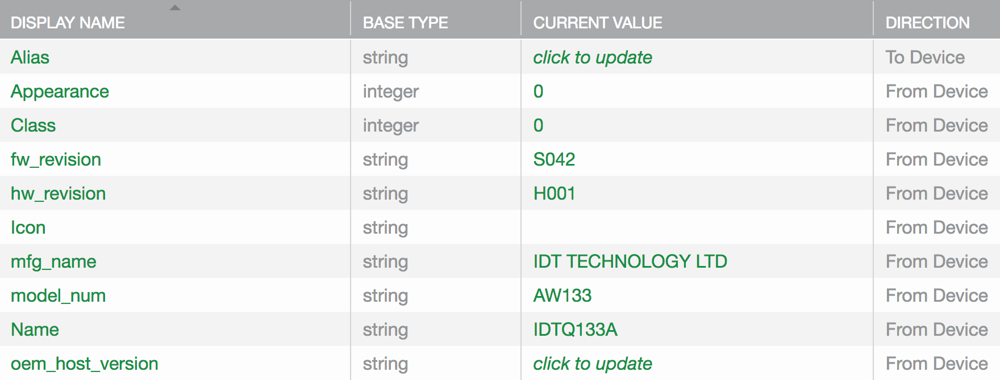

For the <code>BT GW 1</code> device, do the following:

<ol>
<li>Set Scan Enable to 1.
<ol>
<li>Scan Status returns 1.</li>
<li>Scan Result returns the following:
<pre class="light">
[
  {
    "device":
    {
      "bd_addr":"E6:E5:C0:FA:A0:ED",
      "rssi":"-53","name":"IDTQ133A",
      "type":"Grillright"
    }
  }
]
</pre>
</li>
<li>Scan Status returns 0.</li>
<li>Scan Result returns <code>[]</code>.</li>
</ol>
<li>Set Connect Id to E6:E5:C0:FA:A0:ED.
<ol>
<li>Connect Id returns <code></code>.</li>
<li>Scan Result returns <code>[]</code>.</li>
<li>Connect Result returns the following:
<pre class="light">
{
  "bd_addr":"E6:E5:C0:FA:A0:ED",
  "status_code":0,
  "status_detail":"connected"
}
</pre>
</li>
<li>Number of Nodes returns 1.</li>
<li>Connect Result returns the following:
<pre class="light">
{
  "bd_addr":"E6:E5:C0:FA:A0:ED",
  "status_code":1,
  "status_detail":"added"
}
</pre>
</li>
<li>Connect Result returns the following:
<pre class="light">
{
  "bd_addr":"E6:E5:C0:FA:A0:ED",
  "status_code":2,
  "status_detail":"updated"
}
</pre>
</li>
</ol>
</ol>

Below are the properties created during registration. Display names are the same as the names.  

Five properties, Alias, Appearance, Class, Icon, and Name, come from the BT GW Generic template. Four properties, fw_revision, hw_revision, mfg_name, and model_num come from the BT GW Info template. One property, oem_host_version, is created by Ayla for all digital twins. All BT GW Generic properties are present. BT GW Info properties not present are serial_num, sw_revision, and system_id. Ayla is not yet associating the GW with the grillrt template.

Here are the property names before and after registration:

<table class="key-value-table">
<tr><th>Before</th><th>After</th><th>characteristic_uuid</th></tr>
<tr><td>Alias</td><td>dev:generic:Alias</td><td></td></tr>
<tr><td>Appearance</td><td>dev:generic:Appearance</td><td></td></tr>
<tr><td>Class</td><td>dev:generic:Class</td><td></td></tr>
<tr><td>fw_revision</td><td>dev:info:fw_revision</td><td>2a26</td></tr>
<tr><td>hw_revision</td><td>dev:info:hw_revision</td><td>2a27</td></tr>
<tr><td>Icon</td><td>dev:generic:Icon</td><td></td></tr>
<tr><td>mfg_name</td><td>dev:info:mfg_name</td><td>2a29</td></tr>
<tr><td>model_num</td><td>dev:info:model_num</td><td>2a24</td></tr>
<tr><td>Name</td><td>dev:generic:Name</td><td></td></tr>
<tr><td>oem_host_version</td><td>oem_host_version</td><td></td></tr>
</table>

Here is the appd.conf.startup file at this point:

<pre>
{
    "config": {
        "nodes": [
            {
                "address": "E6:E5:C0:FA:A0:ED",
                "version": "",
                "oem_model": "Grillright",
                "interface": 3,
                "power": 0,
                "management_state": "READY",
                "subdevices": [
                    {
                        "key": "01",
                        "templates": [
                            {
                                "key": "grillrt",
                                "version": "1.2",
                                "properties": [
                                    {
                                        "name": "ALARM",
                                        "type": 2,
                                        "from-device": true
                                    },
                                    {
                                        "name": "CONTROL_MODE",
                                        "type": 2,
                                        "from-device": true
                                    },
                                    {
                                        "name": "COOKING",
                                        "type": 15,
                                        "from-device": true
                                    },
                                    {
                                        "name": "TIME",
                                        "type": 5,
                                        "from-device": true
                                    },
                                    {
                                        "name": "DONENESS",
                                        "type": 2,
                                        "from-device": true
                                    },
                                    {
                                        "name": "MEAT",
                                        "type": 2,
                                        "from-device": true
                                    },
                                    {
                                        "name": "PCT_DONE",
                                        "type": 2,
                                        "from-device": true
                                    },
                                    {
                                        "name": "TARGET_TEMP",
                                        "type": 2,
                                        "from-device": true
                                    },
                                    {
                                        "name": "TARGET_TIME",
                                        "type": 5,
                                        "from-device": true
                                    },
                                    {
                                        "name": "TEMP",
                                        "type": 11,
                                        "from-device": true
                                    }
                                ]
                            }
                        ]
                    },
                    {
                        "key": "00",
                        "templates": [
                            {
                                "key": "grillrt",
                                "version": "1.2",
                                "properties": [
                                    {
                                        "name": "ALARM",
                                        "type": 2,
                                        "from-device": true
                                    },
                                    {
                                        "name": "CONTROL_MODE",
                                        "type": 2,
                                        "from-device": true
                                    },
                                    {
                                        "name": "COOKING",
                                        "type": 15,
                                        "from-device": true
                                    },
                                    {
                                        "name": "TIME",
                                        "type": 5,
                                        "from-device": true
                                    },
                                    {
                                        "name": "DONENESS",
                                        "type": 2,
                                        "from-device": true
                                    },
                                    {
                                        "name": "MEAT",
                                        "type": 2,
                                        "from-device": true
                                    },
                                    {
                                        "name": "PCT_DONE",
                                        "type": 2,
                                        "from-device": true
                                    },
                                    {
                                        "name": "TARGET_TEMP",
                                        "type": 2,
                                        "from-device": true
                                    },
                                    {
                                        "name": "TARGET_TIME",
                                        "type": 5,
                                        "from-device": true
                                    },
                                    {
                                        "name": "TEMP",
                                        "type": 11,
                                        "from-device": true
                                    }
                                ]
                            }
                        ]
                    },
                    {
                        "key": "ctl",
                        "templates": [
                            {
                                "key": "grillrt",
                                "version": "1.2",
                                "properties": [
                                    {
                                        "name": "COMMAND",
                                        "type": 5,
                                        "from-device": false
                                    }
                                ]
                            }
                        ]
                    },
                    {
                        "key": "dev",
                        "templates": [
                            {
                                "key": "info",
                                "properties": [
                                    {
                                        "name": "mfg_name",
                                        "type": 5,
                                        "from-device": true
                                    },
                                    {
                                        "name": "fw_revision",
                                        "type": 5,
                                        "from-device": true
                                    },
                                    {
                                        "name": "hw_revision",
                                        "type": 5,
                                        "from-device": true
                                    },
                                    {
                                        "name": "model_num",
                                        "type": 5,
                                        "from-device": true
                                    }
                                ]
                            },
                            {
                                "key": "generic",
                                "properties": [
                                    {
                                        "name": "Alias",
                                        "type": 5,
                                        "from-device": false
                                    },
                                    {
                                        "name": "Appearance",
                                        "type": 2,
                                        "from-device": true
                                    },
                                    {
                                        "name": "Class",
                                        "type": 2,
                                        "from-device": true
                                    },
                                    {
                                        "name": "Icon",
                                        "type": 5,
                                        "from-device": true
                                    },
                                    {
                                        "name": "Name",
                                        "type": 5,
                                        "from-device": true
                                    }
                                ]
                            }
                        ]
                    }
                ]
            }
        ]
    }
}
</pre>
