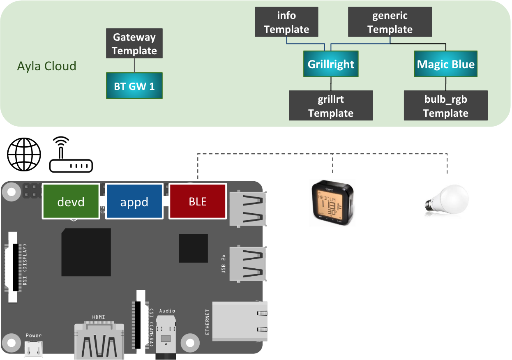

The Bluetooth Gateway connects BLE devices to the Ayla Cloud:

1. In the diagram, the Raspberry Pi represents any Linux-based platform.
1. devd is the Ayla Dynamic Gateway Agent. It communicates with the Ayla Cloud via Wi-Fi or Ethernet.
1. appd is the Bluetooth Gateway (bt_gatewayd).
1. By default, devd controls appd: When you start/stop devd, it starts/stops appd.
1. The black shapes in the Ayla Cloud represent templates which consist of attributes, properties, etc. 
1. You create these templates using the Developer Portal.
1. The gradient blue shapes are digital twins which inherit properties from templates. They model devices.
1. bt_gatewayd supports the following devices out-of-the-box:
  1. [MovingTech 4.5W LED Bluetooth Bulb](https://www.amazon.com/gp/product/B01A5JX7BO)
  1. [Oregon Scientific AW133 Grill Right Bluetooth BBQ Thermometer](https://www.amazon.com/Oregon-Scientific-AW133-Bluetooth-%20Thermometer/dp/B00JFSW0AQ)
  1. [Nordic Semiconductor Multiprotocol Bluetooth LE Proprietary System-on-Chip](https://www.digikey.com/product-detail/en/nordic-semiconductor-asa/NRF52-%20DK/1490-1053-ND/5773879)
