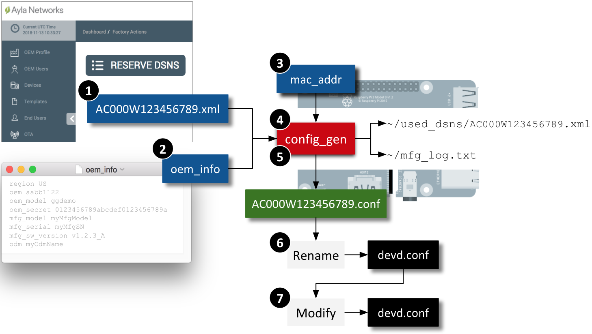

This page shows you how to create dsn.xml and oem_info files, determine the mac address of your RPi, and build & run the config_gen utility to produce a devd.conf file required by ayla_install.sh to install the Ayla Dynamic Gateway Package on your RPi. See the diagram.



### Create a dsn.xml file

1. Browse to the [Ayla Dashboard Portal](https://docs.aylanetworks.com/cloud/ayla-dashboard-portal/).
1. Click Factory Actions in the sidebar.
1. Click the Reserve DSNs button.
1. For Model, select ```AY001MRT1-Linux Software Agent```. 
1. In the textbox on the right, select 1.
1. Click Submit.
1. Download the XML file to your computer.
1. Secure Copy the XML file to your RPi:
<pre class="light">
$ scp AC000W123456789.xml pi@192.168.1.3:
</pre>

### Create on oem_info file

1. On your computer, create a text file called ```oem_info```.
1. Copy and paste the content below. Each line is a space-delimited, key:value pair with no quotes.
<pre class="light">
region myRegion
oem myOemId
oem_model myOemModel
oem_secret myOemSecret
mfg_model myMfgModel
mfg_serial myMfgSN
mfg_sw_version v1.2.3_A
odm myOdmName
</pre>
1. Replace ```myRegion``` with US, EU, or CN.
1. Replace ```myOemId``` with your oem id (see Ayla Dashboard Portal &gt; OEM Profile &gt; OEM ID).
<li>Replace ```myOemModel``` with the appropriate oem_model from the table:
<table class="key-value-table">
<tr><th>Application Name</th><th>Short Name</th><th>oem_model</th></tr>
<tr><td>Simulator Example</td><td>gatewayd</td><td>ggdemo</td></tr>
<tr><td>Bluetooth Example</td><td>bt_gatewayd</td><td>linuxevb</td></tr>
<tr><td>Zigbee Example</td><td>zp_gatewayd</td><td>linuxevb</td></tr>
<tr><td>Multiprotocol Example</td><td>multi_gatewayd</td><td>linuxevb</td></tr>
<tr><td>Device Example</td><td>appd</td><td>linuxevb</td></tr>
</table>
</li>
1. Replace ```myOemSecret``` with your oem secret (see Ayla Dashboard Portal &gt; OEM Profile &gt; OEM Secret)
1. Leave the other values alone, and save. Here is an example:
<pre class="light">
region US
oem aabb1122
oem_model ggdemo
oem_secret 0123456789abcdef0123456789abcdef
mfg_model myMfgModel
mfg_serial myMfgSN
mfg_sw_version v1.2.3_A
odm myOdmName
</pre>
1. Secure Copy the file to your RPi:
<pre class="light">
$ scp oem_info pi@192.168.1.3:
</pre>

### Determine your RPi Mac Address

Secure Shell (ssh) to your RPi, and run ```ip address``` or ```ifconfig```. If the RPi is connected to the internet via Ethernet, use the resulting ```eth0``` values. If via Wi-Fi, use the ```wlan0``` values. Find the term ```ether```. The Mac Address follows. (e.g. b4:11:ab:4c:e2:20). Remove the delimiting colons (e.g. b411ab4ce220). Use the colon-less value below as input to config_gen.

### Make the config_gen utility

1. On your RPi, change directory to your Ayla source directory:
<pre class="light">
$ cd &sim;/device_linux_gw_public
</pre>
1. Build config_gen. 
<pre class="light">
$ sudo make host_utils
</pre>
The newly built utility is in ```~/device_linux_gw_public/build/native/utils```.

### Create the devd.conf file

<ol>
<li>From ```/home/pi```, run ```config_gen```:
<pre class="light">
$ ./device_linux_gw_public/build/native/utils/config_gen -d ~/AC000W123456789.xml -i ~/oem_info -m b411ab4ce220
</pre></li>
<li>Rename the resulting ```AC000W123456789.conf``` file to ```devd.conf```, and leave it in ```/home/pi```.</li>
<li>Open ```devd.conf```. It should resemble this:
<pre class="light">
{
  "config": {
    "sys": {
      "factory": 1
    },
    "id": {
      "dsn": "AC000W123456789",
      "rsa_pub_key": "-----BEGIN RSA PUBLIC KEY-----\nMIIB...
    },
    "client": {
      "region": "US"
    },
    "oem": {
      "oem": "aabb1122",
      "model": "ggdemo",
      "key": "UT9...
    }
  }
}
</pre>
</li>
<li>Add ```,"server": {"default": 1}``` to the ```client``` section as indicated in red below, and save. Don't forget the initial comma. This addition is important for initial prototyping, and can be removed later, after the OEM model is enabled on the platform.
<pre class="light">
{
  "config": {
    "sys": {
      "factory": 1
    },
    "id": {
      "dsn": "AC000W123456789",
      "rsa_pub_key": "-----BEGIN RSA PUBLIC KEY-----\nMIIB...
    },
    "client": {
      "region": "US"<span style="color:red;">,
      "server": {
          "default": 1
      }</span>
    },
    "oem": {
      "oem": "0aaa111e",
      "model": "linuxevb",
      "key": "UT9...
    }
  }
}
</pre>
</li>
</ol>
