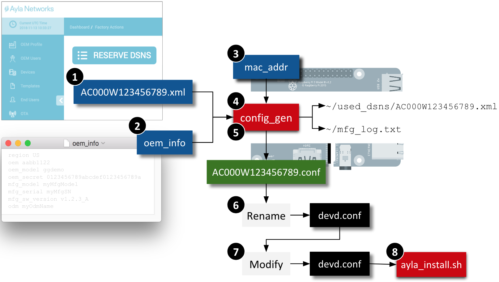

This page shows you how to generate a devd.conf file required (as input) by the ayla_install.sh script. The purpose of the devd.conf file is described near the bottom of this page.

### Overview

Here are the steps required to create a devd.conf file. See the other headings below for details.

1. Reserve a DSN in the Ayla Dashboard Portal to represent your gateway, and download a dsn.xml file.
1. Create an oem_info file to define region, oem id, oem model, and oem secret.
1. Determine the Mac Address of your RPi interface.
1. Make the Ayla config_gen utility.
1. Run config_gen to generate a configuration file, save the xml file, and update the mfg_log.txt file.
1. Rename the configuration file to devd.conf.
1. Add additional JSON to devd.conf.
1. Feed devd.conf to ayla_install.sh.

### Create a dsn.xml file

1. Browse to the [Ayla Dashboard Portal](https://docs.aylanetworks.com/cloud/ayla-dashboard-portal/).
1. Click Factory Actions in the sidebar.
1. Click the Reserve DSNs button.
1. For Model, select <code>AY001MRT1-Linux Software Agent</code>.
1. In the textbox on the right, select 1.
1. Click Submit.
1. Download the archive file to your computer.
1. Unzip the archive file to extract the XML file.
1. Secure Copy the XML file to <code>/home/pi</code> on your RPi:
<pre>
$ scp AC000W123456789.xml pi@192.168.1.3:
</pre>

### Create on oem_info file

1. On your computer, create a text file called <code>oem_info</code>.
1. Copy and paste the content below. Each line is a space-delimited, key:value pair with no quotes.
<pre>
region myRegion
oem myOemId
oem_model myOemModel
oem_secret myOemSecret
mfg_model myMfgModel
mfg_serial myMfgSN
mfg_sw_version v1.2.3_A
odm myOdmName
</pre>
1. Replace <code>myRegion</code> with US, EU, or CN.
1. Replace <code>myOemId</code> with your oem id (see Ayla Dashboard Portal &gt; OEM Profile &gt; OEM ID).
1. Replace <code>myOemModel</code> with the appropriate oem_model from the table:
<table>
<tr><th>Application Name</th><th>Short Name</th><th>oem_model</th></tr>
<tr><td>Simulator Example</td><td>gatewayd</td><td>ggdemo</td></tr>
<tr><td>Bluetooth Example</td><td>bt_gatewayd</td><td>linuxevb</td></tr>
<tr><td>Zigbee Example</td><td>zp_gatewayd</td><td>linuxevb</td></tr>
<tr><td>Multiprotocol Example</td><td>multi_gatewayd</td><td>linuxevb</td></tr>
<tr><td>Device Example</td><td>appd</td><td>linuxevb</td></tr>
</table>

1. Replace <code>myOemSecret</code> with your oem secret (see Ayla Dashboard Portal &gt; OEM Profile &gt; OEM Secret)
1. Leave the other values alone, and save. Here is an example:
<pre>
region US
oem aabb1122
oem_model ggdemo
oem_secret 0123456789abcdef0123456789abcdef
mfg_model myMfgModel
mfg_serial myMfgSN
mfg_sw_version v1.2.3_A
odm myOdmName
</pre>
1. Secure Copy the file to <code>/home/pi</code> on your RPi:
<pre>
$ scp oem_info pi@192.168.1.3:
</pre>

### Determine your RPi Mac Address

Secure Shell (ssh) to your RPi, and run <code>ip address</code> or <code>ifconfig</code>. If the RPi is connected to the internet via Ethernet, use the resulting <code>eth0</code> values. If via Wi-Fi, use the <code>wlan0</code> values. Find the term <code>ether</code>. The Mac Address follows. (e.g. b4:11:ab:4c:e2:20). Remove the delimiting colons (e.g. b411ab4ce220). Use the colon-less value below as input to config_gen.

### Make the config_gen utility

1. On your RPi, change directory to your Ayla source directory:
<pre>
$ cd &#126;/device_linux_gw_public
</pre>
1. Build config_gen. 
<pre>
$ sudo make host_utils
</pre>
The newly built utility is in <code>&#126;/device_linux_gw_public/build/native/utils</code>.

### Run config_gen to generate devd.conf

<ol>
<li>From <code>/home/pi</code>, run config_gen to view command-line options:
<pre>
$ ./device_linux_gw_public/build/native/utils/config_gen
Usage: config_gen -d <dsn_path> -i <oem_info_file> [OPTIONS]
  REQUIRED:
    -d <dsn_path>           Path to DSN .xml file from AFS
    -i <oem_info_file>      Path to file with OEM info (see ex.)
  OPTIONS:
    -n                      Omit mfg log file generation
    -m <MAC_address>        Device MAC addr (omit when using -n)
    -o <output_dir>         Directory to create for output files
    -v <verbosity>          0 = silent, 1 = default, 2 = verbose
  Examples:
    config_gen -d dsns/AC000W000123456.xml -i ./oem_info -m 112233445566 -o ./ayla_config -v 2
    config_gen -n -d dsns/AC000W000123457.xml -i ./oem_info
</pre>
</li>
<li>Run config_gen:
<pre>
$ ./device_linux_gw_public/build/native/utils/config_gen -d ./AC000W123456789.xml -i ./oem_info -m b411ab4ce220
</pre>
</li>
<li>Rename the resulting <code>AC000W123456789.conf</code> file to <code>devd.conf</code>, and leave it in <code>/home/pi</code>.</li>
<li>Open <code>devd.conf</code>. It should resemble this:
<pre>
{
  "config": {
    "sys": {
      "factory": 1
    },
    "id": {
      "dsn": "AC000W123456789",
      "rsa_pub_key": "-----BEGIN RSA PUBLIC KEY-----\nMIIB...
    },
    "client": {
      "region": "US"
    },
    "oem": {
      "oem": "aabb1122",
      "model": "ggdemo",
      "key": "UT9...
    }
  }
}
</pre>
</li>
<li>Add <code>,"server": {"default": 1}</code> to the <code>client</code> section as indicated in red below, and save. Don't forget the initial comma. This addition is important for initial prototyping, but must be removed when the gateway is deployed on your production platform.
<pre>
{
  "config": {
    "sys": {
      "factory": 1
    },
    "id": {
      "dsn": "AC000W123456789",
      "rsa_pub_key": "-----BEGIN RSA PUBLIC KEY-----\nMIIB...
    },
    "client": {
      "region": "US",
      "server": {
          "default": 1
      }
    },
    "oem": {
      "oem": "0aaa111e",
      "model": "linuxevb",
      "key": "UT9...
    }
  }
}
</pre>
</li>
</ol>

### Purpose of devd.conf

1. Provides your gateway with a device serial number (1) unique within the Ayla Cloud, and (2) tied to your RPi Mac Address.
1. Assigns your gateway to a regional instance of the Ayla Cloud, and to a particular OEM account.
1. Defines the template that the Ayla Cloud uses to instantiate the Digital Twin corresponding to your gateway.
1. Provides a baseline for the <code>&#126;/ayla/config/devd.conf.startup</code> file. See [Startup Files](../../reference/startup-files).

### What to do next

Click [Simulator Example](../../simulator-example) in the sidebar. The Simulator Gateway is a great way to learn how to create gateway and node templates.
