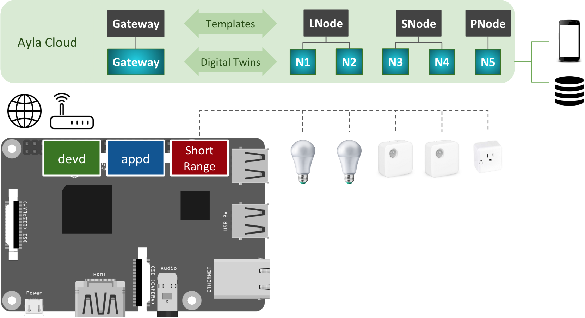

The following diagram presents the essential elements of the Ayla Dynamic Gateway Platform for Linux.

1. In the diagram, the Raspberry Pi represents the Linux-based platform.
1. devd is the Ayla Dynamic Gateway Agent. It communicates with the Ayla Cloud via Wi-Fi or Ethernet.
1. appd is the host app that you write. Ayla provides five examples to help you get started.
1. One of the examples is actually named appd which is a point of confusion because each is renamed appd at compile time:
  1. gatewayd is a simulator gateway app. It resembles the other gateway apps, but requires no hardware.
  1. bt_gatewayd is a gateway app for Bluetooth devices. 
  1. zb_gatewayd is a gateway app for Zigbee devices.
  1. multi_gatewayd is a gateway app for many short-distance protocols.
  1. appd is not a gateway. It is a device app for controlling electronics connected directly to the RPi.
1. You build and run one of these examples at a time.
1. By default, devd controls appd: When you start/stop devd, it starts/stops appd.
1. WPAN represents the interface to a specific short-range wireless protocol (e.g. Bluetooth, Zigbee).
1. The lightbulbs, sensors, and smart plug represent devices with short-distance wireless capability.
1. The black shapes in the Ayla Cloud represent templates which consist of attributes, properties, etc. 
  1. The black rectangle is a gateway (GW) template. Its properties enable node control and gateway diagnostics.
  1. The black circle is a lightbulb node (N) template. Its properties deal with the control and state of a lightblub.
  1. The black stadium square is a sensor node (N) template with relevant properties.
  1. The black diamond is a smart plug node (N) template.
1. You can create templates using the Developer Portal.
1. The gradient blue shapes are digital twins which inherit properties from templates. They model devices.
1. The mobile device interacts with a digital twin to query and control the corresponding device.
1. The database icon represents an external business system that collects, aggregates, and analyzes device data.
