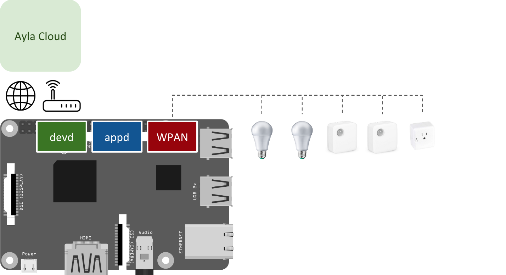

The Gateway Agent (devd) connects a gateway application (appd) and its managed devices to the Ayla Cloud by providing connectivity, security, and other services. See the diagram below. 

The [Ayla Dynamic Gateway Agent](./) Developer Topic you are reading now shows you how to create your own gateway application (appd) based on one of five examples depending on your goals. The Gateway Agent and the example applications are part of the [Ayla Dynamic Gateway Platform for Linux](https://github.com/AylaNetworks/device_linux_gw_public).

To get started, read the [Overview](overview).