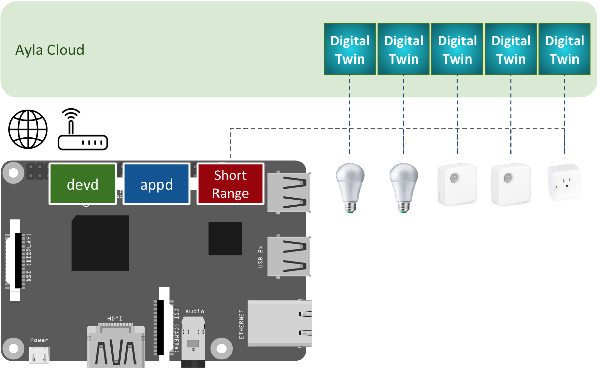

Composed of an Ayla agent (devd) and a host application (appd), an Ayla Gateway connects devices with short-range capabilities (e.g. Bluetooth, Zigbee) to the Ayla Cloud where they are modeled and managed. See the diagram below. The Ayla Agent provides connectivity, security, and other services. Your host application manages the devices, and interfaces with the agent. The best way to create your own application is to customize one of the examples in the sidebar. To begin, click [Getting Started](getting-started).

