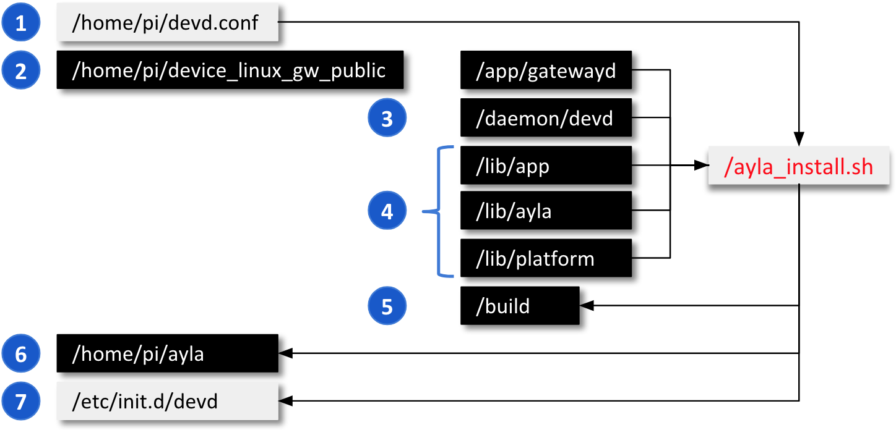
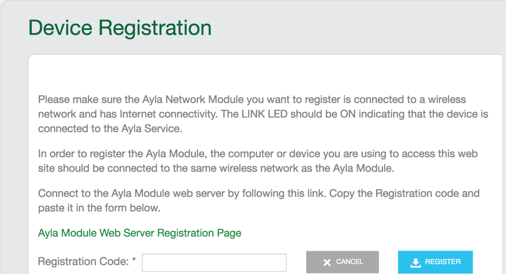

This page shows you how to build and install all gateway components including your simulator gateway, and how to register your gateway.

### Review ayla_install.sh output

<a data-toggle="collapse" href="#preview-output">Click this link</a> to preview sample output from ayla_install.sh.

<pre class="collapse" id="preview-output">
$ sudo ./ayla_install.sh -a gatewayd -n

****************************************
 Configuration
****************************************
** script mode:          CLEAN INSTALL
** package:              https://github.com/AylaNetworks/device_linux_public.git
** config location:      /home/pi
** required config:      devd.conf
** application:          gatewayd
** Wi-Fi support:        NO
** config directory:     /home/pi/ayla/config
** install directory:    /home/pi/ayla

****************************************
 Checking ayla_install.sh prerequisits...
****************************************
** running as root
** Internet connection UP

****************************************
 Creating directories...
****************************************
** creating directory: /tmp/ayla_install.L0Ho
** creating directory: /home/pi/device_linux_gw_public
** creating directory: /home/pi/ayla/config
** creating directory: /home/pi/ayla

****************************************
 Generating config files...
****************************************
** saving ayla_install.sh options file: /home/pi/ayla/ayla_install.opts

****************************************
 Installing required packages...
****************************************
** updating package manager
Hit:1 http://archive.raspberrypi.org/debian stretch InRelease
Hit:2 http://raspbian.raspberrypi.org/raspbian stretch InRelease
Reading package lists...
Reading package lists...
Building dependency tree...
Reading state information...
Calculating upgrade...
The following packages have been kept back:
  chromium-browser nodejs nodered rpi-chromium-mods sense-emu-tools
0 upgraded, 0 newly installed, 0 to remove and 5 not upgraded.
** installing package: libssl1.0-dev
Reading package lists...
Building dependency tree...
Reading state information...
libssl1.0-dev is already the newest version (1.0.2l-2+deb9u3).
0 upgraded, 0 newly installed, 0 to remove and 5 not upgraded.
** installing package: lighttpd
Reading package lists...
Building dependency tree...
Reading state information...
lighttpd is already the newest version (1.4.45-1).
0 upgraded, 0 newly installed, 0 to remove and 5 not upgraded.
** installing package: libcurl4-openssl-dev
Reading package lists...
Building dependency tree...
Reading state information...
libcurl4-openssl-dev is already the newest version (7.52.1-5+deb9u8).
0 upgraded, 0 newly installed, 0 to remove and 5 not upgraded.
** installing package: libjansson-dev
Reading package lists...
Building dependency tree...
Reading state information...
libjansson-dev is already the newest version (2.9-1).
0 upgraded, 0 newly installed, 0 to remove and 5 not upgraded.

****************************************
 Building and installing Ayla modules...
****************************************
** YOU MAY HAVE TO TYPE IN YOUR GITHUB CREDENTIALS
** pulling existing GIT repository: https://github.com/AylaNetworks/device_linux_public.git to /home/pi/device_linux_gw_public
Username for 'https://github.com': matt@aylanetworks.com
Password for 'https://matt@aylanetworks.com@github.com': 
** compiling Ayla source at /home/pi/device_linux_gw_public
rm -rf build
make -s TARGET=install all
CC ../../ext/hashmap/src/hashmap.c
CC amsg.c
CC amsg_protocol.c
CC assert.c
CC async.c
CC base64.c
CC buffer.c
CC clock_utils.c
CC cmd_handle.c
CC conf_io.c
CC conf_rom.c
CC crc8.c
CC crc16.c
CC crc32.c
CC crypto.c
CC endian.c
CC file_io.c
CC file_event.c
CC filesystem_monitor.c
CC hex.c
CC http.c
CC http_client.c
CC json_interface.c
CC json_parser.c
CC lan_ota.c
CC log.c
CC lookup_by_name.c
CC lookup_by_val.c
CC msg_cli.c
CC msg_conf.c
CC msg_utils.c
CC network_utils.c
CC parse_argv.c
CC parse_date.c
CC serv_proxy.c
CC server.c
CC socket.c
CC str_utils.c
CC time_utils.c
CC timer.c
CC uri_encoding_maps.c
CC uri_decode.c
CC uri_encode.c
CC gateway_interface.c
ar: creating ../../build/native/obj/lib/ayla/libayla.a
CC raspberry_pi/system.c
CC raspberry_pi/ota.c
CC generic/conf.c
CC generic/crypto.c
ar: creating ../../build/native/obj/lib/platform/libplatform.a
CC app.c
CC conf_access.c
CC data.c
CC msg_client.c
CC props.c
CC ops.c
CC sched.c
CC schedeval.c
CC gateway.c
ar: creating ../../build/native/obj/lib/app/libapp.a
CC app_if.c
CC client_lan.c
CC dapi.c
CC devd_conf.c
CC dnss.c
CC ds_client.c
CC ds_main.c
CC msg_server.c
CC notify.c
CC ops_devd.c
CC props_client.c
CC props_if.c
CC serv.c
CC gateway_client.c
CC gateway_if.c
Linking devd
CC logd.c
Linking logd
CC acgi.c
Linking acgi
CC acli.c
Linking acli
CC devdwatch.c
Linking devdwatch
CC gsa_main.c
Linking gw_setup_agent
CC ota_download.c
CC ota_update.c
Linking ota_update
CC gateway.c
CC main.c
CC node.c
CC node_sim.c
Linking appd
** copying Ayla default config files to /home/pi/ayla/config
** installing supplied config: devd.conf
** installing platform-specific scripts from lib/platform/raspberry_pi/scripts/
** copying Ayla certificates to /etc/ssl/certs
** rehashing certificate symlinks
Doing /etc/ssl/certs
WARNING: Skipping duplicate certificate ca-certificates.crt
WARNING: Skipping duplicate certificate ca-certificates.crt
WARNING: Skipping duplicate certificate entrust-ca-g2-sha256-2048.pem
WARNING: Skipping duplicate certificate entrust-ca-g2-sha256-2048.pem
WARNING: Skipping duplicate certificate entrust.pem
WARNING: Skipping duplicate certificate entrust.pem
WARNING: Skipping duplicate certificate entrust_rsa_sha1.pem
WARNING: Skipping duplicate certificate entrust_rsa_sha1.pem

****************************************
 Updating package configuration...
****************************************
** enabling lighttpd CGI module
already enabled
Run "service lighttpd force-reload" to enable changes
** removing lighttpd's default index HTML file
rm: cannot remove '/var/www/html/index.lighttpd.html': No such file or directory
** creating stub: /var/www/html/regtoken.json
** creating stub: /var/www/html/local_reg.json
** creating stub: /var/www/html/time.json
** creating stub: /var/www/html/push_button_reg.json
** creating stub: /var/www/html/status.json
** creating stub: /var/www/html/lanota.json

****************************************
 Installing init scripts...
****************************************
** generating init script /etc/init.d/devd for Ayla cloud client
** generating init script /etc/init.d/logd for Ayla device log server

****************************************
 Installation complete. A reboot may be required to apply all changes.
****************************************
** completed successfully
</pre>

### Perform the installation

<ol>
<li>In your RPi Secure Shell, change to your home directory (e.g. <code>/home/pi</code>).</li>
<li>Verify that <code>ayla_install.sh</code> and <code>devd.conf</code> reside there. If not, complete the steps in [Getting Started](../../getting-started).</li>
<li>Use the <code>-h</code> or <code>--help</code> flag to view ayla_install.sh options:
<pre class="light">
$ ./ayla_install.sh -h
&nbsp;
OPTIONS:
  -d, --dryrun        Tests script configuration and exits without modifying the system
  -u, --upgrade       Modifies install to avoid overwriting existing config
  -b, --build_env     Just installs the packages required to compile Ayla modules
  -p, --package PATH  Path of Ayla source tarball, or URL to GIT repo (default: device_linux_public.git)
  -c, --config DIR    Directory to find required config files (default: /home/pi/)
  -a, --app APP_NAME  Appd to build (default: appd)
  -n, --no_wifi       Omits installing and configuring Wi-Fi-specific components
  -g, --gpio          Adds Wiring Pi library for Raspberry Pi
  -m, --modem         Adds usb-modeswitch library to support USB connected [cellular] modems
  -z, --ble           Installs BlueZ Bluetooth daemon from source to enable full BLE support
  -e, --zigbee        Installs libreadline-dev/libncurses-dev to enable full ZigBee support
  -t, --multi         Installs BlueZ Bluetooth daemon/libreadline-dev/libncurses-dev to enable BLE/ZigBee support
  -l, --log PATH      Dump installation details to a log file
  -v, --version       Print script version
  -h, --help          Print usage
</pre>

Use the <code>-a</code> flag to build and install the Simulator Gateway <code>gatewayd</code>. It will be renamed <code>appd</code>.

Use the <code>-n</code> flag if your RPi is connected via Ethernet. The <code>cond</code> daemon will not run.

Use the <code>-u</code> flag to reinstall over a previous installation. Your gateway and node digital twins are untouched.

</li>
<li>Perform the installation. Here are some examples:
<pre class="light">
$ sudo ./ayla_install.sh -a gatewayd        # Your RPi is using Wi-Fi

$ sudo ./ayla_install.sh -a gatewayd -n     # Your RPi is using Ethernet
</pre>

You may be required to enter your Github credentials during the process.

</li>
</ol>

### Inspect the installation

The following diagram provides an overview of components involved in the building and installing the Ayla Dynamic Gateway Package.

1. Review [Generate a devd.conf file](../../getting-started/generate-a-devd-conf-file).
1. Source code for the Simulator Gateway (gatewayd). The installation process renames it to appd in <code>&sim;/ayla/bin</code>.
1. Source code for the Ayla Gateway Agent (devd). 
1. Source code for the libraries which become libapp.a, libayla.a, and libplatform.a in <code>build</code>.
1. The make process puts all daemons, libraries, and utilities here. 
1. The install process copies artifacts from <code>build</code> to <code>&sim;/ayla</code>.
1. This the devd startup file. Startup files for logd and (optionally) cond are here, too.

The following diagram provides details about the <code>/home/pi/ayla</code> installation directory.

1. This is the Ayla Gateway Agent daemon (devd) and your gateway application (appd).
1. See [Startup Files](../../reference/startup-files).
1. These are the libraries used by devd and appd.

### Register the gateway

<ol>
<li>Reboot the RPi with <code>sudo reboot</code>.</li>
<li>Using a computer connected to the same LAN as your RPi, browse to the Ayla Developer Portal.</li>
<li>Click Register New Device. 

If the Device Registration page does not contain a Registration Code textbox, reboot your RPi, and refresh the page.

</li>
<li>Click the link on the page to reveal a device registration code (e.g. e224a1) in a new tab.</li>
<li>Copy and paste the code into the Registration Code textbox, and click Register. The Ayla Cloud registers the gateway to your Ayla user account, and associates the RPi gateway with the Sim GW template you created earlier.</li>
</ol>

### View gateway in Ayla Developer Portal

1. In the Ayla Developer Portal, click View My Devices. A list of devices appears.
1. Click the Serial Number of your gateway. A list of properties appears. <u>Do not update current values at this time</u>.
1. Click (Devices) Details, change Product Name to "Sim GW 1", peruse other attributes, and click OK.
1. Click (Devices) Template, and verify that Current Template is "Sim GW".
1. Click (Devices) Nodes, and verify that this gateway does not yet have any nodes.
1. Click (Devices) Candidates, and verify that it does not have any candidate nodes, either.

### View gateway in Ayla Dashboard Portal

1. Browse to the Ayla Dashboard Portal.
1. Click OEM Users (in the sidebar), click on your user, click Devices (at the top), and view your gateway. 
1. Click Devices (in the sidebar), find "Sim GW 1", click on it, and peruse without modifying anything.
1. Click Templates (in the sidebar), find "Sim GW", click on it, and peruse.

