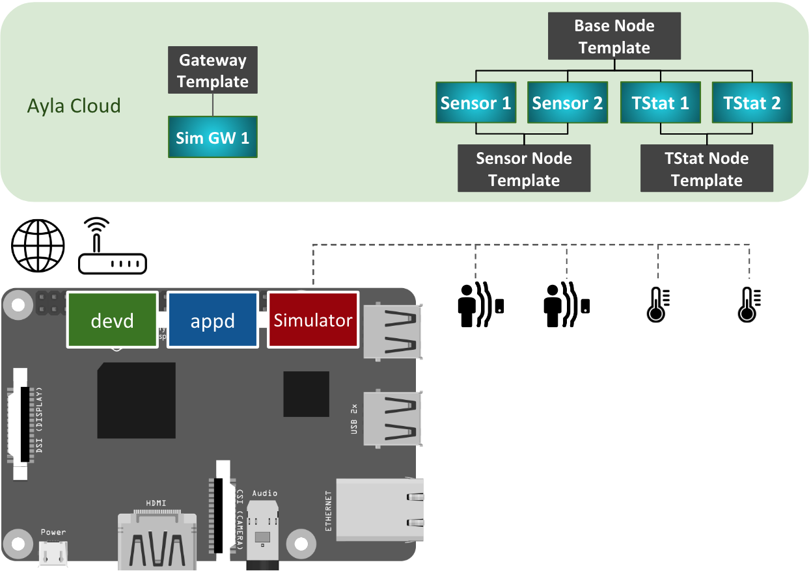

The Simulator Gateway simulates sensor and thermostat nodes producing datapoints (e.g. temperature) every 15 seconds.

1. In the diagram, the Raspberry Pi represents any Linux-based platform.
1. devd is the Ayla Dynamic Gateway Agent. It communicates with the Ayla Cloud via Wi-Fi or Ethernet.
1. appd is the Simulator Gateway.
1. By default, devd controls appd: When you start/stop devd, it starts/stops appd.
1. The sensor and thermostat devices exist only as simulations within the red box.
1. The black shapes in the Ayla Cloud represent templates which consist of attributes, properties, etc. 
1. You create these templates.
  1. Sim GW is the Simulator Gateway template.
  1. Sim GW SNode is the Simulator Gateway Sensor Node template.
  1. Sim GW TNode is the Simulator Gateway Thermonstat Node template.
1. You can create templates using the Developer Portal.
1. The gradient blue shapes are digital twins which inherit properties from templates. They model devices.
