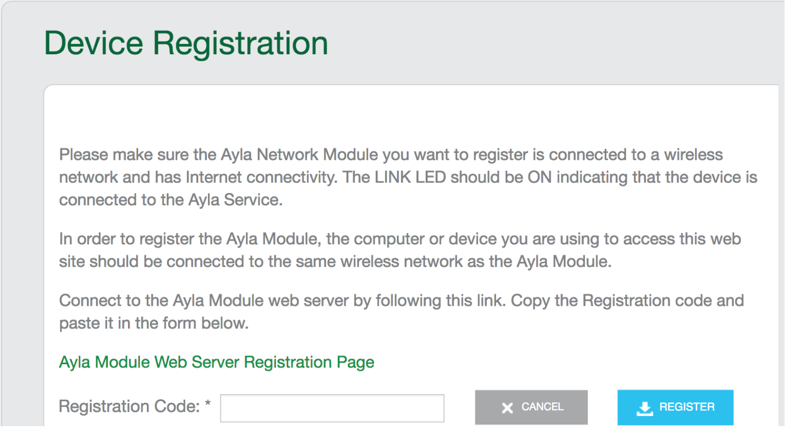

<ol>
<li>Using a computer connected to the same LAN as your RPi, browse to the Ayla Developer Portal.</li>
<li>Click Register New Device:

</li>
<li>Click the link on the page to reveal a device registration code (e.g. e224a1).</li>
<li>Copy and paste the code into the Registration Code textbox of the Device Registration form, and click Register.</li>
</ol>

Peruse Ayla Developer and Dashboard portals.

Don't click the Add Sensor Nodes and Add Thermostat Nodes yet. Explain why they are integers.

Explain how Ayla associated the RPi and Template. See the template.

Change oem_host_version to appd_template_version, and explain why.

Assign a new Product Name to the RPi Gateway.

See that Nodes is empty.