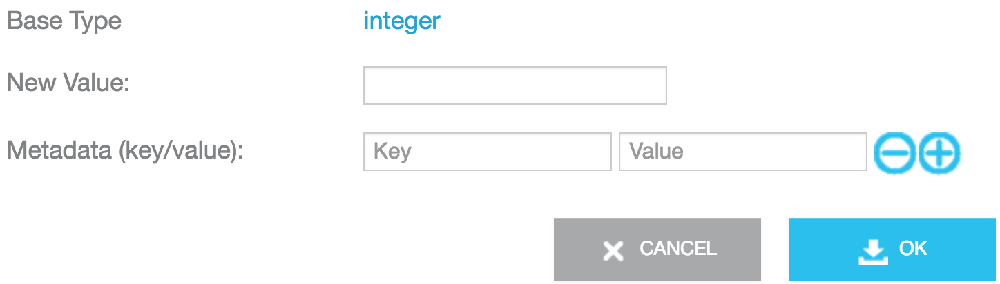

This page shows you how to add your devices as nodes to your Zigbee gateway. You will need to know how to put your devices into pairing mode. Below are some examples. Don't actually put your devices into pairing mode yet. 

1. For SmartThings Motion Sensors and Multipurpose Sensors, remove the cap, and hold down the small white button for about 5 seconds until the LED next to it blinks.
1. For SmartThings SmartPower Outlet, hold down the connect button on the top of the unit for about 5 seconds until the led blinks.
1. For GE Link Connected LED bulbs, if it is new, simply install it in a socket, and turn it on. If it has already paired with another device, [follow these directions](https://support.smartthings.com/hc/en-us/articles/204833550-GE-Link-LED-Bulb) to reset it.

To add your devices to your Zigbee gateway, follow these directions:

1. Browse to the Ayla Developer Portal.
1. Click View My Devices.
1. Click the serial number of your gateway.
1. Click the Current Value column of the <code>zb_join_enable</code> property.

1. Enter an integer representing the number of seconds the gateway will remain in pairing mode, and click OK. Common choices are 60, 90, and 120.
1. Put your Zigbee device into pairing mode.
1. Note that the <code>num_nodes</code> property value increments:

1. Click the Candidates tab to verify that your device appears as a candidate:

1. Click <code>Register</code>.
1. Click the Nodes tab to verify that your device appears as a node:

1. Click the serial number of your new node to inspect properties and details:

1. Interact with the device to cause property value changes. For example, create motion near a motion detector, and note that the <code>status</code> property value changes to <code>1</code>:

