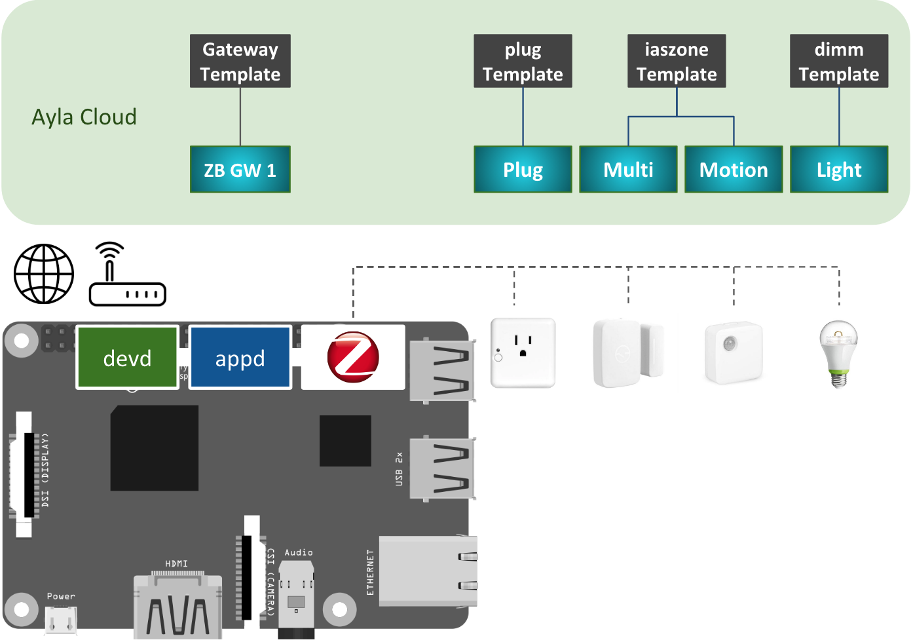

The Zigbee Gateway connects Zigbee devices to the Ayla Cloud:

1. In the diagram, the Raspberry Pi represents any Linux-based platform.
1. devd is the Ayla Dynamic Gateway Agent. It communicates with the Ayla Cloud via Wi-Fi or Ethernet.
1. appd is the Zigbee Gateway (zb_gatewayd).
1. By default, devd controls appd: When you start/stop devd, it starts/stops appd.
1. The black shapes in the Ayla Cloud represent templates which consist of attributes, properties, etc. 
1. You create these templates using the Developer Portal.
1. The gradient blue shapes are digital twins which inherit properties from templates. They model devices.
1. zb_gatewayd supports the following devices out-of-the-box:
  1. [GE Link Smart LED Light Bulb](https://www.amazon.com/gp/product/B00NOL16K0/ref=ox_sc_act_title_1?smid%20=ALZ3B3LU3WJHD&psc=1)
  1. [Samsung SmartThings Outlet](https://www.amazon.com/Samsung-SmartThings-Outlet-Works-%20Amazon/dp/B00MI5V5N6/ref=lp_14425685011_1_7?srs=14425685011&ie=UT%20F8&qid=1523423896&sr=8-7)
  1. [Samsung SmartThings Multipurpose Sensor](https://www.amazon.com/Samsung-SmartThings-F-MLT-US-2-Multipurpose-%20Sensor/dp/B0118RQW3W/ref=lp_14425685011_1_3?srs=14425685011&ie=UT%20F8&qid=1523423896&sr=8-3)
  1. [Samsung SmartThings Motion Sensor](https://www.amazon.com/Samsung-SmartThings-F-IRM-US-2-Motion-%20Sensor/dp/B01IE35PCC/ref=lp_14425685011_1_6?srs=14425685011&ie=UTF8%20&qid=1523423896&sr=8-6)
  1. [Centralite 3-Series Pearl Touch Thermostat](https://www.amazon.com/gp/product/B01G99KR94/ref=ox_sc_act_title_2?ie=UTF8&p%20sc=1&smid=A17T4L29EADQN5)