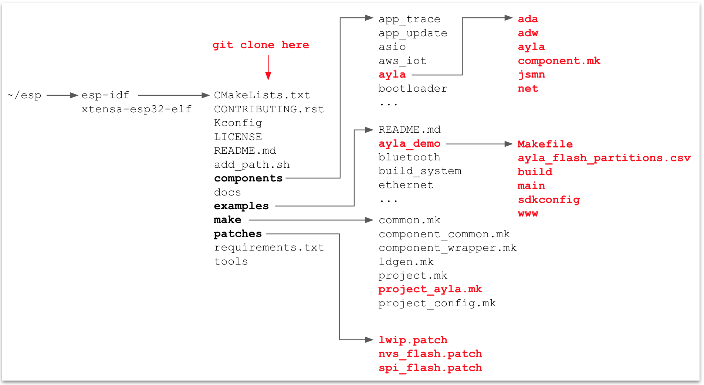

This page provides steps for cloning  

<ol>
<li>Change directory to <code>&#126;/esp/esp-idf</code>.</li>
<li>Clone the .... (I will use git clone when available instead of tar):
<pre>
$ cd &#126;/esp/esp-idf
$ tar xfz ada-esp-idf-src-1.3.8.tgz
$ cp -R ada-esp-idf-src-1.3.8/&#42; .
</pre>

</li>
</ol>
