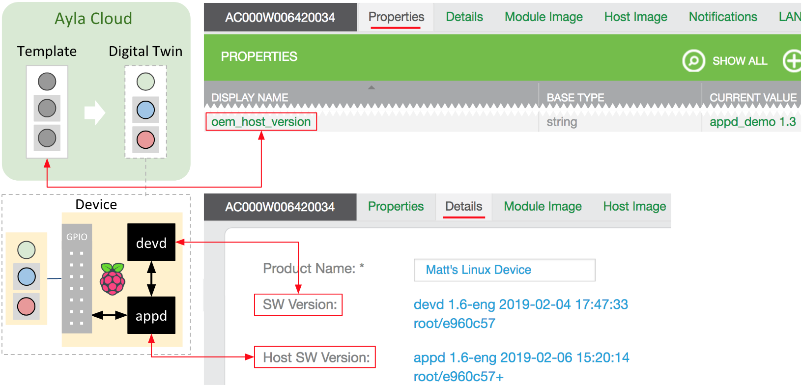
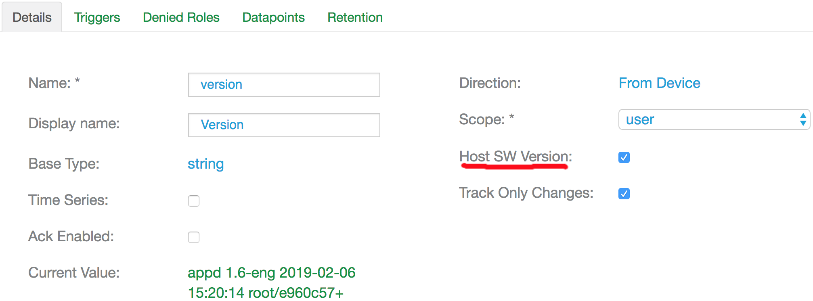
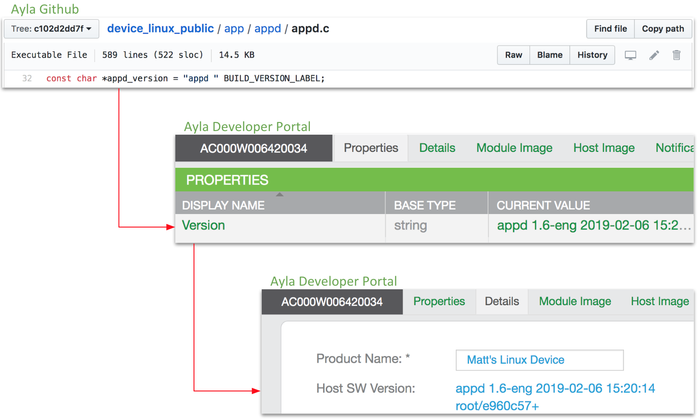
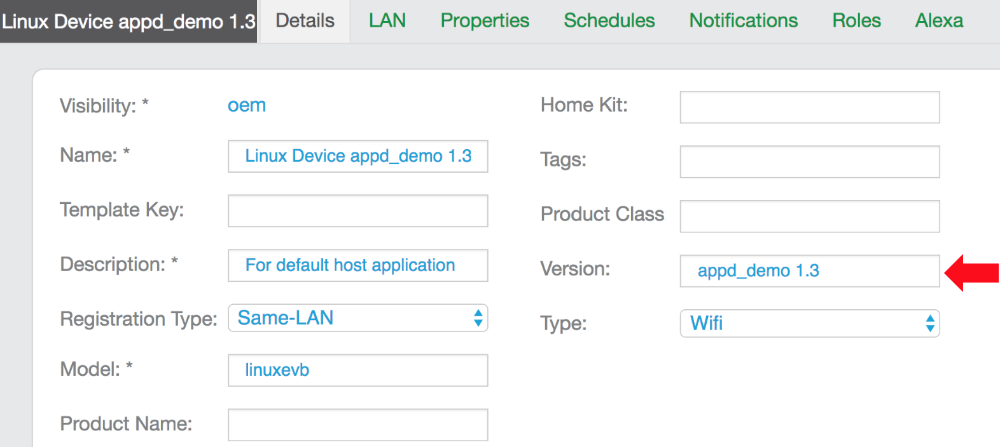
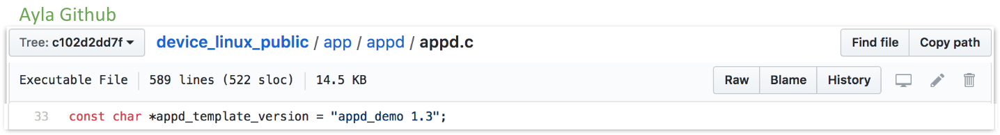
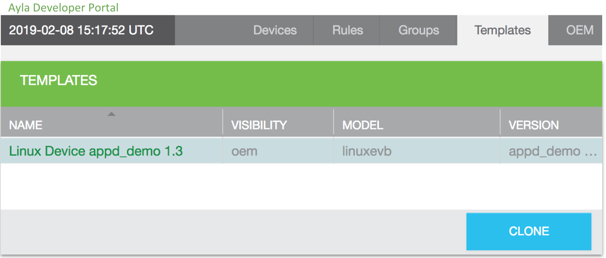

Versioning allows you to upgrade the Ayla Linux Agent (devd), the host application (appd), and the template associated with the host application while maintaining compatibility among the three components. This page explains versioning in general. It does not explain how to perform over-the-air updates with version control. For that, see [Perform OTA Updates](../../tutorials/perform-ota-updates). Now, consider the following diagram:

### Ayla Linux Agent version

The <code>SW Version</code> device attribute reflects the Ayla Linux Agent (devd) version number which is defined in <code>devd's</code> [ds_main.c](https://github.com/AylaNetworks/device_linux_public/blob/master/daemon/devd/ds_main.c):

<pre>
const char version[] = "devd " BUILD_VERSION_LABEL;
</pre>

Ayla controls this version number.

### Host Application version

The <code>Host SW Version</code> device attribute reflects the Host Application (appd) version number which is defined in <code>appd's</code> [appd.c](https://github.com/AylaNetworks/device_linux_public/blob/c102d2dd7fc31386ca2686099bb31fb4ddae8c38/app/appd/appd.c):

<pre>
const char *appd_version = "appd " BUILD_VERSION_LABEL;
</pre>

<code>appd_version</code> is mapped to the digital twin property for which <code>Host SW Version</code> is checked:

For example, the example <code>Linux Device appd_demo 1.3</code> template specifies the <code>version</code> property as the <code>Host SW Version</code>:

From there, it is mapped to the <code>Host SW Version</code> device attribute. Here is the complete mapping:

### Template version

The template version is reflected in the <code>oem_host_version</code> property (created by Ayla) and defined in the template itself:

### Host Application/Template association

The host application (<code>appd</code>) specifies the corresponding Ayla Cloud template in [appd.c](https://github.com/AylaNetworks/device_linux_public/blob/c102d2dd7fc31386ca2686099bb31fb4ddae8c38/app/appd/appd.c):

When you update <code>appd</code>, if you do **not** add, remove, or modify properties defined in <code>appd</code> source code, then you do **not** need to define and use a new template. Otherwise, you must create a new template reflecting the changes. Usually, you simply clone and modify the previous template, change the name, change the version number, and add/remove properties, etc.:

Be sure to click on a column other than the <code>Name</code> column when you choose a template on the list. Once you choose the template, you will probably need to scroll down to see the <code>Clone</code> button.
