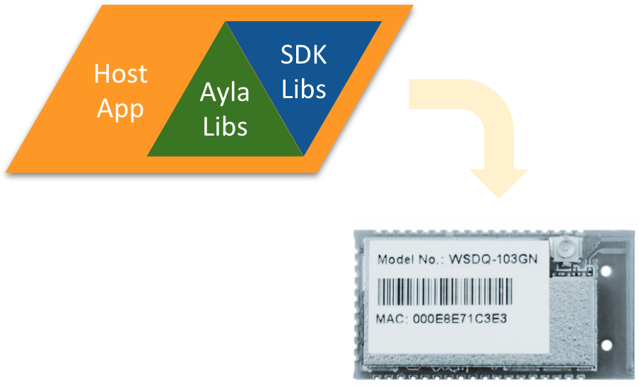

Ayla Integrated Agents are software libraries that extend the SDKs associated with particular chipsets used on communication modules. Ayla also provides a sample host application that links with the libraries and runs on the target chipset:

Ayla Integrated Agents eliminate the need for a separate MCU dedicated to the host application​ which reduces cost and footprint. The host application can access module resources and I/O​, and it can customize communication module behavior. The license allows source-code modifications, but not source-code redistribution.

Click [Guide](guide) to get started connecting a communication module to the Ayla Cloud.
