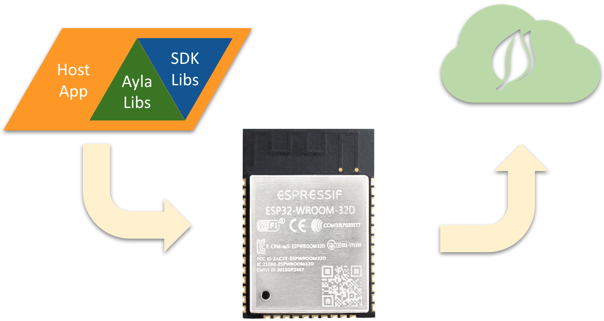

Ayla Integrated Agents are software libraries that extend the SDKs associated with particular chipsets used on communication modules:

|Chip Vendor|Reference Design|Target SDK Version|Ayla Version|Wi-Fi Setup|OTA|Status|
|-|-|-|-|-|-|-|
|Marvell|MW300|WMSDK 3.4.6|1.3|yes|yes|Production|
|Qualcomm|QCA4010|QCA4010 SDK r00006.2|1.3|yes|yes|Production|
|RealTek|RTK8711|Ameba 4.0a|1.4|yes|yes|Production|
|Espressif|ESP-WROOM-32|ESP-IDF|TBD|yes|yes|Development|

Ayla also provides a sample host application that links with the libraries and runs on the target chipset.

Here are additional details:

1. This approach eliminates the need for a separate MCU dedicated to the host application​, reducing cost and footprint.
1. The host application can access module resources and I/O​.
1. The host application can customize communication module behavior.
1. The license allows source-code modifications, but not source-code redistribution.

<!---->
