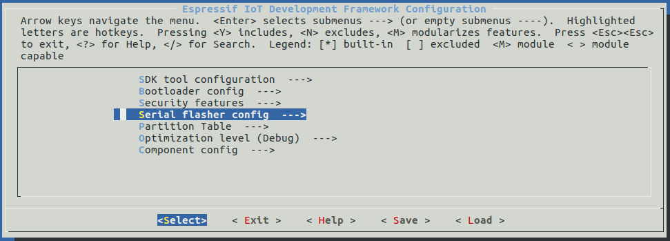

I am using [Espressif ESP32 ESP32-DevKitC](https://www.amazon.com/Espressif-ESP32-ESP32-DEVKITC-ESP-WROOM-32-soldered/dp/B01N0SB08Q/ref=sr_1_1?ie=UTF8&qid=1550786254&sr=8-1&keywords=espressif+esp32-devkitc) as my example.

See [ESP32-DevKitC V4 Getting Started Guide](https://docs.espressif.com/projects/esp-idf/en/latest/get-started/get-started-devkitc.html).

Here is the [directory](https://aylait.sharepoint.com/sites/eng/device/Shared%20Documents/Forms/AllItems.aspx?csf=1&e=1ah3r6&RootFolder=/sites/eng/device/Shared%20Documents/Engineering/Engineering%20Devices/Module%20Software/Ayla_Device_Agent/releases/ada-1.3.8&FolderCTID=0x01200035018376B736F7469262A6CA3CD80952) containing the source code and setup guide.

Refer to "Ayla White Box Agent User Guide(beta).pdf".

Notes from JC:

1. I have two lines of code in my .profile document which is located in my home directory. The top line stays the same from when you setup just Espressif then add Ayla. The second line is what changes when adding Ayla. 
<pre>
export PATH=$HOME/esp/xtensa-esp32-elf/bin:$PATH
export IDF_PATH=$HOME/esp/esp-idf-v3.1-beta1
</pre>
If you are doing this on your Mac be sure to do this step. To get your dev kit serial port name, plug in the dev kit to you Mac. Then, in terminal, run <code>ls /dev/cu&#42;</code> command. You should see something like <code>/dev/cu.SLAB_USBtoUART</code>.
1. Change directory, and run config utility:
<pre>
cd &#126;/esp/hello_world
make menuconfig
</pre>
If previous steps have been done correctly, the following menu will be displayed:

1. In the menu, navigate to <code>Serial flasher config &gt; Default serial port</code> to configure the serial port, where project will be loaded to.
1. Confirm selection by pressing Enter, save configuration by selecting Save, and  exit application by selecting Exit.

Additional Notes:

* When it comes time to add the Ayla stuff, there is an instruction in our document "Copy the folders inside this ada-esp-idf-src-1.3.6-eng into esp-idf-v3.1-beta1 folder." I made the mistake of replacing the existing esp-idf files, all you need to do is just add/merge the files in the Ayla ada-esp-idf-src-1.3.8 with the esp-idf directories.
* Unfortunately I do not remember the details, but I recall having some challenge with the patching. But just follow the instructions in the "beta" document (attached) and see if you have any problems. I vaguely remember thinking I was missing something simple. I think it was my note above about coping the Ayla files and not replacing the esp-idf files.
* Also I used Aura on iOS to setup the wifi and it worked perfectly. No need to setup wifi via CLI.

## Notes from ESP-IDF Programming Guide

What is [Espressif Systems](https://www.espressif.com/en/company/about-us/who-we-are)?

[ESP-IDF Programming Guide](https://docs.espressif.com/projects/esp-idf/en/latest/)

ESP-IDF stands for Espressif IoT Development Framework.

### Development steps for Linux

1. Install generic toolchain
<pre>
$ sudo apt-get install gcc git wget make libncurses-dev flex bison gperf python python-pip python-setuptools python-serial python-cryptography python-future python-pyparsing
Reading package lists... Done
Building dependency tree       
Reading state information... Done
Note, selecting 'libncurses5-dev' instead of 'libncurses-dev'
gcc is already the newest version (4:6.3.0-4).
gcc set to manually installed.
git is already the newest version (1:2.11.0-3+deb9u4).
make is already the newest version (4.1-9.1).
make set to manually installed.
python is already the newest version (2.7.13-2).
python-cryptography is already the newest version (1.7.1-3+b2).
python-cryptography set to manually installed.
python-serial is already the newest version (3.2.1-1).
python-setuptools is already the newest version (33.1.1-1).
python-setuptools set to manually installed.
wget is already the newest version (1.18-5+deb9u2).
python-pip is already the newest version (9.0.1-2+rpt2).
The following package was automatically installed and is no longer required:
  realpath
Use 'sudo apt autoremove' to remove it.
The following additional packages will be installed:
  libbison-dev libfl-dev libsigsegv2 libtinfo-dev m4 python-configparser
Suggested packages:
  bison-doc ncurses-doc m4-doc python-future-doc python-pyparsing-doc
The following NEW packages will be installed:
  bison flex gperf libbison-dev libfl-dev libncurses5-dev libsigsegv2 libtinfo-dev m4 python-configparser python-future python-pyparsing
0 upgraded, 12 newly installed, 0 to remove and 3 not upgraded.
Need to get 2,843 kB of archives.
After this operation, 8,293 kB of additional disk space will be used.
Do you want to continue? [Y/n]
</pre>
1. Install ESP32 toolchain
[https&colon;//dl.espressif.com/dl/xtensa-esp32-elf-linux32-1.22.0-80-g6c4433a-5.2.0.tar.gz](https://dl.espressif.com/dl/xtensa-esp32-elf-linux32-1.22.0-80-g6c4433a-5.2.0.tar.gz)
<pre>
$ mkdir -p ~/esp
$ cd &#126;/esp
$ tar -xzf ~/Downloads/xtensa-esp32-elf-linux32-1.22.0-80-g6c4433a-5.2.0.tar.gz
</pre>
Produces <code>/home/pi/esp/xtensa-esp32-elf</code>.
1. Update PATH environment variable
<pre>
export PATH="$HOME/esp/xtensa-esp32-elf/bin:$PATH"
</pre>
Then run these:
<pre>
$ source &#126;/.profile
$ printenv PATH
</pre>
1. Get ESP-IDF libraries from GitHub
<pre>
$ cd &#126;/esp
$ git clone --recursive https://github.com/espressif/esp-idf.git
</pre>
Produces <code>/home/pi/esp/esp-idf</code>.
1. Update IDF_PATH environment variable
<pre>
export IDF_PATH=~/esp/esp-idf
</pre>
Then run these:
<pre>
$ source ~/.profile
$ printenv IDF_PATH
</pre>
1. Install Python packages
<pre>
$ sudo python2.7 -m pip install --user -r $IDF_PATH/requirements.txt
</pre>
[Failed building wheel for cryptography](https://github.com/espressif/esp-idf/issues/2480). Got error: <code>No package 'libffi' found</code>. Tried <code>sudo apt-get install libffi-dev</code>. See [this](https://stackoverflow.com/questions/50471010/cant-install-package-pysftp-no-package-libffi-found-failed-with-error-code). Re-ran <code>python2.7</code> command. It worked.
1. Create project
<pre>
$ cd &#126;/esp
$ cp -r $IDF_PATH/examples/get-started/hello_world .
</pre>
1. Connect to ESP32
1. Configure project
1. Compile and link project (create application)
1. Upload application
1. Run, monitor, and debug application

## Notes from Ayla White Box Agent User Guide(beta).pdf

## Notes from Ayla Source Code

