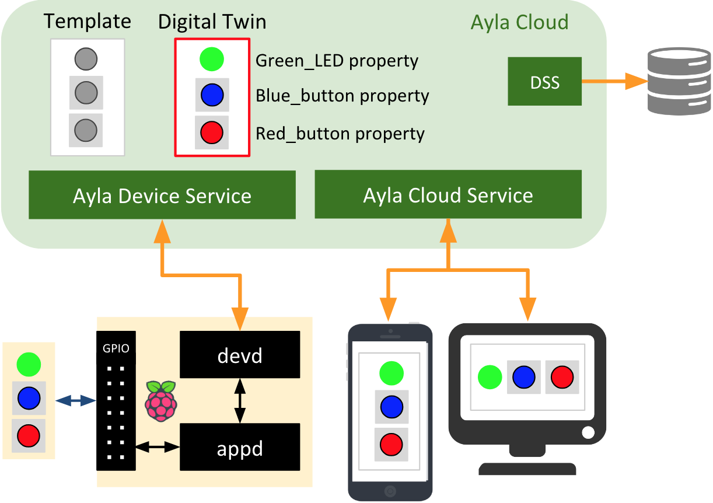

The following diagram shows the Ayla Linux Agent (devd) and an example host application (appd) within the context of the Ayla Platform.

1. The Raspberry Pi, devd, appd, the green LED, and the two buttons form the IoT device.
1. The digital twin is a model of the device instantiated from the template.
1. The digital twin is how web and mobile apps see the device. 
1. These applications send commands to the device via "To Device" properties like the green LED.
1. They remain aware of device state via "From Device" properties like the buttons.
1. devd provides connectivity and security.

The video below shows devd and appd in action on a Raspbery Pi:

<iframe 
  width="560" 
  height="315" 
  src="https://www.youtube.com/embed/aDdyFeo2A5E?rel=0&amp;showinfo=0" 
  frameborder="0" 
  allow="autoplay; 
  encrypted-media" 
  allowfullscreen>
</iframe>

### Transcript

A Host Application called appd (written in C) is running on the CPU of this Raspberry Pi 3, and it is controlling this green LED, this blue button, and this red button. Together, the Raspberry Pi, the host application, the LED, and the buttons form our Raspberry Pi Device.

An Ayla Linux Agent called devd (also written in C) is also running on this CPU.

Now, appd uses devd to talk to the Ayla Cloud which maintains a digital twin of our Raspberry Pi Device that includes a Green_LED property, a Blue_button property, and a Red-button property.

Mobile and web applications (like the Aura Mobile App shown here) send commands to, and receive events from, our Raspberry Pi Device by interacting with the digital twin in the cloud. So, for example, we can send a command, via the digital twin, to illumindate the LED, and we can receive press and release events from the blue and red buttons.

### Ayla Device Platform for Linux components

1. The Ayla Linux Agent (devd) communicates via HTTPS with the Ayla Device Service (ADS), connects to and receives event notifications from the Ayla Notification Service (ANS), handles HTTP requests from devices on the local network with its internal web server, responds to mDNS address requests for DSN hostnames, supports LAN mode encrypted sessions for communication with Ayla mobile apps, and provides an IPC interface for internal messaging with other Ayla daemons.
1. The host application (appd) defines and manages device properties, and either directly controls the behavior of a device, or provides an interface to other applications in control of devices. By default, devd launches and monitors appd. If appd crashes or quits, devd re-launches it. To speed development, a demo application daemon is provided.
1. devdwatch is watchdog software designed to monitor and re-launch devd in case of failure. If available, Ayla recommends using the system's built-in process-restart functionality.
1. acgi is a CGI utility executed by the system’s primary web server. Acgi parses each request and forwards valid requests to devd, which handles them using its internal web server. This component is required to support LAN mode, Wi-Fi Setup, and Same-LAN registration. For acgi to work, some device configuration is required.
1. ota_update is a utility for downloading, verifying, and applying over-the-air (OTA) firmware images. This utility is invoked by devd when the service indicates a pending device update. For ota_update to be fully functional, OTA-related platform-specific functions must be implemented in the lib/platform library. Platform-specific functions implement image storage, readback, and apply the downloaded image to the system.
1. cond is the Wi-Fi connection manager daemon that enables Ayla Wi-Fi Setup functionality, and provides an abstraction layer between Ayla daemons and the Wi-Fi driver. This daemon manages scan results and network profiles, configures AP mode, and establishes connections to Wi-Fi access points. (Optional component and may be omitted if Ayla Wi- Fi Setup solution is not needed.)
1. logd is the Ayla logging client. Ayla daemons write specially-tagged log messages to Syslog. This daemon parses syslog output, filters messages based on log config managed by devd, and posts them to Ayla logging service. Can be remotely enabled from the Ayla OEM Dashboard and configured to monitor and debug. (Optional component and may be omitted if remote logging functionality is not needed.)
