This page provides instructions for testing your RPi device using the Aura mobile app. You can perform the same tests using the Developer Portal.

### Change the Product Name (iPhone)

<ol>
<li>In Aura, click your RPi Device. Then, click the Pencil icon, type a new name, and click Confirm.

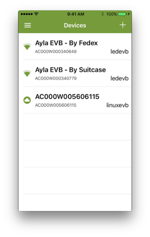

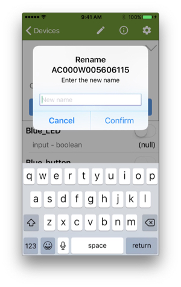

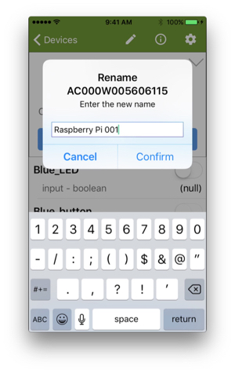

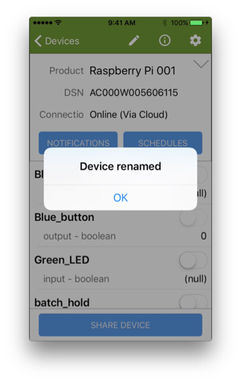

</li>

<li>Return to the Aura Devices page to see the new name.</li>
</ol>

### Test boolean properties

The example customer application (appd) has three boolean properties: Blue_LED, Green_LED, and Blue_button. By default, your RPi is not connected to a breadboard, so the two LED properties do not represent real LEDs, and the button property does not represent a real button. (Instructions for connecting appd to real peripherals can be found in the Tutorial.) When you set both Blue_LED and Green_LED to true, appd sets Blue_button to true. Use Aura to set Blue_LED to true, and then Green_LED to true. (Initially, values for the two LED properties may be null instead of zero as seen below).

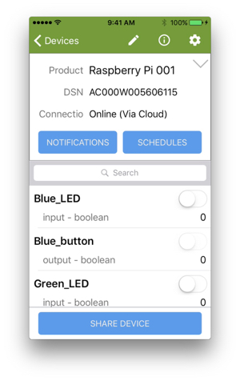

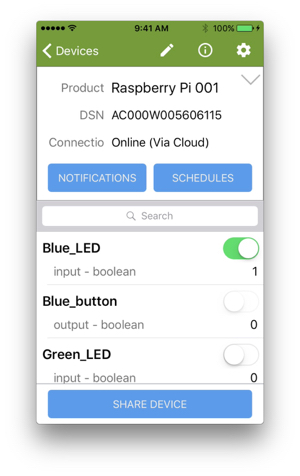

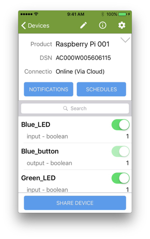

### Test integer properties 

appd has two integer properties: input and output. When you set the input property to a value, the Ayla Cloud sends the value via ADS and the Ayla Linux Agent to appd which sets the output value to the square of the input value, and sends the new output value back to the Ayla Cloud. If the square of the input value overflows a 32-bit number, appd sets the output to -1. You can test this.

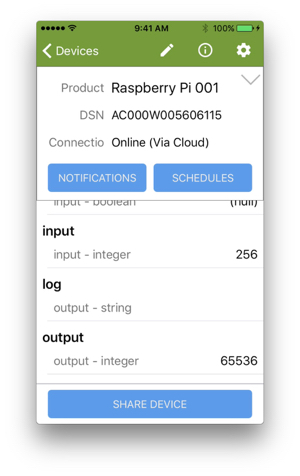

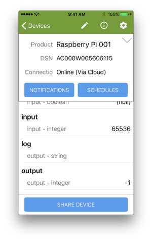

### Testing string properties

appd has two string properties: cmd and log. When you set cmd to a value, the Ayla Cloud sends the value via ADS and the Ayla Linux Agent to appd which copies the value to the log property, and sends the new log value back to the Ayla Cloud. You can test this.

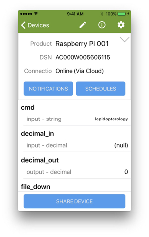

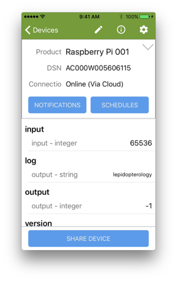

<!---

-->

### Test decimal properties

appd has two decimal properties: decimal_in and decimal_out. When you set decimal_in to a value, the Ayla Cloud sends the value via ADS and the Ayla Linux Agent to appd which copies the value to the decimal_out property, and sends the new decimal_out value back to the Ayla Cloud. You can test this.

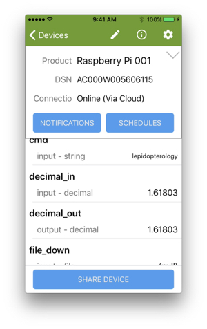

### Test file properties

appd has two file properties: file_up and file_down. Useful for large data blobs such as log files and images, file properties can be of any size. Of the two file properties, appd enables you to test file_up only. When you set the boolean property file_up_test to 1, appd uploads a file to file_up, and resets file_up_test to 0.

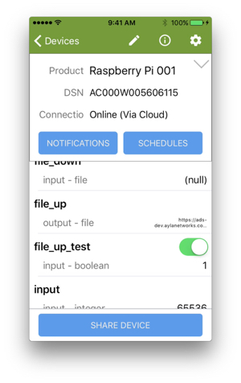

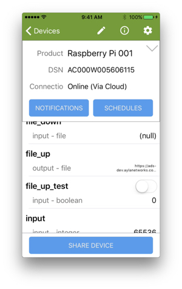

<h1>Test the version property</h1>

appd has a version property where it stores the current appd software version. The Ayla Cloud reads and display this version. A user who needs to initiate an OTA update may find the version property useful.

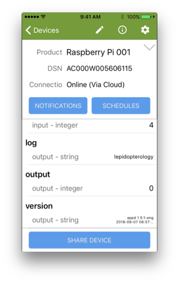

<!---

-->

