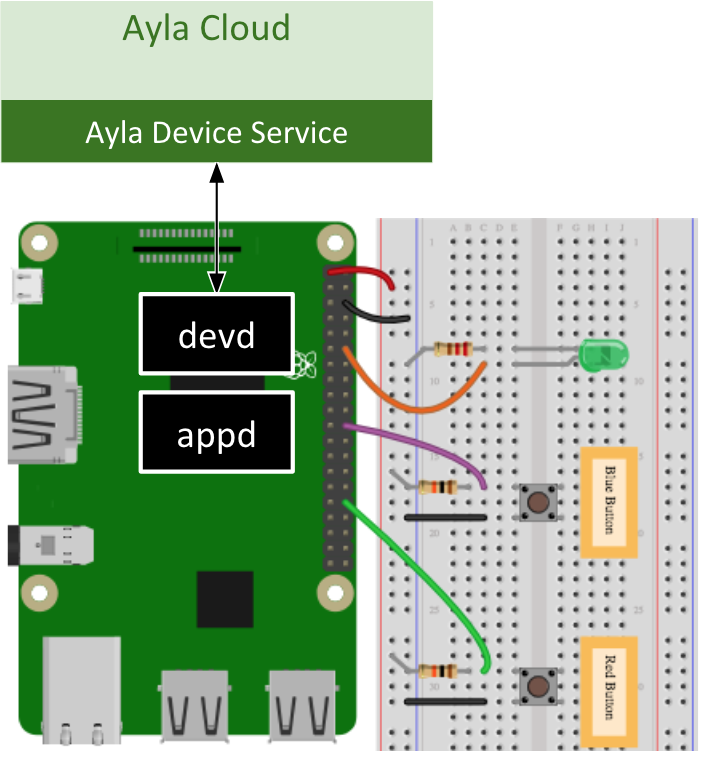

The Ayla Linux Agent (devd in the diagram) connects Linux-based applications to the Ayla Cloud by providing connectivity, security, and other services. It is part of the Ayla Device Platform for Linux.

The [Guide](/devices/ayla-linux-agent/guide) shows you how to install the Ayla Device Platform for Linux on a Raspberry Pi, register the Ayla Linux Agent with the Ayla Cloud, and test the agent with an example host application called appd.

The [Tutorials](/devices/ayla-linux-agent/tutorials) help you explore appd in more detail. They help you set up a development environment, understand appd architecture, modify appd to control an LED and a button, add a property, and perform Over-The-Air (OTA) updates.

The [Reference](/devices/ayla-linux-agent/reference) provides API documentation and background information.