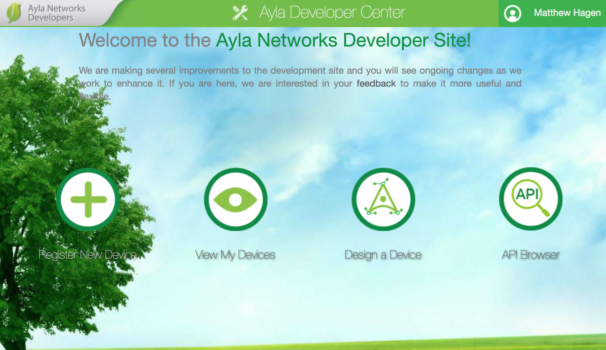
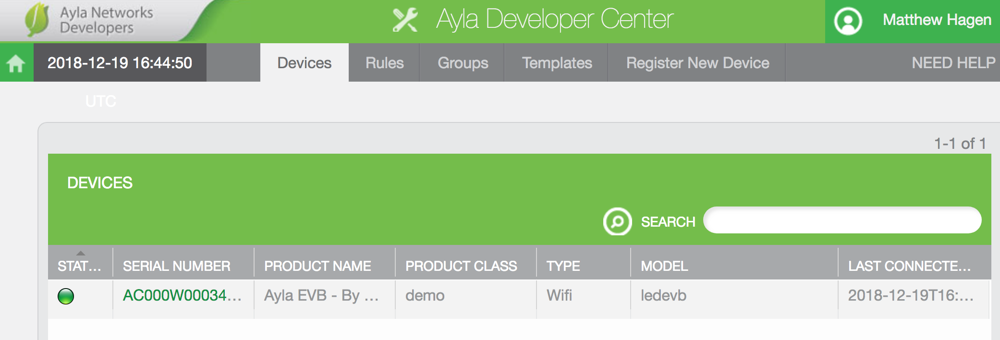

### Create an Ayla Account

1. Browse to [developer.aylanetworks.com](https://developer.aylanetworks.com/), and create an account.
1. Open the confirmation email, click the link, and access your Developer Portal Account.

1. Click View My Devices. Initially, your Devices list will be empty. After you register your Raspberry Pi, your RPi device will appear in this list as a single row.

### Obtain access to the Github repo

Contact your Ayla representative get access to this [Github Repository](https://github.com/AylaNetworks/device_linux_public).
