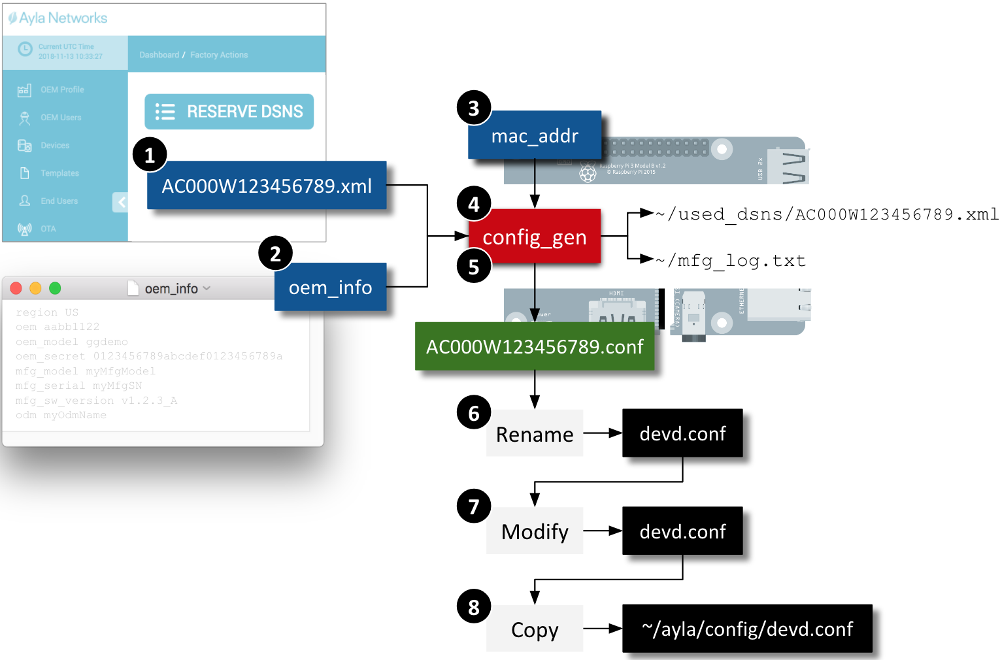

These directions assume that you will use your Raspberry Pi as both a development environment and an Ayla device. This page shows you how to set up your development environment on your RPi, and how to register your RPi as a device in the Ayla Cloud.

## Clone and build

### Clone the Ayla repository

1. Secure shell to your RPi:
<pre>
$ ssh pi&#64;192.168.1.9
</pre>
1. Ensure that you are in your home directory (e.g. <code>/home/pi</code>).
1. Clone the Ayla [device-linux-public](https://github.com/AylaNetworks/device_linux_public) repository. You will be asked for your Github username and password.
<pre>
$ git clone https&#58;//github.com/AylaNetworks/device_linux_public.git
</pre>
1. View the new <code>/home/pi/device_linux_public</code> directory.
<pre>
$ ls &#126;/device_linux_public/
app  daemon  dev_kit  ext  host_util  lib  make  Makefile  package_version.mk  README  util
</pre>

### Edit ayla_install.sh

1. Copy ayla_install.sh to your home directory:
<pre>
$ cp &#126;/device_linux_public/dev_kit/raspberry_pi/ayla_install.sh ~/ 
</pre>
1. Open the file for editing, and find the following line:
<pre>
ayla_src_dir="$temp_dir/ayla/src"
</pre>
1. Change it to the following, and save.
<pre>
ayla_src_dir="/home/pi/device_linux_public"
</pre>

### Build/install the Ayla Device Platform for Linux

1. Create an empty text file named <code>devd.conf</code> in <code>/home/pi</code>. You will replace this file later.
<pre>
$ touch devd.conf
</pre>
1. View installation options:
<pre>
$ ./ayla_install.sh -h
</pre>
1. Start the installation. You will be asked for your Github username and password during the installation.
<pre>
$ sudo ./ayla_install.sh -g     // Wi-Fi
$ sudo ./ayla_install.sh -g -n  // Ethernet
</pre>
If you are installing over a previous installation, include the <code>-u</code> flag. The <code>-g</code> flag installs the [Wiring Pi library](http://wiringpi.com/) in your run environment which is required by the tutorials for connecting your RPi via GPIO pins to LEDs and buttons on a breadboard.

<a data-toggle="collapse" href="#build-output">Click to see example build output</a>

<pre class="collapse" id="build-output">
$ sudo ./ayla_install.sh -g

****************************************
 Configuration
****************************************
** script mode:          CLEAN INSTALL
** package:              https://github.com/AylaNetworks/device_linux_public.git
** config location:      /home/pi
** required config:      devd.conf
** application:          appd
** Wi-Fi support:        YES
** GPIO support:         Wiring Pi (for Raspberry Pi)
** config directory:     /home/pi/ayla/config
** install directory:    /home/pi/ayla

****************************************
 Checking ayla_install.sh prerequisits...
****************************************
** running as root
** Internet connection UP

****************************************
 Creating directories...
****************************************
** creating directory: /tmp/ayla_install.dlI7
** creating directory: /home/pi/device_linux_public
** creating directory: /home/pi/ayla/config
** creating directory: /home/pi/ayla

****************************************
 Generating config files...
****************************************
** saving ayla_install.sh options file: /home/pi/ayla/ayla_install.opts

****************************************
 Installing required packages...
****************************************
** updating package manager
Get:1 http://archive.raspberrypi.org/debian stretch InRelease [25.4 kB]
Get:2 http://raspbian.raspberrypi.org/raspbian stretch InRelease [15.0 kB]
Get:3 http://raspbian.raspberrypi.org/raspbian stretch/main armhf Packages [11.7 MB]
Get:4 http://archive.raspberrypi.org/debian stretch/main armhf Packages [205 kB]
Fetched 11.9 MB in 8s (1,326 kB/s)
Reading package lists...
Reading package lists...
Building dependency tree...
Reading state information...
Calculating upgrade...
The following packages will be upgraded:
  apt apt-transport-https apt-utils base-files bluez-firmware libapt-inst2.0 libapt-pkg5.0 libpam-systemd libperl5.24 libpolkit-agent-1-0 libpolkit-backend-1-0
  libpolkit-gobject-1-0 libssl1.0.2 libssl1.1 libsystemd0 libudev1 libwbclient0 openssl perl perl-base perl-modules-5.24 policykit-1 python-rpi.gpio python3-six
  raspberrypi-sys-mods raspi-config samba-common systemd systemd-sysv tzdata udev
31 upgraded, 0 newly installed, 0 to remove and 0 not upgraded.
Need to get 17.4 MB of archives.
After this operation, 218 kB of additional disk space will be used.
Get:1 http://archive.raspberrypi.org/debian stretch/main armhf bluez-firmware all 1.2-3+rpt7 [125 kB]
Get:3 http://archive.raspberrypi.org/debian stretch/main armhf python-rpi.gpio armhf 0.6.5~stretch-1 [23.5 kB]
Get:4 http://archive.raspberrypi.org/debian stretch/ui armhf python3-six all 1.12.0 [13.3 kB]
Get:5 http://archive.raspberrypi.org/debian stretch/main armhf raspberrypi-sys-mods armhf 20181127 [10.2 kB]
Get:6 http://archive.raspberrypi.org/debian stretch/ui armhf raspi-config all 20181118 [20.2 kB]
Get:2 http://raspbian.mirror.constant.com/raspbian stretch/main armhf base-files armhf 9.9+rpi1+deb9u6 [67.5 kB]
Get:7 http://raspbian.mirror.constant.com/raspbian stretch/main armhf libperl5.24 armhf 5.24.1-3+deb9u5 [2,837 kB]
Get:8 http://raspbian.mirror.constant.com/raspbian stretch/main armhf perl armhf 5.24.1-3+deb9u5 [219 kB]
Get:9 http://raspbian.mirror.constant.com/raspbian stretch/main armhf perl-base armhf 5.24.1-3+deb9u5 [1,198 kB]
Get:10 http://raspbian.mirror.constant.com/raspbian stretch/main armhf perl-modules-5.24 all 5.24.1-3+deb9u5 [2,722 kB]
Get:11 http://raspbian.mirror.constant.com/raspbian stretch/main armhf libapt-pkg5.0 armhf 1.4.9 [833 kB]
Get:12 http://raspbian.mirror.constant.com/raspbian stretch/main armhf libapt-inst2.0 armhf 1.4.9 [190 kB]
Get:13 http://raspbian.mirror.constant.com/raspbian stretch/main armhf apt armhf 1.4.9 [1,190 kB]
Get:14 http://raspbian.mirror.constant.com/raspbian stretch/main armhf apt-utils armhf 1.4.9 [392 kB]
Get:15 http://raspbian.mirror.constant.com/raspbian stretch/main armhf systemd-sysv armhf 232-25+deb9u8 [81.8 kB]
Get:16 http://raspbian.mirror.constant.com/raspbian stretch/main armhf libpam-systemd armhf 232-25+deb9u8 [174 kB]
Get:17 http://raspbian.mirror.constant.com/raspbian stretch/main armhf libsystemd0 armhf 232-25+deb9u8 [259 kB]
Get:18 http://raspbian.mirror.constant.com/raspbian stretch/main armhf systemd armhf 232-25+deb9u8 [2,221 kB]
Get:19 http://raspbian.mirror.constant.com/raspbian stretch/main armhf udev armhf 232-25+deb9u8 [1,072 kB]
Get:20 http://raspbian.mirror.constant.com/raspbian stretch/main armhf libudev1 armhf 232-25+deb9u8 [120 kB]
Get:21 http://raspbian.mirror.constant.com/raspbian stretch/main armhf libwbclient0 armhf 2:4.5.12+dfsg-2+deb9u4 [121 kB]
Get:22 http://raspbian.mirror.constant.com/raspbian stretch/main armhf samba-common all 2:4.5.12+dfsg-2+deb9u4 [172 kB]
Get:23 http://raspbian.mirror.constant.com/raspbian stretch/main armhf tzdata all 2018i-0+deb9u1 [273 kB]
Get:24 http://raspbian.mirror.constant.com/raspbian stretch/main armhf libssl1.0.2 armhf 1.0.2q-1~deb9u1 [898 kB]
Get:25 http://raspbian.mirror.constant.com/raspbian stretch/main armhf libssl1.1 armhf 1.1.0j-1~deb9u1 [1,115 kB]
Get:26 http://raspbian.mirror.constant.com/raspbian stretch/main armhf apt-transport-https armhf 1.4.9 [166 kB]
Get:27 http://raspbian.mirror.constant.com/raspbian stretch/main armhf policykit-1 armhf 0.105-18+deb9u1 [61.7 kB]
Get:28 http://raspbian.mirror.constant.com/raspbian stretch/main armhf libpolkit-agent-1-0 armhf 0.105-18+deb9u1 [22.3 kB]
Get:29 http://raspbian.mirror.constant.com/raspbian stretch/main armhf libpolkit-backend-1-0 armhf 0.105-18+deb9u1 [39.8 kB]
Get:30 http://raspbian.mirror.constant.com/raspbian stretch/main armhf libpolkit-gobject-1-0 armhf 0.105-18+deb9u1 [37.8 kB]
Get:31 http://raspbian.mirror.constant.com/raspbian stretch/main armhf openssl armhf 1.1.0j-1~deb9u1 [712 kB]
Fetched 17.4 MB in 10s (1,620 kB/s)
apt-listchanges: Reading changelogs...
Extracting templates from packages: 100%
Preconfiguring packages ...
(Reading database ... 35478 files and directories currently installed.)
Preparing to unpack .../base-files_9.9+rpi1+deb9u6_armhf.deb ...
Unpacking base-files (9.9+rpi1+deb9u6) over (9.9+rpi1+deb9u4) ...
Setting up base-files (9.9+rpi1+deb9u6) ...
Installing new version of config file /etc/debian_version ...
(Reading database ... 35478 files and directories currently installed.)
Preparing to unpack .../libperl5.24_5.24.1-3+deb9u5_armhf.deb ...
Unpacking libperl5.24:armhf (5.24.1-3+deb9u5) over (5.24.1-3+deb9u4) ...
Preparing to unpack .../perl_5.24.1-3+deb9u5_armhf.deb ...
Unpacking perl (5.24.1-3+deb9u5) over (5.24.1-3+deb9u4) ...
Preparing to unpack .../perl-base_5.24.1-3+deb9u5_armhf.deb ...
Unpacking perl-base (5.24.1-3+deb9u5) over (5.24.1-3+deb9u4) ...
Setting up perl-base (5.24.1-3+deb9u5) ...
(Reading database ... 35478 files and directories currently installed.)
Preparing to unpack .../perl-modules-5.24_5.24.1-3+deb9u5_all.deb ...
Unpacking perl-modules-5.24 (5.24.1-3+deb9u5) over (5.24.1-3+deb9u4) ...
Preparing to unpack .../libapt-pkg5.0_1.4.9_armhf.deb ...
Unpacking libapt-pkg5.0:armhf (1.4.9) over (1.4.8) ...
Setting up libapt-pkg5.0:armhf (1.4.9) ...
(Reading database ... 35478 files and directories currently installed.)
Preparing to unpack .../libapt-inst2.0_1.4.9_armhf.deb ...
Unpacking libapt-inst2.0:armhf (1.4.9) over (1.4.8) ...
Preparing to unpack .../archives/apt_1.4.9_armhf.deb ...
Unpacking apt (1.4.9) over (1.4.8) ...
Setting up apt (1.4.9) ...
(Reading database ... 35478 files and directories currently installed.)
Preparing to unpack .../apt-utils_1.4.9_armhf.deb ...
Unpacking apt-utils (1.4.9) over (1.4.8) ...
Preparing to unpack .../systemd-sysv_232-25+deb9u8_armhf.deb ...
Unpacking systemd-sysv (232-25+deb9u8) over (232-25+deb9u6) ...
Preparing to unpack .../libpam-systemd_232-25+deb9u8_armhf.deb ...
Unpacking libpam-systemd:armhf (232-25+deb9u8) over (232-25+deb9u6) ...
Preparing to unpack .../libsystemd0_232-25+deb9u8_armhf.deb ...
Unpacking libsystemd0:armhf (232-25+deb9u8) over (232-25+deb9u6) ...
Setting up libsystemd0:armhf (232-25+deb9u8) ...
(Reading database ... 35478 files and directories currently installed.)
Preparing to unpack .../systemd_232-25+deb9u8_armhf.deb ...
Unpacking systemd (232-25+deb9u8) over (232-25+deb9u6) ...
Preparing to unpack .../udev_232-25+deb9u8_armhf.deb ...
Unpacking udev (232-25+deb9u8) over (232-25+deb9u6) ...
Preparing to unpack .../libudev1_232-25+deb9u8_armhf.deb ...
Unpacking libudev1:armhf (232-25+deb9u8) over (232-25+deb9u6) ...
Setting up libudev1:armhf (232-25+deb9u8) ...
(Reading database ... 35478 files and directories currently installed.)
Preparing to unpack .../00-libwbclient0_2%3a4.5.12+dfsg-2+deb9u4_armhf.deb ...
Unpacking libwbclient0:armhf (2:4.5.12+dfsg-2+deb9u4) over (2:4.5.12+dfsg-2+deb9u3) ...
Preparing to unpack .../01-samba-common_2%3a4.5.12+dfsg-2+deb9u4_all.deb ...
Unpacking samba-common (2:4.5.12+dfsg-2+deb9u4) over (2:4.5.12+dfsg-2+deb9u3) ...
Preparing to unpack .../02-tzdata_2018i-0+deb9u1_all.deb ...
Unpacking tzdata (2018i-0+deb9u1) over (2018g-0+deb9u1) ...
Preparing to unpack .../03-libssl1.0.2_1.0.2q-1~deb9u1_armhf.deb ...
Unpacking libssl1.0.2:armhf (1.0.2q-1~deb9u1) over (1.0.2l-2+deb9u3) ...
Preparing to unpack .../04-libssl1.1_1.1.0j-1~deb9u1_armhf.deb ...
Unpacking libssl1.1:armhf (1.1.0j-1~deb9u1) over (1.1.0f-3+deb9u2) ...
Preparing to unpack .../05-apt-transport-https_1.4.9_armhf.deb ...
Unpacking apt-transport-https (1.4.9) over (1.4.8) ...
Preparing to unpack .../06-bluez-firmware_1.2-3+rpt7_all.deb ...
Unpacking bluez-firmware (1.2-3+rpt7) over (1.2-3+rpt6) ...
Preparing to unpack .../07-policykit-1_0.105-18+deb9u1_armhf.deb ...
Created symlink /run/systemd/system/polkit.service → /dev/null.
Unpacking policykit-1 (0.105-18+deb9u1) over (0.105-18) ...
Preparing to unpack .../08-libpolkit-agent-1-0_0.105-18+deb9u1_armhf.deb ...
Unpacking libpolkit-agent-1-0:armhf (0.105-18+deb9u1) over (0.105-18) ...
Preparing to unpack .../09-libpolkit-backend-1-0_0.105-18+deb9u1_armhf.deb ...
Unpacking libpolkit-backend-1-0:armhf (0.105-18+deb9u1) over (0.105-18) ...
Preparing to unpack .../10-libpolkit-gobject-1-0_0.105-18+deb9u1_armhf.deb ...
Unpacking libpolkit-gobject-1-0:armhf (0.105-18+deb9u1) over (0.105-18) ...
Preparing to unpack .../11-openssl_1.1.0j-1~deb9u1_armhf.deb ...
Unpacking openssl (1.1.0j-1~deb9u1) over (1.1.0f-3+deb9u2) ...
Preparing to unpack .../12-python-rpi.gpio_0.6.5~stretch-1_armhf.deb ...
Unpacking python-rpi.gpio (0.6.5~stretch-1) over (0.6.3~stretch-1) ...
Preparing to unpack .../13-python3-six_1.12.0_all.deb ...
Unpacking python3-six (1.12.0) over (1.10.0-3) ...
Preparing to unpack .../14-raspberrypi-sys-mods_20181127_armhf.deb ...
Unpacking raspberrypi-sys-mods (20181127) over (20180328+1) ...
Preparing to unpack .../15-raspi-config_20181118_all.deb ...
Unpacking raspi-config (20181118) over (20180518) ...
Setting up perl-modules-5.24 (5.24.1-3+deb9u5) ...
Setting up libapt-inst2.0:armhf (1.4.9) ...
Setting up libperl5.24:armhf (5.24.1-3+deb9u5) ...
Setting up libwbclient0:armhf (2:4.5.12+dfsg-2+deb9u4) ...
Setting up apt-transport-https (1.4.9) ...
Setting up bluez-firmware (1.2-3+rpt7) ...
Setting up apt-utils (1.4.9) ...
Processing triggers for install-info (6.3.0.dfsg.1-1+b1) ...
Setting up tzdata (2018i-0+deb9u1) ...

Current default time zone: 'Europe/London'
Local time is now:      Mon Feb  4 17:45:10 GMT 2019.
Universal Time is now:  Mon Feb  4 17:45:10 UTC 2019.
Run 'dpkg-reconfigure tzdata' if you wish to change it.

Setting up python3-six (1.12.0) ...
2019-02-04 17:45:11 py2deb.hooks[5518] INFO Generated 1 Python bytecode files(s) for python3-six package.
Setting up samba-common (2:4.5.12+dfsg-2+deb9u4) ...
Setting up raspi-config (20181118) ...
Setting up perl (5.24.1-3+deb9u5) ...
Setting up libssl1.0.2:armhf (1.0.2q-1~deb9u1) ...
Processing triggers for libc-bin (2.24-11+deb9u3) ...
Setting up udev (232-25+deb9u8) ...
addgroup: The group `input' already exists as a system group. Exiting.
update-initramfs: deferring update (trigger activated)
Setting up libssl1.1:armhf (1.1.0j-1~deb9u1) ...
Setting up systemd (232-25+deb9u8) ...
addgroup: The group `systemd-journal' already exists as a system group. Exiting.
Setting up openssl (1.1.0j-1~deb9u1) ...
Processing triggers for man-db (2.7.6.1-2) ...
Processing triggers for dbus (1.10.26-0+deb9u1) ...
Setting up libpolkit-gobject-1-0:armhf (0.105-18+deb9u1) ...
Setting up python-rpi.gpio (0.6.5~stretch-1) ...
Setting up raspberrypi-sys-mods (20181127) ...
Setting up libpolkit-agent-1-0:armhf (0.105-18+deb9u1) ...
Setting up systemd-sysv (232-25+deb9u8) ...
Setting up libpolkit-backend-1-0:armhf (0.105-18+deb9u1) ...
Setting up libpam-systemd:armhf (232-25+deb9u8) ...
Setting up policykit-1 (0.105-18+deb9u1) ...
Removed /run/systemd/system/polkit.service.
polkit.service is a disabled or a static unit not running, not starting it.
Processing triggers for initramfs-tools (0.130) ...
Processing triggers for libc-bin (2.24-11+deb9u3) ...
** installing package: libssl1.0-dev
Reading package lists...
Building dependency tree...
Reading state information...
The following NEW packages will be installed:
  libssl1.0-dev
0 upgraded, 1 newly installed, 0 to remove and 0 not upgraded.
Need to get 1,157 kB of archives.
After this operation, 5,236 kB of additional disk space will be used.
Get:1 http://raspbian.mirror.constant.com/raspbian stretch/main armhf libssl1.0-dev armhf 1.0.2q-1~deb9u1 [1,157 kB]
Fetched 1,157 kB in 1s (1,139 kB/s)
Selecting previously unselected package libssl1.0-dev:armhf.
(Reading database ... 35529 files and directories currently installed.)
Preparing to unpack .../libssl1.0-dev_1.0.2q-1~deb9u1_armhf.deb ...
Unpacking libssl1.0-dev:armhf (1.0.2q-1~deb9u1) ...
Setting up libssl1.0-dev:armhf (1.0.2q-1~deb9u1) ...
** installing package: lighttpd
Reading package lists...
Building dependency tree...
Reading state information...
The following additional packages will be installed:
  libfam0 spawn-fcgi
Suggested packages:
  fam rrdtool php5-cgi apache2-utils lighttpd-doc
The following NEW packages will be installed:
  libfam0 lighttpd spawn-fcgi
0 upgraded, 3 newly installed, 0 to remove and 0 not upgraded.
Need to get 294 kB of archives.
After this operation, 943 kB of additional disk space will be used.
Get:1 http://raspbian-us.ngc292.space/raspbian stretch/main armhf libfam0 armhf 2.7.0-17.2 [24.6 kB]
Get:2 http://raspbian-us.ngc292.space/raspbian stretch/main armhf lighttpd armhf 1.4.45-1 [256 kB]
Get:3 http://raspbian-us.ngc292.space/raspbian stretch/main armhf spawn-fcgi armhf 1.6.4-1 [13.8 kB]
Fetched 294 kB in 1s (227 kB/s)
Selecting previously unselected package libfam0:armhf.
(Reading database ... 35615 files and directories currently installed.)
Preparing to unpack .../libfam0_2.7.0-17.2_armhf.deb ...
Unpacking libfam0:armhf (2.7.0-17.2) ...
Selecting previously unselected package lighttpd.
Preparing to unpack .../lighttpd_1.4.45-1_armhf.deb ...
Unpacking lighttpd (1.4.45-1) ...
Selecting previously unselected package spawn-fcgi.
Preparing to unpack .../spawn-fcgi_1.6.4-1_armhf.deb ...
Unpacking spawn-fcgi (1.6.4-1) ...
Setting up libfam0:armhf (2.7.0-17.2) ...
Setting up spawn-fcgi (1.6.4-1) ...
Processing triggers for libc-bin (2.24-11+deb9u3) ...
Setting up lighttpd (1.4.45-1) ...
Created symlink /etc/systemd/system/multi-user.target.wants/lighttpd.service → /lib/systemd/system/lighttpd.service.
Processing triggers for systemd (232-25+deb9u8) ...
Processing triggers for man-db (2.7.6.1-2) ...
** installing package: libcurl4-openssl-dev
Reading package lists...
Building dependency tree...
Reading state information...
Suggested packages:
  libcurl4-doc libcurl3-dbg libidn11-dev libkrb5-dev libldap2-dev librtmp-dev libssh2-1-dev
The following NEW packages will be installed:
  libcurl4-openssl-dev
0 upgraded, 1 newly installed, 0 to remove and 0 not upgraded.
Need to get 327 kB of archives.
After this operation, 999 kB of additional disk space will be used.
Get:1 http://raspbian.mirror.constant.com/raspbian stretch/main armhf libcurl4-openssl-dev armhf 7.52.1-5+deb9u8 [327 kB]
Fetched 327 kB in 0s (327 kB/s)
Selecting previously unselected package libcurl4-openssl-dev:armhf.
(Reading database ... 35731 files and directories currently installed.)
Preparing to unpack .../libcurl4-openssl-dev_7.52.1-5+deb9u8_armhf.deb ...
Unpacking libcurl4-openssl-dev:armhf (7.52.1-5+deb9u8) ...
Processing triggers for man-db (2.7.6.1-2) ...
Setting up libcurl4-openssl-dev:armhf (7.52.1-5+deb9u8) ...
** installing package: libjansson-dev
Reading package lists...
Building dependency tree...
Reading state information...
The following additional packages will be installed:
  libjansson4
The following NEW packages will be installed:
  libjansson-dev libjansson4
0 upgraded, 2 newly installed, 0 to remove and 0 not upgraded.
Need to get 49.9 kB of archives.
After this operation, 161 kB of additional disk space will be used.
Get:1 http://raspbian-us.ngc292.space/raspbian stretch/main armhf libjansson4 armhf 2.9-1 [25.2 kB]
Get:2 http://raspbian-us.ngc292.space/raspbian stretch/main armhf libjansson-dev armhf 2.9-1 [24.7 kB]
Fetched 49.9 kB in 0s (51.8 kB/s)
Selecting previously unselected package libjansson4:armhf.
(Reading database ... 35753 files and directories currently installed.)
Preparing to unpack .../libjansson4_2.9-1_armhf.deb ...
Unpacking libjansson4:armhf (2.9-1) ...
Selecting previously unselected package libjansson-dev:armhf.
Preparing to unpack .../libjansson-dev_2.9-1_armhf.deb ...
Unpacking libjansson-dev:armhf (2.9-1) ...
Setting up libjansson4:armhf (2.9-1) ...
Processing triggers for libc-bin (2.24-11+deb9u3) ...
Setting up libjansson-dev:armhf (2.9-1) ...
** installing package: wpasupplicant
Reading package lists...
Building dependency tree...
Reading state information...
wpasupplicant is already the newest version (2:2.4-1+deb9u2).
0 upgraded, 0 newly installed, 0 to remove and 0 not upgraded.
** installing package: hostapd
Reading package lists...
Building dependency tree...
Reading state information...
The following additional packages will be installed:
  libnl-route-3-200
The following NEW packages will be installed:
  hostapd libnl-route-3-200
0 upgraded, 2 newly installed, 0 to remove and 0 not upgraded.
Need to get 576 kB of archives.
After this operation, 1,565 kB of additional disk space will be used.
Get:1 http://raspbian-us.ngc292.space/raspbian stretch/main armhf libnl-route-3-200 armhf 3.2.27-2 [113 kB]
Get:2 http://raspbian.mirror.constant.com/raspbian stretch/main armhf hostapd armhf 2:2.4-1+deb9u2 [463 kB]
Fetched 576 kB in 1s (393 kB/s)
Selecting previously unselected package libnl-route-3-200:armhf.
(Reading database ... 35771 files and directories currently installed.)
Preparing to unpack .../libnl-route-3-200_3.2.27-2_armhf.deb ...
Unpacking libnl-route-3-200:armhf (3.2.27-2) ...
Selecting previously unselected package hostapd.
Preparing to unpack .../hostapd_2%3a2.4-1+deb9u2_armhf.deb ...
Unpacking hostapd (2:2.4-1+deb9u2) ...
Setting up libnl-route-3-200:armhf (3.2.27-2) ...
Processing triggers for libc-bin (2.24-11+deb9u3) ...
Processing triggers for systemd (232-25+deb9u8) ...
Processing triggers for man-db (2.7.6.1-2) ...
Setting up hostapd (2:2.4-1+deb9u2) ...
Processing triggers for systemd (232-25+deb9u8) ...
** installing package: dnsmasq
Reading package lists...
Building dependency tree...
Reading state information...
The following additional packages will be installed:
  dns-root-data dnsmasq-base
The following NEW packages will be installed:
  dns-root-data dnsmasq dnsmasq-base
0 upgraded, 3 newly installed, 0 to remove and 0 not upgraded.
Need to get 406 kB of archives.
After this operation, 909 kB of additional disk space will be used.
Get:1 http://archive.raspberrypi.org/debian stretch/main armhf dnsmasq-base armhf 2.76-5+rpt1+deb9u1 [385 kB]
Get:2 http://raspbian-us.ngc292.space/raspbian stretch/main armhf dns-root-data all 2017072601~deb9u1 [4,840 B]
Get:3 http://archive.raspberrypi.org/debian stretch/main armhf dnsmasq all 2.76-5+rpt1+deb9u1 [16.1 kB]
Fetched 406 kB in 1s (397 kB/s)
Selecting previously unselected package dns-root-data.
(Reading database ... 35801 files and directories currently installed.)
Preparing to unpack .../dns-root-data_2017072601~deb9u1_all.deb ...
Unpacking dns-root-data (2017072601~deb9u1) ...
Selecting previously unselected package dnsmasq-base.
Preparing to unpack .../dnsmasq-base_2.76-5+rpt1+deb9u1_armhf.deb ...
Unpacking dnsmasq-base (2.76-5+rpt1+deb9u1) ...
Selecting previously unselected package dnsmasq.
Preparing to unpack .../dnsmasq_2.76-5+rpt1+deb9u1_all.deb ...
Unpacking dnsmasq (2.76-5+rpt1+deb9u1) ...
Setting up dns-root-data (2017072601~deb9u1) ...
Processing triggers for systemd (232-25+deb9u8) ...
Setting up dnsmasq-base (2.76-5+rpt1+deb9u1) ...
Processing triggers for man-db (2.7.6.1-2) ...
Processing triggers for dbus (1.10.26-0+deb9u1) ...
Setting up dnsmasq (2.76-5+rpt1+deb9u1) ...
Created symlink /etc/systemd/system/multi-user.target.wants/dnsmasq.service → /lib/systemd/system/dnsmasq.service.
Processing triggers for systemd (232-25+deb9u8) ...
** installing package: libdbus-1-dev
Reading package lists...
Building dependency tree...
Reading state information...
The following NEW packages will be installed:
  libdbus-1-dev
0 upgraded, 1 newly installed, 0 to remove and 0 not upgraded.
Need to get 201 kB of archives.
After this operation, 691 kB of additional disk space will be used.
Get:1 http://raspbian-us.ngc292.space/raspbian stretch/main armhf libdbus-1-dev armhf 1.10.26-0+deb9u1 [201 kB]
Fetched 201 kB in 0s (203 kB/s)
Selecting previously unselected package libdbus-1-dev:armhf.
(Reading database ... 35854 files and directories currently installed.)
Preparing to unpack .../libdbus-1-dev_1.10.26-0+deb9u1_armhf.deb ...
Unpacking libdbus-1-dev:armhf (1.10.26-0+deb9u1) ...
Setting up libdbus-1-dev:armhf (1.10.26-0+deb9u1) ...
** YOU MAY HAVE TO TYPE IN YOUR GITHUB CREDENTIALS
** cloning GIT repository: git://git.drogon.net/wiringPi to /tmp/ayla_install.dlI7/wiringPi
wiringPi Build script
=====================

WiringPi Library
[UnInstall]
[Compile] wiringPi.c
[Compile] wiringSerial.c
[Compile] wiringShift.c
[Compile] piHiPri.c
[Compile] piThread.c
[Compile] wiringPiSPI.c
[Compile] wiringPiI2C.c
[Compile] softPwm.c
[Compile] softTone.c
wiringPi.c:1309:21: warning: ‘digitalWrite8Dummy’ defined but not used [-Wunused-function]
 static         void digitalWrite8Dummy       (UNU struct wiringPiNodeStruct *node, UNU int pin, UNU int value) { return ; }
                     ^~~~~~~~~~~~~~~~~~
wiringPi.c:1308:21: warning: ‘digitalRead8Dummy’ defined but not used [-Wunused-function]
 static unsigned int digitalRead8Dummy        (UNU struct wiringPiNodeStruct *node, UNU int UNU pin)            { return 0 ; }
                     ^~~~~~~~~~~~~~~~~
[Compile] mcp23008.c
[Compile] mcp23016.c
[Compile] mcp23017.c
[Compile] mcp23s08.c
[Compile] sr595.c
[Compile] mcp23s17.c
[Compile] pcf8574.c
[Compile] pcf8591.c
[Compile] mcp3002.c
[Compile] mcp3004.c
[Compile] mcp4802.c
[Compile] mcp3422.c
[Compile] max31855.c
[Compile] max5322.c
[Compile] ads1115.c
[Compile] sn3218.c
[Compile] bmp180.c
[Compile] htu21d.c
[Compile] rht03.c
[Compile] ds18b20.c
[Compile] drcSerial.c
[Compile] drcNet.c
[Compile] pseudoPins.c
[Compile] wpiExtensions.c
[Link (Dynamic)]
[Install Headers]
[Install Dynamic Lib]

WiringPi Devices Library
[UnInstall]
[Compile] ds1302.c
[Compile] maxdetect.c
[Compile] piNes.c
[Compile] piFace.c
[Compile] gertboard.c
[Compile] lcd128x64.c
[Compile] lcd.c
[Compile] scrollPhat.c
[Compile] piGlow.c
[Link (Dynamic)]
[Install Headers]
[Install Dynamic Lib]

GPIO Utility
[Compile] gpio.c
[Compile] readall.c
[Link]
[Install]

All Done.

NOTE: To compile programs with wiringPi, you need to add:
    -lwiringPi
  to your compile line(s) To use the Gertboard, MaxDetect, etc.
  code (the devLib), you need to also add:
    -lwiringPiDev
  to your compile line(s).

****************************************
 Building and installing Ayla modules...
****************************************
** YOU MAY HAVE TO TYPE IN YOUR GITHUB CREDENTIALS
** pulling existing GIT repository: https://github.com/AylaNetworks/device_linux_public.git to /home/pi/device_linux_public
Username for 'https://github.com': matt@aylanetworks.com
Password for 'https://matt@aylanetworks.com@github.com': 
** compiling Ayla source at /home/pi/device_linux_public
rm -rf build
make -s TARGET=install all
CC ../../ext/hashmap/src/hashmap.c
CC amsg.c
CC amsg_protocol.c
CC assert.c
CC async.c
CC base64.c
CC buffer.c
CC clock_utils.c
CC cmd_handle.c
CC conf_io.c
CC conf_rom.c
CC crc8.c
CC crc16.c
CC crc32.c
CC crypto.c
CC endian.c
CC file_io.c
CC file_event.c
CC filesystem_monitor.c
CC hex.c
CC http.c
CC http_client.c
CC json_interface.c
CC json_parser.c
CC lan_ota.c
CC log.c
CC lookup_by_name.c
CC lookup_by_val.c
CC msg_cli.c
CC msg_conf.c
CC msg_utils.c
CC network_utils.c
CC parse_argv.c
CC parse_date.c
CC serv_proxy.c
CC server.c
CC socket.c
CC str_utils.c
CC time_utils.c
CC timer.c
CC uri_encoding_maps.c
CC uri_decode.c
CC uri_encode.c
ar: creating ../../build/native/obj/lib/ayla/libayla.a
CC raspberry_pi/system.c
CC raspberry_pi/ota.c
CC generic/conf.c
CC generic/crypto.c
ar: creating ../../build/native/obj/lib/platform/libplatform.a
CC app.c
CC conf_access.c
CC data.c
CC msg_client.c
CC props.c
CC ops.c
CC sched.c
CC schedeval.c
ar: creating ../../build/native/obj/lib/app/libapp.a
CC app_if.c
CC client_lan.c
CC dapi.c
CC devd_conf.c
CC dnss.c
CC ds_client.c
CC ds_main.c
CC msg_server.c
CC notify.c
CC ops_devd.c
CC props_client.c
CC props_if.c
CC serv.c
Linking devd
CC ble/gatt_service.c
CC ble/dbus_client.c
CC ble/dbus_utils.c
CC cond.c
CC platform/supplicant/wifi_platform.c
CC wifi_utils.c
CC wifi.c
CC wifi_conf.c
CC wifi_interface.c
CC ../../ext/hostap/src/utils/common.c
CC ../../ext/hostap/src/utils/os_unix.c
CC ../../ext/hostap/src/utils/wpa_debug.c
CC ../../ext/hostap/src/utils/trace.c
CC ../../ext/hostap/src/utils/wpabuf.c
CC ../../ext/hostap/src/common/wpa_ctrl.c
Linking cond
CC logd.c
Linking logd
CC acgi.c
Linking acgi
CC acli.c
Linking acli
CC devdwatch.c
Linking devdwatch
CC gsa_main.c
Linking gw_setup_agent
CC ota_download.c
CC ota_update.c
Linking ota_update
CC appd.c
CC main.c
Linking appd
** copying Ayla default config files to /home/pi/ayla/config
** installing supplied config: devd.conf
** installing platform-specific scripts from lib/platform/raspberry_pi/scripts/
** copying Ayla certificates to /etc/ssl/certs
** rehashing certificate symlinks
Doing /etc/ssl/certs
WARNING: Skipping duplicate certificate ca-certificates.crt
WARNING: Skipping duplicate certificate ca-certificates.crt
WARNING: Skipping duplicate certificate entrust-ca-g2-sha256-2048.pem
WARNING: Skipping duplicate certificate entrust-ca-g2-sha256-2048.pem
WARNING: Skipping duplicate certificate entrust.pem
WARNING: Skipping duplicate certificate entrust.pem
WARNING: Skipping duplicate certificate entrust_rsa_sha1.pem
WARNING: Skipping duplicate certificate entrust_rsa_sha1.pem

****************************************
 Updating package configuration...
****************************************
** enabling lighttpd CGI module
Enabling cgi: ok
Run "service lighttpd force-reload" to enable changes
** appending "cgi.assign = ( ".json" => "/home/pi/ayla/bin/acgi" )" to /etc/lighttpd/conf-enabled/10-cgi.conf
** appending "$HTTP["url"] == "/client" { mimetype.assign = ( "" => "text/html" ) }" to /etc/lighttpd/lighttpd.conf
** appending "$HTTP["url"] == "/wifi" { mimetype.assign = ( "" => "text/html" ) }" to /etc/lighttpd/lighttpd.conf
** removing lighttpd's default index HTML file
** creating stub: /var/www/html/regtoken.json
** creating stub: /var/www/html/local_reg.json
** creating stub: /var/www/html/time.json
** creating stub: /var/www/html/push_button_reg.json
** creating stub: /var/www/html/status.json
** creating stub: /var/www/html/lanota.json
** creating stub: /var/www/html/wifi_scan.json
** creating stub: /var/www/html/wifi_stop_ap.json
** creating stub: /var/www/html/wifi_connect.json
** creating stub: /var/www/html/wifi_scan_results.json
** creating stub: /var/www/html/wps_pbc.json
** creating stub: /var/www/html/wifi_profile.json
** creating stub: /var/www/html/wifi_profiles.json
** creating stub: /var/www/html/wifi_status.json
** disabling dnsmasq and hostapd boot scripts
** disabling wpa_supplicant automatic start in /etc/network/interfaces
** configuring DHCP server options in /etc/dnsmasq.conf
** creating link to ayla-dhcpcd-hook in dhcpcd hook directory

****************************************
 Installing init scripts...
****************************************
** generating init script /etc/init.d/devd for Ayla cloud client
** generating init script /etc/init.d/logd for Ayla device log server
** generating init script /etc/init.d/cond for Ayla Wi-Fi connection manager

****************************************
 Installation complete. A reboot may be required to apply all changes.
****************************************
** completed successfully
</pre>

## Create a devd.conf file

This section shows you how to create an Ayla Linux Agent configuration file (devd.conf) that allows the agent to access your company's OEM account in the Ayla Cloud. The diagram below illustrates the steps:

### 1. Create a dsn.xml file

1. Browse to the [Ayla Dashboard Portal](https://docs.aylanetworks.com/cloud/ayla-dashboard-portal/), and log in.
1. Click Factory Actions in the sidebar.
1. Click the Reserve DSNs button.
1. For Model, select <code>AY001MRT1-Linux Software Agent</code>.
1. In the textbox on the right, select 1.
1. Click Submit.
1. Download the archive file to your computer.
1. Unzip the archive file to extract the XML file.
1. Secure Copy the XML file from your computer to <code>/home/pi</code> on your RPi:
<pre>
$ scp AC000W123456789.xml pi@192.168.1.9:
</pre>

### 2. Create on oem_info file

1. On your computer, create a text file called <code>oem_info</code>.
1. Copy and paste the content below. Each line is a space-delimited, key:value pair with no quotes.
<pre>
region myRegion
oem myOemId
oem_model myOemModel
oem_secret myOemSecret
mfg_model myMfgModel
mfg_serial myMfgSN
mfg_sw_version v1.2.3_A
odm myOdmName
</pre>
1. Replace <code>myRegion</code> with US, EU, or CN.
1. Replace <code>myOemId</code> with your oemId (see Ayla Dashboard Portal &gt; OEM Profile &gt; OEM ID).
1. Replace <code>myOemModel</code> with the <code>linuxevb</code>.
1. Replace <code>myOemSecret</code> with your oemSecret (see Ayla Dashboard Portal &gt; OEM Profile &gt; OEM Secret)
1. Leave the other values alone, and save. 
1. Secure Copy the file to <code>/home/pi</code> on your RPi:
<pre>
$ scp oem_info pi@192.168.1.9:
</pre>

### 3. Determine your RPi Mac Address

1. Secure Shell to your RPi.
1. Run <code>ip address</code> or <code>ifconfig</code>. If the RPi is connected to the internet via Ethernet, use the resulting <code>eth0</code> values. If via Wi-Fi, use the <code>wlan0</code> values. Find the term <code>ether</code>. The Mac Address follows. (e.g. b4:11:ab:4c:e2:20). Copy & paste the Mac Address to a scratch pad.
1. Remove the delimiting colons (e.g. b411ab4ce220). Use the colon-less value  as input to config_gen below.

### 4. Make the config_gen utility

1. On your RPi, change directory to your Ayla source directory:
<pre>
$ cd &#126;/device_linux_public
</pre>
1. Build config_gen. 
<pre>
$ sudo make host_utils
</pre>
The newly built utility is in <code>&#126;/device_linux_public/build/native/utils</code>.

### 5. Run config_gen to generate devd.conf

1. From <code>/home/pi</code>, run <code>config_gen</code> to view command-line options.
1. Run config_gen to generate a <code>.conf</code> file:
<pre>
$ ./device_linux_public/build/native/utils/config_gen -d ./AC000W123456789.xml -i ./oem_info -m b411ab4ce220
</pre>

### 6. Rename to devd.conf

Rename the resulting <code>AC000W123456789.conf</code> file to <code>devd.conf</code> (overwriting any existing one), and leave it in <code>/home/pi</code>.

### 7. Modify devd.conf

<ol>
<li>Open <code>devd.conf</code>. It should resemble this:
<pre>
{
  "config": {
    "sys": {
      "factory": 1
    },
    "id": {
      "dsn": "AC000W123456789",
      "rsa_pub_key": "-----BEGIN RSA PUBLIC KEY-----\nMIIB...
    },
    "client": {
      "region": "US"
    },
    "oem": {
      "oem": "aabb1122",
      "model": "linuxevb",
      "key": "UT9...
    }
  }
}
</pre>
</li>
<li>Add <code>,"server": {"default": 1}</code> to the <code>client</code> section as indicated in yellow below, and save. Don't forget the initial comma. This addition is important for initial prototyping, but must be removed when the device is deployed on your production platform.
<pre>
{
  "config": {
    "sys": {
      "factory": 1
    },
    "id": {
      "dsn": "AC000W123456789",
      "rsa_pub_key": "-----BEGIN RSA PUBLIC KEY-----\nMIIB...
    },
    "client": {
      "region": "US",
      "server": {
          "default": 1
      }
    },
    "oem": {
      "oem": "0aaa111e",
      "model": "linuxevb",
      "key": "UT9...
    }
  }
}
</pre>
</li>
</ol>

### 8. Copy devd.conf

Copy <code>devd.conf</code> from <code>&#126;/</code> to <code>&#126;/ayla/config</code>:
<pre>
$ sudo cp devd.conf ~/ayla/config/devd.conf
</pre>

## Register your device

