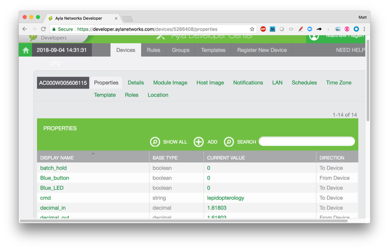
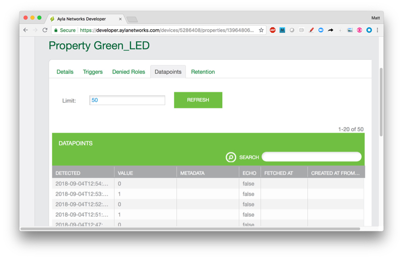

### Clone the Ayla Github repo

By default, the installation script ([ayla_install.sh](https://github.com/AylaNetworks/device_linux_public/blob/master/dev_kit/raspberry_pi/ayla_install.sh)) copies source files from the Github repository to a temporary directory on your RPi, builds various libraries, daemons, and the example application, installs them in <code>/home/pi/ayla</code>, and deletes the temporary directory. The directions below show you how to modify this installation behavior to retain the source files in <code>/home/pi/device_linux_public</code> so that you can modify them as you experiment with building an application.

<ol>
<li>Secure shell to your RPi:
<pre>
$ ssh pi&#64;192.168.1.3
</pre>
</li>
<li>Ensure that you are in your home directory (e.g. <code>/home/pi</code>).</li>
<li>Clone the repository. You will be asked for your Github username and password.
<pre>
$ git clone https&#58;//github.com/AylaNetworks/device_linux_public.git
</pre>
</li>
<li>View the new <code>/home/pi/device_linux_public</code> source directory.</li>
</ol>

### Obtain a devd.conf file

The installation script (ayla_install.sh) requires a configuration file called <code>devd.conf</code> which associates an Ayla-generated device serial number (DSN) with your RPi. You can request this file from your Ayla rep. If you receive a file with a DSN name (e.g. <code>AC000W005606115.conf</code>), rename it to <code>devd.conf</code>. Alternately, if you have admin access rights to your Ayla OEM account, you can [generate a devd.conf file yourself](/devices/ayla-dynamic-gateway-agent/getting-started/generate-a-devd-conf-file/).

### Copy and edit ayla_install.sh

<ol>
<li>Copy ayla_install.sh to your home directory:
<pre>
$ cp ~/device_linux_public/dev_kit/raspberry_pi/ayla_install.sh ~/ 
</pre>
</li>
<li>Open the file for editing, and find the following line:
<pre>
ayla_src_dir="$temp_dir/ayla/src"
</pre>
</li>
<li>Change it to the following, and save.
<pre>
ayla_src_dir="/home/pi/device_linux_public"
</pre>
</li>
</ol>

### Install the Ayla Device Platform for Linux

<ol>
<li>View installation options:
<pre>
$ ./ayla_install.sh -h
</pre>
The following options appear:
<pre>
ayla_install.sh [OPTIONS]
OPTIONS:
  -d, --dryrun        Tests script configuration and exits without modifying the system
  -u, --upgrade       Modifies install to avoid overwriting existing config
  -b, --build_env     Just installs the packages required to compile Ayla modules
  -p, --package PATH  Path of Ayla source tarball, or URL to GIT repo (default: device_linux_public.git)
  -c, --config DIR    Directory to find required config files (default: /home/pi/)
  -a, --app APP_NAME  Appd to build (default: appd)
  -n, --no_wifi       Omits installing and configuring Wi-Fi-specific components
  -g, --gpio          Adds Wiring Pi library for Raspberry Pi
  -m, --modem         Adds usb-modeswitch library to support USB connected [cellular] modems
  -z, --ble           Installs BlueZ Bluetooth daemon from source to enable full BLE support
  -e, --zigbee        Installs libreadline-dev/libncurses-dev to enable full ZigBee support
  -t, --multi         Installs BlueZ Bluetooth daemon/libreadline-dev/libncurses-dev to enable BLE/ZigBee support
  -l, --log PATH      Dump installation details to a log file
  -v, --version       Print script version
  -h, --help          Print usage
</pre>
</li>
<li>Start the installation:
<pre>
$ ssh pi&#64;192.168.1.7
$ sudo ./ayla_install.sh -g     // Wi-Fi
$ sudo ./ayla_install.sh -g -n  // Ethernet
</pre>
If you are installing over a previous installation, include the <code>-u</code> flag. The <code>-g</code> flag installs the [Wiring Pi library](http://wiringpi.com/) in your run environment which is required by the tutorials for connecting your RPi via the GPIO pins to an LED and a button on a breadboard.
</li>
<li>Reboot the RPi.
<pre>
$ sudo reboot
</pre>
On reboot, the Ayla Linux Agent daemon (devd) and the Host Application daemon (appd) will start.
</li>
<li>Verify that both are running. Here are a few ways to do this:
<pre>
$ tail -30 /var/log/messages
$ ps -A | grep devd
$ ps -A | grep appd
$ top -c -p $(pgrep -d',' -f devd)
$ top -c -p $(pgrep -d',' -f appd)
$ pgrep devd
$ pgrep appd
$ htop (and then search with F3)
$ systemctl status devd.service
</pre>
Note that appd and devd reside on disk in <code>/home/pi/ayla/bin</code>.
</li>
</ol>

### Register the device

<ol>
<li>Using a computer connected to the same LAN as your RPi, browse to the Ayla Developer Portal.</li>
<li>Click Register New Device.

If the Device Registration page does not contain a Registration Code textbox, reboot your RPi, and refresh the page.
</li>
<li>Click the link on the page to reveal a device registration code (e.g. e224a1) in a new tab.</li>
<li>Copy and paste the code into the Registration Code textbox, and click Register. The Ayla Cloud registers the device to your Ayla user account.</li>
</ol>

### View your RPi device properties

<ol>
<li>Browse to the <a href="/apps/ayla-developer-portal/">Developer Portal</a>.

</li>
<li>Click View My Devices. A Devices list appears.

</li>
<li>Click your RPi device. A properties list appears.

</li>
<li>Scroll, and click a property. A property Details page appears (bottom horizontal menu).

</li>
<li>Click Datapoints. The property value history appears. 

</li>
</ol>
