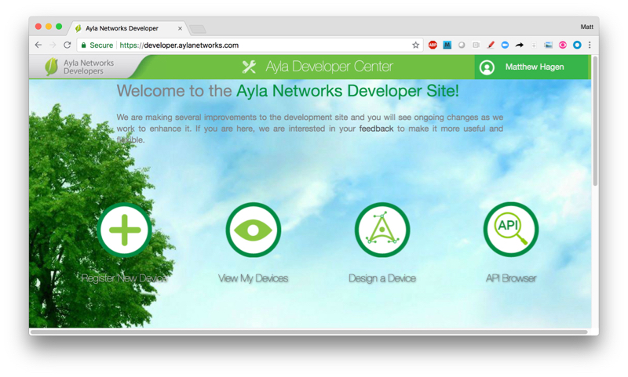
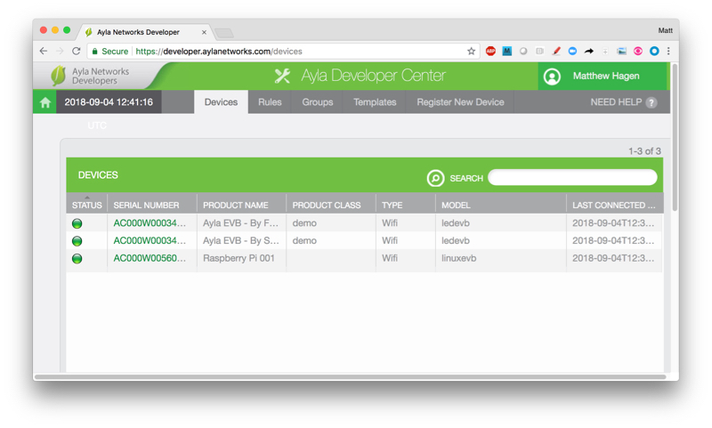

This page shows you how to create an Ayla account, set up your Raspberry Pi, create a factory configuration file, and install the Ayla Device Platform for Linux which includes the Ayla Linux Agent (devd) and a host application (appd).

### Create an Ayla Account

<ol>
<li>Browse to <a href="">Ayla Networks</a>.</li>
<li>Click Getting Started > Developer Portal > Developer Portal > <a href="https://developer.aylanetworks.com/registrations/new">Sign Up</a>.</li>
<li>Fill in the form. Leave "Have an Ayla Dev Kit" unchecked. Click OK.</li>
<li>Open the confirmation email, click the link, and access your Developer Portal Account.

</li>
<li>Click View My Devices. Initially, your Devices list will be empty. After you register your Raspberry Pi, your RPi device will appear in this list as a single row.

</li>
</ol>

### Set up your Raspberry Pi

To complete the hands-on exercises in the Guide and Tutorial, you will need a functioning Raspberry Pi 2 or 3 with the latest Raspbian image, and Ethernet or Wi-Fi connectivity. To test the exercises, we used the [CanaKit Raspberry Pi Quick Start Guide](https://www.canakit.com/Media/CanaKit-Raspberry-Pi-Quick-Start-Guide-3.2.pdf) to set up a [Raspberry Pi 3 Model B+ 32-bit Starter Kit](https://www.canakit.com/raspberry-pi-3-model-b-plus-starter-kit.html). The exercises assume you are accessing your RPi via SSH, so connecting your RPi to a monitor, keyboard, and mouse is optional. 

<a class="btn btn-primary" data-toggle="collapse" href="#rpi-help" role="button">Click here for helpful hints regarding your Raspberry Pi.</a>

Useful Links:

<ul>
<li><a href="https://www.raspberrypi.org/">Raspberry Pi Homepage</a></li>
<li><a href="https://www.canakit.com/Media/CanaKit-Raspberry-Pi-Quick-Start-Guide-3.2.pdf">CanaKit Raspberry Pi Quick Start Guide</a></li>
<li><a href="http://wiringpi.com/">Wiring Pi: GPIO Interface library for the Raspberry Pi</a></li>
<li><a href="https://www.lifewire.com/raspberry-pi-terminal-commands-4054108">20 Handy Raspberry Pi Terminal Commands</a></li>
<li><a href="https://www.dexterindustries.com/howto/run-a-program-on-your-raspberry-pi-at-startup/">Five Ways To Run a Program On Your Raspberry Pi At Startup</a></li>
</ul>

Use <code>scp</code> to copy files between a computer and an RPi.

<ul>
<li>Use this to copy hello.c from the current directory on your computer to <code>/home/pi/ayla</code> on the RPi:
<pre>
$ scp hello.c pi@192.168.1.7:ayla
</pre>
</li>
<li>Use this to copy hello.c from <code>/home/pi/ayla</code> on the RPi to the current directory on your computer:
<pre>
$ scp pi@192.168.1.7:ayla/hello.c .
</pre>
</li>
</ul>

Use <code>ssh</code> to remotely access an RPi:

<pre>
$ ssh pi@192.168.1.7
</pre>

Use <code>pinout</code> to visualize the GPIO layout:

<pre>
$ pinout
</pre>

Use <code>gpio readall</code> to visualize all GPIO identification schemes:

<pre>
$ gpio readall
</pre>

Use <code>gcc</code> to compile C code:

<pre>
$ gcc hello.c -o hello
</pre>

Use <code>shutdown</code>  to remotely shutdown the RPi:

<pre>
$ sudo shutdown -h now
</pre>

Check the Raspbian version with this command:

<pre>
$ cat /etc/os-release
</pre>

Use <code>df</code> to determine free space:

<pre>
$ df -h
</pre>

Update your package manager like this:

<pre>
$ sudo apt-get update
</pre>

Update your Raspbian distribution like this:

<pre>
$ sudo apt-get dist-upgrade
</pre>

### Create a Factory Configuration File

The Ayla Linux Agent (devd) requires a factory configuration file to uniquely identify and authenticate the Raspberry Pi with the Ayla Device Service (ADS). The JSON file has the following format:

<pre>
{
  "config": {
    "id": {
      "rsa_pub_key": "-----BEGIN RSA PUBLIC KEY-----\n...\n-----END RSA PUBLIC KEY-----\n",
      "dsn": "AC000W001234567"
    },
    "sys": {"factory": 1},
    "client": {"region": "US"},
    "oem": {
      "oem": "0dfc1234",
      "model": "linuxevb",
      "key": "Qrt2...H9IrjbZi18u3RFGXbBH=="
    }
  }
}
</pre>

Contact your Ayla representative to obtain an Ayla Device Platform for Linux Configuration File. Ask for access to the Ayla Device Platform for Linux [Github Repository](https://github.com/AylaNetworks/device_linux_public), too.

### Install the Ayla Device Platform for Linux
<ol>
<li>Download [Github: ayla_install.sh](https://github.com/AylaNetworks/device_linux_public/tree/master/dev_kit/raspberry_pi).</li>
<li>Copy ayla_install.sh from the current directory to <code>/home/pi</code> on the RPi.
<pre>
$ scp ayla_install.sh pi@192.168.1.7:
</pre>
</li>
<li>Copy your configuration file from the current directory to <code>/home/pi/devd.conf</code>.<pre>
$ scp AC000W005606115.conf pi@192.168.1.7:devd.conf
</pre>
</li>
<li>View installation options:
<pre>
$ ./ayla_install.sh -h
</pre>
The following options appear:
<pre>
ayla_install.sh [OPTIONS]
OPTIONS:
  -d, --dryrun        Tests script configuration and exits without modifying the system
  -u, --upgrade       Modifies install to avoid overwriting existing config
  -b, --build_env     Just installs the packages required to compile Ayla modules
  -p, --package PATH  Path of Ayla source tarball, or URL to GIT repo (default: device_linux_public.git)
  -c, --config DIR    Directory to find required config files (default: /home/pi/)
  -a, --app APP_NAME  Appd to build (default: appd)
  -n, --no_wifi       Omits installing and configuring Wi-Fi-specific components
  -g, --gpio          Adds Wiring Pi library for Raspberry Pi
  -m, --modem         Adds usb-modeswitch library to support USB connected [cellular] modems
  -z, --ble           Installs BlueZ Bluetooth daemon from source to enable full BLE support
  -e, --zigbee        Installs libreadline-dev/libncurses-dev to enable full ZigBee support
  -t, --multi         Installs BlueZ Bluetooth daemon/libreadline-dev/libncurses-dev to enable BLE/ZigBee support
  -l, --log PATH      Dump installation details to a log file
  -v, --version       Print script version
  -h, --help          Print usage
</pre>
</li>
<li>Start the installation:
<pre>
$ ssh pi@192.168.1.7
$ sudo ./ayla_install.sh -g     // Wi-Fi
$ sudo ./ayla_install.sh ­-g -n  // Ethernet
</pre>
If you are installing over a previous installation, include the <code>-u</code> flag. The <code>-g</code> flag installs the [Wiring Pi library](http://wiringpi.com/) in your run environment which is necessary when connecting your RPi via the GPIO pins to an LED and a button on a breadboard.
</li>
<li>Reboot the RPi.
<pre>
$ sudo reboot
</pre>
On reboot, the Ayla Linux Agent daemon (devd) and the Customer Application daemon (appd) will start.
</li>
<li>Verify that both are running. Here are a few ways to do this:
<pre>
$ tail -30 /var/log/messages
$ ps -A | grep devd
$ ps -A | grep appd
$ top -c -p $(pgrep -d',' -f devd)
$ top -c -p $(pgrep -d',' -f appd)
$ pgrep devd
$ pgrep appd
$ htop (and then search with F3)
$ systemctl status devd.service
</pre>
Note that appd and devd reside on disk in <code>/home/pi/ayla/bin</code>.
</li>
</ol>
