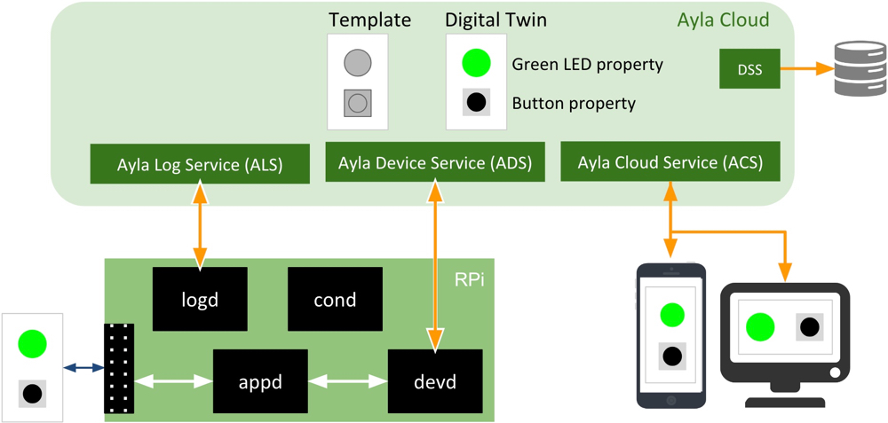

The Ayla Linux Agent, a software daemon called devd that connects Linux-based applications to the Ayla Cloud, is part of the Ayla Device Platform for Linux ([Github](https://github.com/AylaNetworks/device_linux_public)) which is composed of the following components:

<dl>
<dt>devd</dt>
<dd>The Ayla Linux Agent (devd) provides the following functionality:
<ul>
<li>Communicates via HTTPS with the Ayla Device Service (ADS).</li>
<li>Connects to and receives event notifications from the Ayla Notification Service (ANS).</li>
<li>Handles HTTP requests from devices on the local network with its internal web server.</li>
<li>Responds to mDNS address requests for DSN hostnames.</li>
<li>Supports LAN mode encrypted sessions for communication with Ayla mobile apps.</li>
<li>Provides an IPC interface for internal messaging with other Ayla daemons.</li>
</ul>
</dd>

<dt>appd</dt>
<dd>The host application (appd) defines and manages device properties, and either directly controls the behavior of a device, or provides an interface to other applications in control of devices. By default, devd launches and monitors appd. If appd crashes or quits, devd re-launches it. To speed development, a demo application daemon is provided.</dd>

<dt>devdwatch</dt>
<dd>This watchdog software is designed to monitor and re-launch devd in case of failure. If available, Ayla recommends using the system's built-in process-restart functionality.</dd>

<dt>acgi</dt>
<dd>This CGI utility is executed by the system’s primary web server. Acgi parses each request and forwards valid requests to devd, which handles them using its internal web server. This component is required to support LAN mode, Wi-Fi Setup, and Same-LAN registration. For acgi to work, some device configuration is required.</dd>

<dt>ota_update</dt>
<dd>This utility is used to download, verify, and apply an over-the-air (OTA) firmware image. This utility is invoked by devd when the service indicates a pending device update. For ota_update to be fully functional, OTA-related platform-specific functions must be implemented in the lib/platform library. Platform-specific functions implement image storage, readback, and apply the downloaded image to the system.</dd>

<dt>cond</dt>
<dd>Wi-Fi connection manager daemon that enables Ayla Wi-Fi Setup functionality and provides an abstraction layer between Ayla daemons and the Wi-Fi driver. This daemon manages scan results and network profiles, configures AP mode, and establishes connections to Wi-Fi access points. (Optional component and may be omitted if Ayla Wi- Fi Setup solution is not needed.)</dd>

<dt>logd</dt>
<dd>This is the Ayla logging client. Ayla daemons write specially-tagged log messages to Syslog. This daemon parses syslog output, filters messages based on log config managed by devd, and posts them to Ayla logging service. Can be remotely enabled from the Ayla OEM Dashboard and configured to monitor and debug. (Optional component and may be omitted if remote logging functionality is not needed.)</dd>
</dl>

All communication between various Ayla modules listed above uses messages sent over Unix domain sockets. To promote maintainability and code reuse, Internal message payloads and protocols are generally defined in lib/ayla or lib/app. See the diagram:

Note the following in the diagram:

1. devd is the Ayla Linux Agent.
1. appd is the host application.
1. appd communicates with a green LED and a button via the GPIO pins on the RPi.
1. The Ayla Cloud maintains a digital twin (model) of the RPi device. The digital twin is an instance of a template.
1. The digital twin is composed of properties representing characteristics of the RPi device.
1. Each property has a name, type, value, and direction (To Device or From Device). 
1. As the value of a property changes, the Ayla Cloud maintains a time-stamped history of these datapoints. 
1. Mobile and web apps interact with the digital twin.
1. An LED property is a good example of a "To Device" property: Apps send on/off commands to the device.
1. A button property is a good example of a "From Device" property: Button on/off state comes from the device. 
1. The Data Streaming Service (DSS) enables the Ayla Cloud to send data to integrated systems for data analysis.