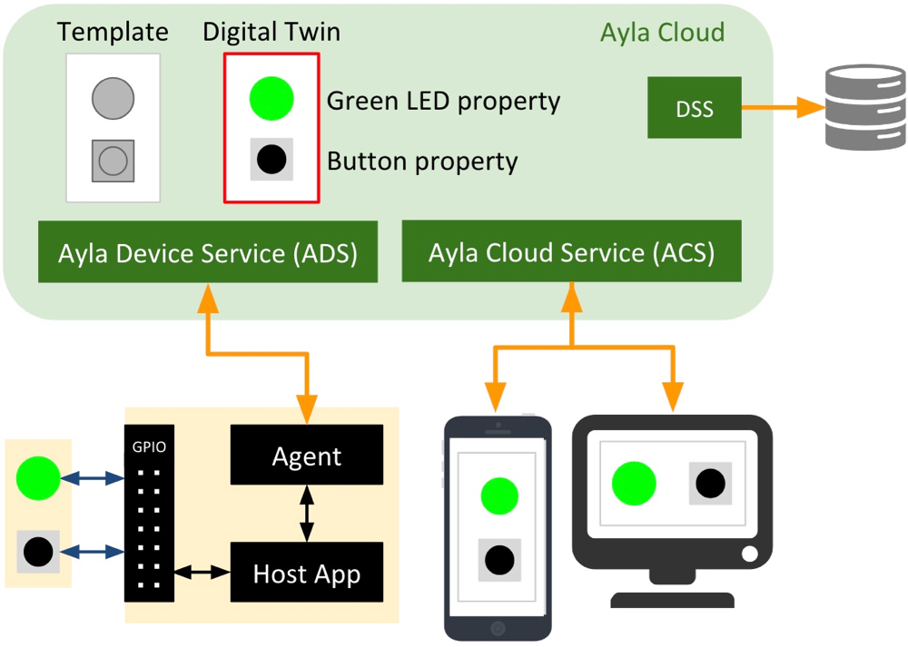

This page provides a brief description of both the Ayla Platform and the Ayla Device Platform for Linux (which includes the Ayla Linux Agent).

# Ayla Platform

Ayla architecture is divided into three parts: device, cloud, and apps:

<iframe 
  class="hspace"
  width="560" 
  height="315" 
  src="https://www.youtube.com/embed/qmMH4I_RVno?rel=0&amp;showinfo=0" 
  frameborder="0" 
  allow="autoplay; 
  encrypted-media" 
  allowfullscreen>
</iframe>

<a class="btn btn-link" data-toggle="collapse" href="#transcript" role="button">Click to view the video transcript.</a>

The Internet of Things, or IoT, is here, and it is connecting everything around us to the internet. From ceiling fans to thermostats, this network is enabling everyday devices to communicate for the very first time.

But, suppose you are a manufacturer, and you want to IoT-enable your products to provide consumers with a better user experience, or even just to learn how users are actually using your devices. Where do you start? Well, first you would need to wirelessly connect your device to the cloud by designing the necessary networking hardware and networking stack into your product. Then, you would need to develop an application, writing the software to establish and manage the communication with the cloud. And finally, to make it all work, you would also need to build a cloud that has the capabilities to support all your users and devices as you scale.

However, building this type of solution is only half the battle as it not only poses an enormous amount of risk and financial investment up front, but an ongoing challenge to maintain it as well. Fortunately, there is an alternative to building and managing this yourself. Ayla offers an end-to-end IoT platform that includes a completely managed cloud service which provides the enterprise capabilities you need to scale your deployment. The Ayla cloud requires zero cloud coding and has been built from the ground up to provide security and scale, global reach, analytics, user management, device management, alerts and notifications, data management, and more, out of the box.

The Ayla cloud also offers several pre-integrated apps, feeds, and reporting services, as well as the ability to integrate with other third-party systems to enable you to better manage your business. To connect your devices to the Ayla cloud, Ayla enables pre-programmed, fully-tested, and production-ready networking hardware through partnerships with the industry's leading chip and module manufacturers. Ayla offers support for both embedded and Linux-based applications to cover the broadest array of communication protocols, and adds no additional cost to hardware.

As for developing mobile apps that can securely control and manage your products, Ayla provides native iOS and Android libraries that support the creation of triggers, schedules & timers, registrations, account CRUD, and more. For customers looking for an even faster time to market with less on-going maintenance, Ayla offers a partially completed white-label mobile app called AMAP that provides much of the coding needed to jump start the development of primary features that consumers have come to expect from any high-performing mobile app.

For those looking for some mobile development help, Ayla has a robust ecosystem of partners who can be called on to assist with any project. Ayla's agile IoT platform abstracts the complexity of developing connected devices, and is trusted by some of the world's leading brands to sole the IoT so they can focus on what they do best. Ayla is solving the Internet of Things, so you don't have to.

Fundamentally, putting aside data collection and analytics, the Ayla Platform enables applications to interact with a cloud-based model of a device, controlling various aspects of the device, and responding to device events. Consider, for example, a simple Linux-based device composed of a host application, green LED, and button:

The central character in this diagram is the digital twin (red box) composed of properties representing various aspects of the device. The digital twin is how web and mobile apps see the device. These applications send commands to the device via "To Device" properties like the green LED. They remain aware of device state via "From Device" properties like the button. The Ayla software agent enables the device to connect to the Ayla Cloud.

# Ayla Device Platform for Linux

The Ayla Device Platform for Linux ([Github](https://github.com/AylaNetworks/device_linux_public)), which includes two software daemons, the Ayla Linux Agent (devd) and an example host application (appd), is simply a device-based environment that enables a Linux device (e.g. Raspberry Pi) to stay in sync with a digital twin in the Ayla Cloud. The following video shows appd and devd in action on a Raspbery Pi:

<iframe 
  class="hspace"
  width="560" 
  height="315" 
  src="https://www.youtube.com/embed/yMBrq3hoCd4?rel=0&amp;showinfo=0" 
  frameborder="0" 
  allow="autoplay; 
  encrypted-media" 
  allowfullscreen>
</iframe>

The Ayla Device Platform for Linux is composed of the components below. Communication among Ayla daemons takes place over Unix domain sockets.

<dl>
<dt>devd</dt>
<dd>The Ayla Linux Agent (devd) provides the following functionality:
<ul>
<li>Communicates via HTTPS with the Ayla Device Service (ADS).</li>
<li>Connects to and receives event notifications from the Ayla Notification Service (ANS).</li>
<li>Handles HTTP requests from devices on the local network with its internal web server.</li>
<li>Responds to mDNS address requests for DSN hostnames.</li>
<li>Supports LAN mode encrypted sessions for communication with Ayla mobile apps.</li>
<li>Provides an IPC interface for internal messaging with other Ayla daemons.</li>
</ul>
</dd>

<dt>appd</dt>
<dd>The host application (appd) defines and manages device properties, and either directly controls the behavior of a device, or provides an interface to other applications in control of devices. By default, devd launches and monitors appd. If appd crashes or quits, devd re-launches it. To speed development, a demo application daemon is provided.</dd>

<dt>devdwatch</dt>
<dd>This watchdog software is designed to monitor and re-launch devd in case of failure. If available, Ayla recommends using the system's built-in process-restart functionality.</dd>

<dt>acgi</dt>
<dd>This CGI utility is executed by the system’s primary web server. Acgi parses each request and forwards valid requests to devd, which handles them using its internal web server. This component is required to support LAN mode, Wi-Fi Setup, and Same-LAN registration. For acgi to work, some device configuration is required.</dd>

<dt>ota_update</dt>
<dd>This utility is used to download, verify, and apply an over-the-air (OTA) firmware image. This utility is invoked by devd when the service indicates a pending device update. For ota_update to be fully functional, OTA-related platform-specific functions must be implemented in the lib/platform library. Platform-specific functions implement image storage, readback, and apply the downloaded image to the system.</dd>

<dt>cond</dt>
<dd>Wi-Fi connection manager daemon that enables Ayla Wi-Fi Setup functionality and provides an abstraction layer between Ayla daemons and the Wi-Fi driver. This daemon manages scan results and network profiles, configures AP mode, and establishes connections to Wi-Fi access points. (Optional component and may be omitted if Ayla Wi- Fi Setup solution is not needed.)</dd>

<dt>logd</dt>
<dd>This is the Ayla logging client. Ayla daemons write specially-tagged log messages to Syslog. This daemon parses syslog output, filters messages based on log config managed by devd, and posts them to Ayla logging service. Can be remotely enabled from the Ayla OEM Dashboard and configured to monitor and debug. (Optional component and may be omitted if remote logging functionality is not needed.)</dd>
</dl>