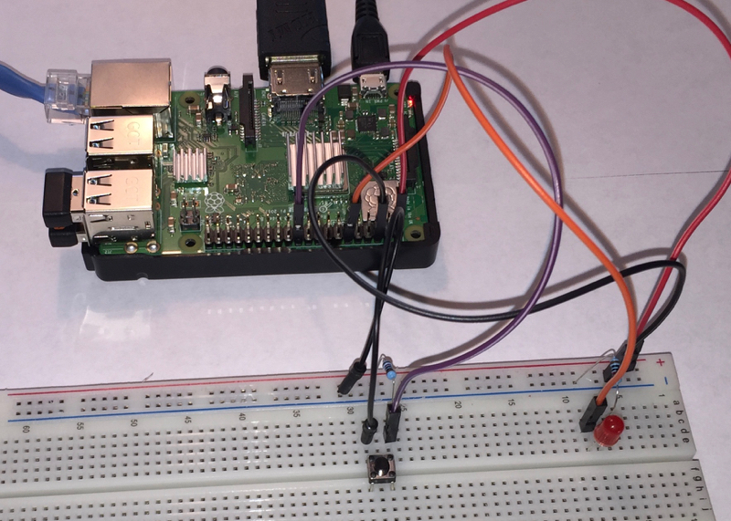
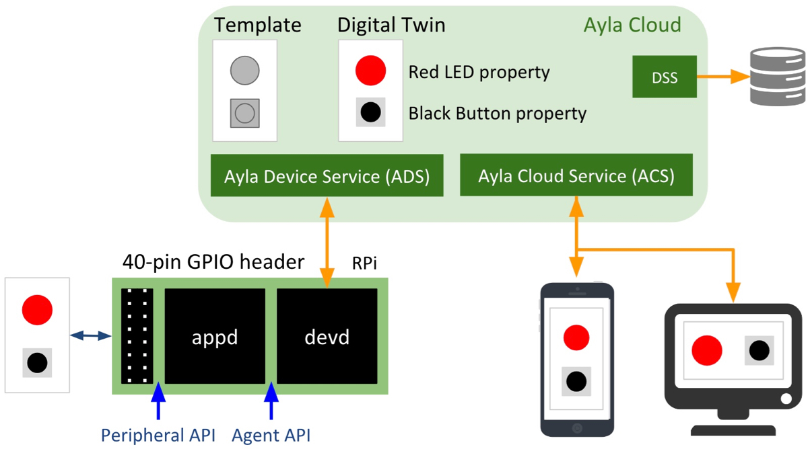
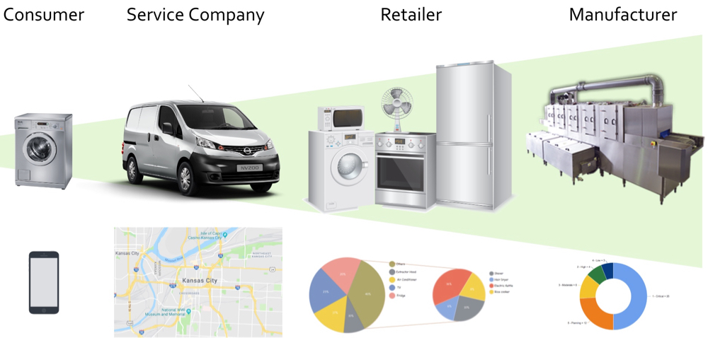

This guide uses a [Raspberry Pi](https://www.raspberrypi.org/) connected via jumper wires to a breadboard (hosting a red LED and a black button) to represent any Linux-based device that you may want to connect to the [Ayla Cloud](/glossary/ayla-cloud). The guide refers to this RPi/breadboard combination as the <i>Device</i>. See the diagram.

The best way to connect your device to the Ayla Cloud is to run an [Ayla Linux Agent](/glossary/ayla-linux-agent) on the device. The Ayla Linux Agent, part of the [Ayla Device Platform for Linux](/glossary/ayla-device-platform-for-linux), provides cloud connectivity, security, and several other services. The Ayla Linux Agent is implemented as devd (Device Daemon), and your app is implemented as appd (App Daemon). See the diagram.

Note the following:

1. devd is the Ayla Agent, and appd is your application.
1. Both run as Linux daemons on your RPi, either in the foreground or the background.
1. devd interacts with the Ayla Device Service (ADS).
1. appd has two interfaces: Peripheral API and Agent API. Your principle focus is interacting with these.
1. A device is represented in the Ayla Cloud by a digital twin, which is an instance of a template.
1. Digital twins have properties defined in templates.
1. The current value of a property is a datapoint.
1. Mobile and web applications access properties via the Ayla Cloud (RESTful) interface.
1. The Ayla Cloud includes a Data Streaming Service (DSS) for real-time updates to integrated systems.

Before diving into details, it is worth considering the value of connecting a device to the Ayla Cloud. See the diagram.

Remote control of devices is not the only benefit. Depending on how device data is aggregated and analyzed, consumers, service technicians, retailers, and manufacturers can leverage insights to improve efficiencies and performance.