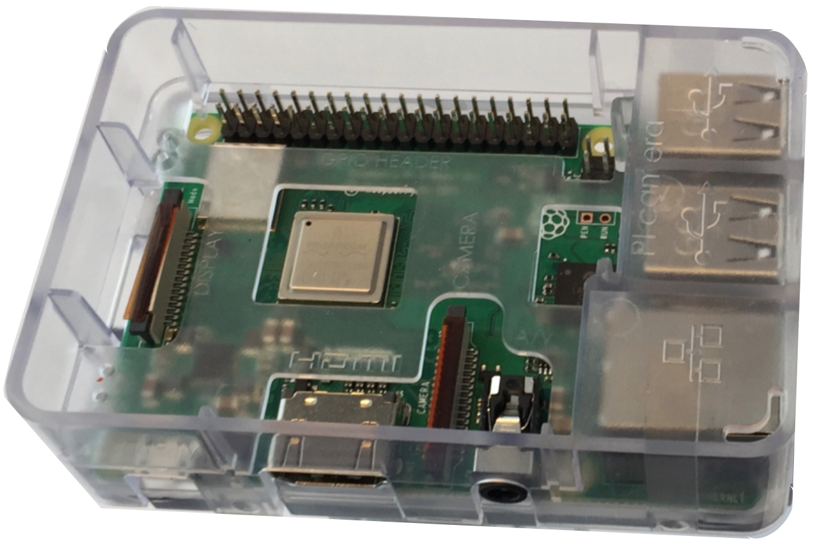
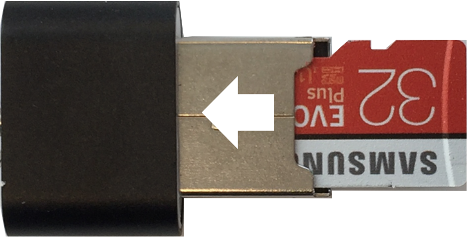
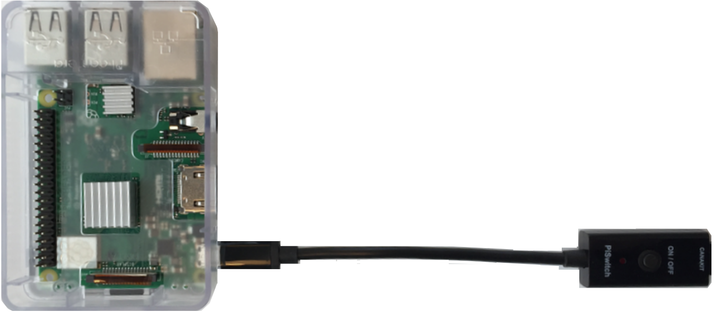
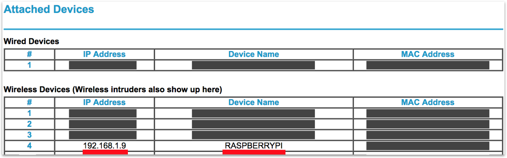
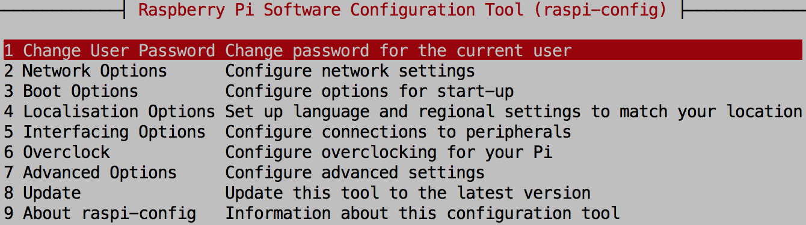

The [CanaKit Raspberry Pi 3 Model B+ Ultimate Starter Kit](https://www.canakit.com/raspberry-pi-3-model-b-plus-ultimate-kit.html) provides all the components needed to complete the standard tutorials. Refer to the "Read Me First!" card, "CanaKit Raspberry Pi Quick-Start Guide," official [Raspberry Pi](https://www.raspberrypi.org/) website, and Additional Links at the bottom of this page for official set-up directions. 

## Raspberry Pi 3 B+ components

The following diagram points out many RPi components:

## Headless Setup

The following steps explain how to set up a headless, wireless Raspberry Pi (no monitor, keyboard, mouse, Ethernet cable), running Raspbian Stretch Full or Lite, and accessible via Secure Shell (ssh):

<ol>

<li>Insert the RPi into the clear case per [these directions](https://www.canakit.com/pi-case). You won't need the lid or camera for now.

</li>

<li>Install the heat sinks:

</li>

<li>insert the card into a USB MicroSD card reader:

</li>

<li>Insert the reader into a USB port on your computer. 

</li>

<li>If you want to overwrite pre-loaded [NOOBS](https://www.raspberrypi.org/downloads/noobs/) with a Raspian OS installation, do the following:

<ol>
<li>Download one of the flavors of [Raspbian Stretch](https://www.raspberrypi.org/downloads/raspbian/) to your computer. Do not unzip. Be aware that Raspbian Stretch Lite does not include <code>git</code>. You can install it afterward.

<li>Download [Etcher](https://www.balena.io/etcher/) to your computer, and install it.

</li>

<li>Run Etcher, click the gear, uncheck <code>Auto-unmount</code>, and click Back:

</li>

<li>Flash the Raspian image to the MicroSD card:

</li>
</li>
</ol>

<li>In a terminal on your computer, view the contents of the MicroSD card which may be named <code>boot</code>:
<pre>
/Volumes/boot$ ls -1
COPYING.linux
LICENCE.broadcom
LICENSE.oracle
bcm2708-rpi-0-w.dtb
...
</pre>
</li>

<li>If you will be using a wireless connection to the RPi, do the following:

<ol>
<li>create a <code>wpa_supplicant.conf</code> text file:
<pre>
/Volumes/boot$ touch wpa_supplicant.conf
</pre>
</li>

<li>Edit the file, copy & paste the configuration below, modify <code>country</code>, <code>ssid</code>, <code>psk</code>, and <code>key_mgmt</code>, and save:
<pre>
ctrl_interface=DIR=/var/run/wpa_supplicant GROUP=netdev
update_config=1
country=US

network={
     ssid="Your network name/SSID"
     psk="Your WPA/WPA2 security key"
     key_mgmt=WPA-PSK
}

network={
     ssid="Public network"
     key_mgmt=NONE
}

network={
    key_mgmt=NONE
    priority=-999
}
</pre>
At boot time, Raspian copies the file to <code>/etc/wpa_supplicant/wpa_supplicant.conf</code>.
</li>
</li>
</ol>

<li>Configure Secure Shell by creating an empty <code>ssh</code> text file:
<pre>
/Volumes/boot$ touch ssh
</pre>
</li>

<li>Unmount/remove the MicroSD card from your computer/card reader:

</li>

<li>Insert the MicroSD card into your Raspberry Pi:

</li>

<li>Use the CanaKit PiSwitch to plug-in and power-on the RPi, and wait for a minute or two:

</li>

<li>Inspect your router to determine the IP address of your Raspberry Pi:

You can also enter <code>arp</code> in a terminal:
<pre>
$ arp -a
...
? (192.168.1.9) at aa:aa:aa:aa:aa:aa on en0 ifscope [ethernet]
...
</pre>
</li>

<li>Connect to the Raspberry Pi from your computer using one or both options below. Username is <code>pi</code>. Default password is <code>raspberry</code>.

<ol>
<li>Use Secure Shell.
<pre>
$ ssh pi&#64;192.168.1.9
</pre>
</li>

<li>Use Virtual Network Computing (VNC). [See the direction here](https://www.raspberrypi.org/documentation/remote-access/vnc/). 

</li>
</li>
</ol>

<li>Change your password:
<pre>
passwd
</pre>
</li>

<li>Change the hostname (default is <code>raspberrypi</code>):
<pre>
$ sudo raspi-config
</pre>
Then, select <code>Network Options</code> &gt; <code>Hostname</code>. Change occurs after reboot.

<li>Record the hostname, username, password, and mac address of your RPI.</li>

<li>If you are using Raspbian Stretch Lite, install <code>git</code>, and determine version:
<pre>
$ sudo apt-get update
$ sudo apt-get install git -y
$ git --version
git version 2.11.0
</pre>
</li>

<li>Determine <code>gcc</code> version:
<pre>
$ gcc --version
gcc (Raspbian 6.3.0-18+rpi1+deb9u1) 6.3.0 20170516
Copyright (C) 2016 Free Software Foundation, Inc.
This is free software; see the source for copying conditions.  There is NO
warranty; not even for MERCHANTABILITY or FITNESS FOR A PARTICULAR PURPOSE.
</pre>
</li>

<li>Determine <code>python</code> version:
<pre>
$ python --version
Python 2.7.13
</pre>
</li>

<li>Determine <code>nano</code> version:
<pre>
$ nano --version
GNU nano, version 2.7.4
</pre>
</li>

</ol>

## Notes

### Working via Hotspot

Do these steps right after burning a new Raspbian image on your MicroSD card:

1. Define a hotspot on your mobile device.
1. Enable the hotspot network.
1. Know the ssid, password, and encryption type (WPA2) of the network.
1. Create a wpa_supplicant.conf. The hotspot network definition should appear first.
1. Do the rest of the steps above. 
1. Use the Hotspot network for your computer.
1. Run <code>arp -a</code> to determine the IP range to scan.
1. Run <code>nmap -T5 -sP 172.20.10.1-255</code> to scan an IP range. You are looking for the IP of your RPi using the mac address.
1. <code>ssh</code> to your RPI.

### ssh

When you reinstall Raspian on an RPi to which you have been previously opening a secure shell, <code>ssh</code> on your computer may notice the change, and may display a notice similar to the following:
<pre>
@@@@@@@@@@@@@@@@@@@@@@@@@@@@@@@@@@@@@@@@@@@@@@@@@@@@@@@@@@@
@    WARNING: REMOTE HOST IDENTIFICATION HAS CHANGED!     @
@@@@@@@@@@@@@@@@@@@@@@@@@@@@@@@@@@@@@@@@@@@@@@@@@@@@@@@@@@@
IT IS POSSIBLE THAT SOMEONE IS DOING SOMETHING NASTY!
Someone could be eavesdropping on you right now (man-in-the-middle attack)!
It is also possible that a host key has just been changed.
The fingerprint for the ECDSA key sent by the remote host is
SHA256:r4Y+vxKp5N6tEsMJtc6za1v/Rujms4wfjMY51jH8wsw.
Please contact your system administrator.
Add correct host key in /Users/matt/.ssh/known_hosts to get rid of this message.
Offending ECDSA key in /Users/matt/.ssh/known_hosts:5
ECDSA host key for 192.168.1.8 has changed and you have requested strict checking.
Host key verification failed.
</pre>

To solve this, open <code>&#126;/.ssh/known_hosts</code> on your computer, and delete the row representing the previous (IP Address, ECDSA Key) association.

### raspi-config

Use <code>raspi-config</code> to set configuration from the command line:

<pre>
$ sudo raspi-config
</pre>

## Additional Links

* [raspberrypi.org/documentation/remote-access/ssh](https://www.raspberrypi.org/documentation/remote-access/ssh/)
* [Installing NOOBS for first time without screen or keyboard](https://www.raspberrypi.org/forums/viewtopic.php?t=172862)
* [NOOBS (New Out of Box Software)](https://github.com/raspberrypi/noobs/blob/master/README.md)
* [Setting up a Raspberry Pi headless](https://www.raspberrypi.org/documentation/configuration/wireless/headless.md)
* [Raspbian](https://www.raspberrypi.org/downloads/raspbian/)
* [pi zero w wpa_supplicant](https://www.raspberrypi.org/forums/viewtopic.php?t=203716)
* [Setting WiFi up via the command line](https://www.raspberrypi.org/documentation/configuration/wireless/wireless-cli.md)
* [SSH (Secure Shell)](https://www.raspberrypi.org/documentation/remote-access/ssh/)
* [Setting up your own Raspberry Pi 3 git server with Go Git Service (Gogs) and Raspbian Stretch Lite](https://www.techcoil.com/blog/setting-up-your-own-raspberry-pi-3-git-server-with-go-git-service-gogs-and-raspbian-stretch-lite/)
* [Setting Wi-Fi up via the command line](https://www.raspberrypi.org/documentation/configuration/wireless/wireless-cli.md)
* [User management in Raspbian](https://www.raspberrypi.org/documentation/linux/usage/users.md)
* [Change Raspberry Pi’s hostname](https://geek-university.com/raspberry-pi/change-raspberry-pis-hostname/)
* [Automatically connect a Raspberry Pi to a Wifi network](https://weworkweplay.com/play/automatically-connect-a-raspberry-pi-to-a-wifi-network/)
* [Automatically connect to open WiFi network](https://www.raspberrypi.org/forums/viewtopic.php?t=107852)
* [Adafruit's Raspberry Pi Lesson 5. Using a Console Cable](https://learn.adafruit.com/adafruits-raspberry-pi-lesson-5-using-a-console-cable/enabling-serial-console)
* [Read and Write From Serial Port With Raspberry Pi](https://www.instructables.com/id/Read-and-write-from-serial-port-with-Raspberry-Pi/)
* [The Raspberry Pi UARTs](https://www.raspberrypi.org/documentation/configuration/uart.md)
* [Node-RED Running on Raspberry Pi](https://nodered.org/docs/hardware/raspberrypi)
* [Raspberry Pi Serial (UART) Tutorial](https://www.teachmemicro.com/raspberry-pi-serial-uart-tutorial/)
* [VNC (Virtual Network Computing)](https://www.raspberrypi.org/documentation/remote-access/vnc/)
* [Control Arduino using Raspberry Pi | Arduino Raspberry Pi Serial Communication](https://electronicshobbyists.com/control-arduino-using-raspberry-pi-arduino-and-raspberry-pi-serial-communication/)

