The Ayla Device Platform for Linux runs on a Linux operating system such as Debian-based Raspbian, the primary OS of the small and versatile [Raspberry Pi](https://en.wikipedia.org/wiki/Raspberry_Pi). This page explains how to set up a [Raspberry Pi 3 Model B+](https://www.raspberrypi.org/products/raspberry-pi-3-model-b-plus/), part of the [CanaKit Raspberry Pi 3 Model B+ Ultimate Starter Kit](https://www.canakit.com/raspberry-pi-3-model-b-plus-ultimate-kit.html) which provides all the components needed to complete the tutorials. Although it is possible to set up a Raspberry Pi in desktop mode (with monitor, keyboard, mouse, and Ethernet cable), most use cases require remote access via [Secure Shell (ssh)](https://en.wikipedia.org/wiki/Secure_Shell), [VNC Viewer](https://www.realvnc.com/en/connect/download/viewer/), or some other tool, to a headless and, sometimes, wireless installation. Of the possible set up combinations below, Row C is recommended as your initial environment because it allows you to use VNC Viewer (explained below), and it avoids the need to pre-configure wireless which you can do using VNC Viewer later. 

|&nbsp;|Raspbian OS|Monitor + Keyboard + Mouse|Network Connection|
|-|-|-|-|-|
|A|full|yes|wired|
|B|full|yes|wireless|
|C|full|no|wired|
|D|full|no|wireless|
|E|lite|yes|wired|
|F|lite|yes|wireless|
|G|lite|no|wired|
|H|lite|no|wireless|

Although the full Raspbian OS (<code>Raspbian Stretch OS with desktop and recommended software</code>) is pre-installed on the Canakit MicroSD card, the steps below include instructions for flashing a new Raspbian OS onto your MicroSD card in case you want to re-image.

## Recommended setup

### Set up the physical Raspberry Pi

1. Insert the RPi into the clear case per [these directions](https://www.canakit.com/pi-case). You won't need the lid or camera for now.
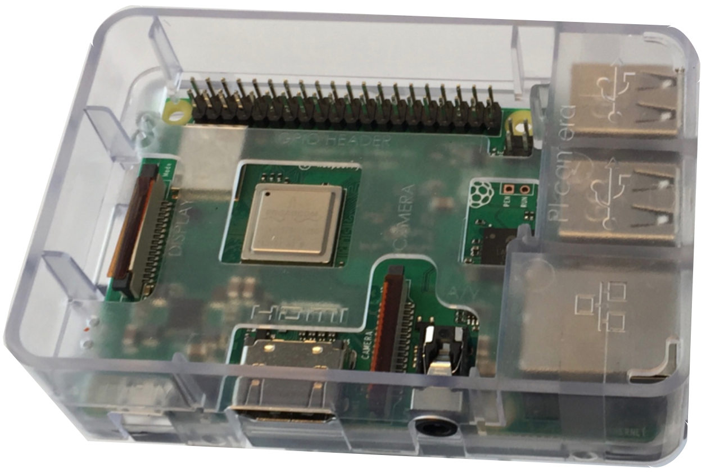
1. Install the heat sinks:
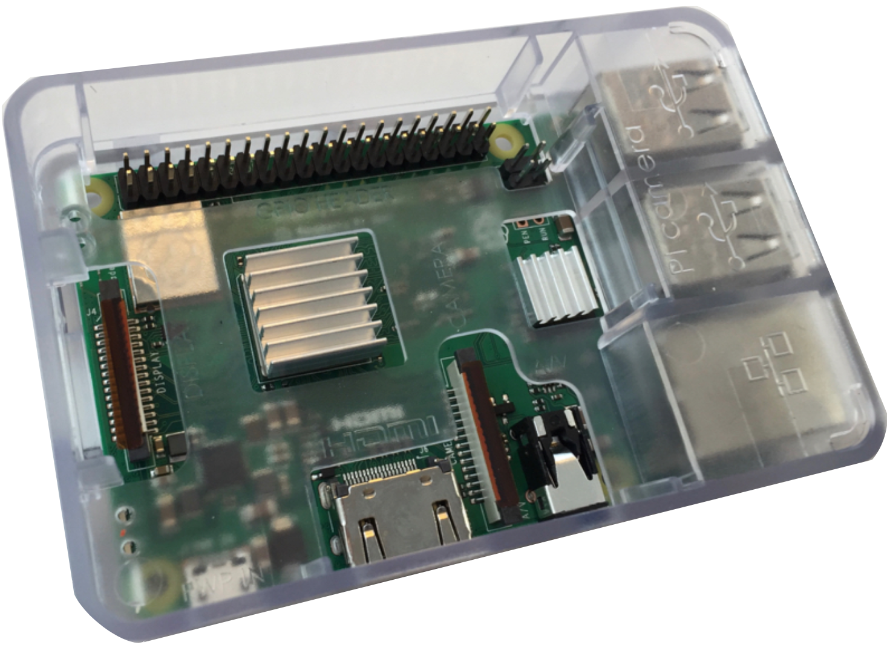

### Access the MicroSD card

1. Insert the MicroSD card into a USB MicroSD card reader:

1. Insert the reader into a USB port on your computer.
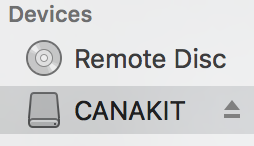

### Flash an OS image

1. Download one of the flavors of [Raspbian Stretch](https://www.raspberrypi.org/downloads/raspbian/) to your computer. Do not unzip.
1. Download [Etcher](https://www.balena.io/etcher/) to your computer, and install it.
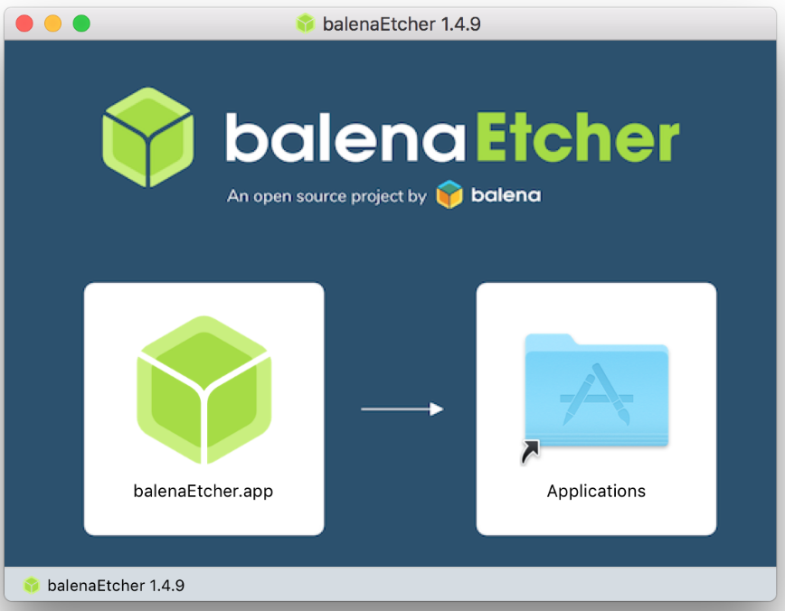
1. Run Etcher, click the gear, uncheck <code>Auto-unmount</code>, and click Back:
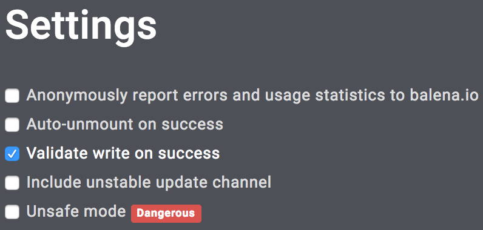
1. Flash the new Raspian image to the MicroSD card:
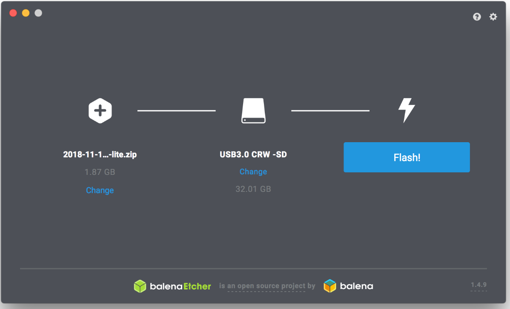

### Configure for remote access

1. In a terminal on your computer, view the contents of the MicroSD card which may be named <code>boot</code>:
<pre>
/Volumes/boot$ ls -1
COPYING.linux
LICENCE.broadcom
LICENSE.oracle
bcm2708-rpi-0-w.dtb
...
</pre>
1. Enable Secure Shell by creating an empty <code>ssh</code> text file:
<pre>
/Volumes/boot$ touch ssh
</pre>
1. Unmount the MicroSD card:
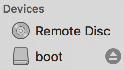

### Power on the Raspberry Pi

CAUTION: After powering on, you will need to find the IP address of your Raspberry Pi. If you have access to your router, you can determine the IP address by finding a new device named <code>RASPBERRYPI</code>, the default RPi name. Otherwise, finding the newly assigned IP address can be challenging. One approach is running <code>arp -a &gt; before</code> in a terminal before powering on, and <code>arp -a &gt; after</code> after powering on, and then comparing the two files with <code>diff before after</code>. The new IP entry will be the difference between the two files. 

1. Insert the MicroSD card into your Raspberry Pi:
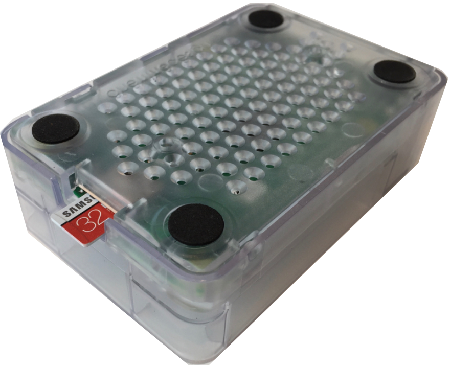
1. Use the CanaKit PiSwitch to plug-in and power-on the RPi, and wait for a minute or two:
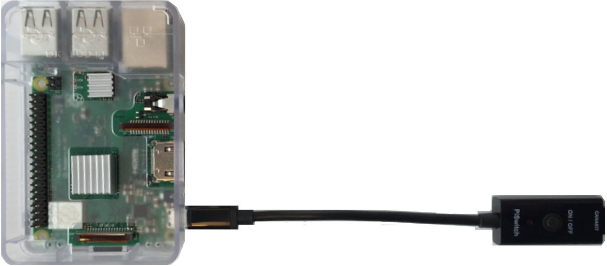

### Find your RPi IP address

If you have access, you can inspect your router directly:

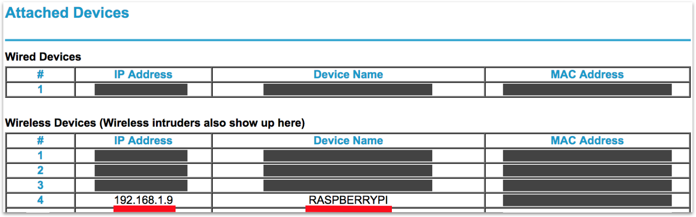

And/or you can enter <code>arp -a</code> in a terminal:
<pre>
$ arp -a
...
? (192.168.1.9) at aa:aa:aa:aa:aa:aa on en0 ifscope [ethernet]
...
</pre>

### Connect via Secure Shell

1. Run <code>ssh</code>:
<pre>
$ ssh pi&#64;192.168.1.9
</pre>
Normally, you will see a message similar to the following:
<pre>
The authenticity of host '192.168.1.9 (192.168.1.9)' can't be established.
ECDSA key fingerprint is SHA256:CcQtTqvRl5SLlAbCdEfG/UsK0/NN018UKnSRw.
Are you sure you want to continue connecting (yes/no)?
</pre>
Sometimes, however, you will see this message:
<pre>
@@@@@@@@@@@@@@@@@@@@@@@@@@@@@@@@@@@@@@@@@@@@@@@@@@@@@@@@@@@
@    WARNING: REMOTE HOST IDENTIFICATION HAS CHANGED!     @
@@@@@@@@@@@@@@@@@@@@@@@@@@@@@@@@@@@@@@@@@@@@@@@@@@@@@@@@@@@
IT IS POSSIBLE THAT SOMEONE IS DOING SOMETHING NASTY!
Someone could be eavesdropping on you right now (man-in-the-middle attack)!
It is also possible that a host key has just been changed.
The fingerprint for the ECDSA key sent by the remote host is
SHA256:r4Y+vxKp5N6tEsMJtc6za1v/Rujms4wfjMY51jH8wsw.
Please contact your system administrator.
Add correct host key in /Users/matt/.ssh/known_hosts to get rid of this message.
Offending ECDSA key in /Users/matt/.ssh/known_hosts:5
ECDSA host key for 192.168.1.8 has changed and you have requested strict checking.
Host key verification failed.
</pre>
To solve this, open <code>&#126;/.ssh/known_hosts</code> on your computer, and delete the row representing the previous (IP Address, ECDSA Key) association.
1. Type <code>yes</code>.
You will see a message similar to the following:
<pre>
Warning: Permanently added '192.168.1.9' (ECDSA) to the list of known hosts.
pi@192.168.1.9's password:
</pre>
1. Enter <code>raspberry</code> for password. (Your username is <code>pi</code>). You will see a message similar to the following:
<pre>
Linux raspberrypi 4.14.79-v7+ #1159 SMP Sun Nov 4 17:50:20 GMT 2018 armv7l 
The programs included with the Debian GNU/Linux system are free software;
the exact distribution terms for each program are described in the
individual files in /usr/share/doc/&#42;/copyright. 
Debian GNU/Linux comes with ABSOLUTELY NO WARRANTY, to the extent
permitted by applicable law.
Last login: Tue Feb 19 15:33:15 2019 from 192.168.1.9 
SSH is enabled and the default password for the 'pi' user has not been changed.
This is a security risk - please login as the 'pi' user and type 'passwd' to set a new password. 
Wi-Fi is disabled because the country is not set.
Use raspi-config to set the country before use.
</pre>

### Run VNC Viewer

1. In your <code>ssh</code> terminal, enter the following:
<pre>
$ sudo raspi-config
</pre>
The Raspberry Pi Software Configuration Tool menu appears:
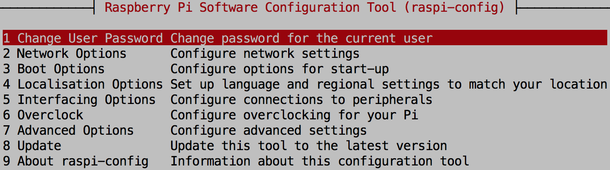
1. Navigate to <code>Interfacing Options</code>, click <code>VNC</code>, and press <code>Yes</code> to enable.
1. Navigate to <code>Advanced Options</code>, click <code>Resolution</code>, and set to an appropriate mode for your computer screen.
1. Navigate to <code>Network Options</code>, click <code>Hostname</code>, and enter your preferred hostname.
1. Exit the utility, and reboot.
1. Download [VNC Viewer](https://www.realvnc.com/en/connect/download/viewer/) onto your computer, install, and run. See also [Virtual Network Computing](https://www.raspberrypi.org/documentation/remote-access/vnc/).
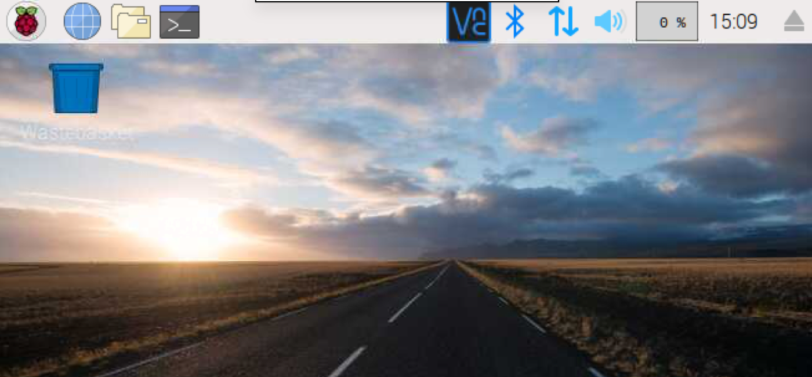
Now, to access your RPi from your computer, you can use VNC Viewer with its File Manager, Text Editor, Terminal, and Browser, and/or you can use a Secure Shell with <code>vi</code>, <code>nano</code>, etc.

### Finish up

1. Change your password:
<pre>
$ passwd
</pre>
1. Determine your RPi Mac address
<pre>
$ ip address
</pre>
1. Record the hostname, username, password, and mac address of your RPI.</li>
1. If you are using Raspbian Stretch Lite, install <code>git</code>:
<pre>
$ sudo apt-get update
$ sudo apt-get install git -y
</pre>
</li>

## Configure for wireless

### At run time

1. In VNC Viewer, click the wireless icon at top-right:

1. Select <code>Country</code>.
1. Select your wireless network, and enter any credentials.

### Before boot time

1. With the MicroSD card in the card reader inserted in your computer, create a <code>wpa_supplicant.conf</code> text file in the boot directory:
<pre>
/Volumes/boot$ touch wpa_supplicant.conf
</pre>
1. Edit the file, copy & paste the configuration below, modify <code>country</code>, <code>ssid</code>, <code>psk</code>, and <code>key_mgmt</code>, and save:
<pre>
ctrl_interface=DIR=/var/run/wpa_supplicant GROUP=netdev
update_config=1
country=US 
network={
     ssid="Your network name/SSID"
     psk="Your WPA/WPA2 security key"
     key_mgmt=WPA-PSK
} 
network={
     ssid="Public network"
     key_mgmt=NONE
} 
network={
    key_mgmt=NONE
    priority=-999
}
</pre>
This particular file specifies three different networks. The first requires authentication. The second does not. The third means "find the first available public network." Raspian tries each in order. Modify the file to suit your needs. At boot time, Raspian copies the file to <code>/etc/wpa_supplicant/wpa_supplicant.conf</code>.

### Working via Hotspot

Do these steps right after burning a new Raspbian image on your MicroSD card:

1. Define a hotspot on your mobile device.
1. Enable the hotspot network.
1. Know the ssid, password, and encryption type (e.g. WPA2) of the network.
1. Create a wpa_supplicant.conf. The hotspot network definition should appear first.
1. Use the Hotspot network for your computer.
1. Find the IP address of your Hotspot.
  * Run <code>arp -a</code> to determine the IP range to scan.
  * Run <code>nmap -T5 -sP 172.20.10.1-255</code> to scan an IP range. You are looking for the IP of your RPi using the mac address.
1. <code>ssh</code> to your RPI.

## Additional Links

* [raspberrypi.org/documentation/remote-access/ssh](https://www.raspberrypi.org/documentation/remote-access/ssh/)
* [Installing NOOBS for first time without screen or keyboard](https://www.raspberrypi.org/forums/viewtopic.php?t=172862)
* [NOOBS (New Out of Box Software)](https://github.com/raspberrypi/noobs/blob/master/README.md)
* [Setting up a Raspberry Pi headless](https://www.raspberrypi.org/documentation/configuration/wireless/headless.md)
* [Raspbian](https://www.raspberrypi.org/downloads/raspbian/)
* [pi zero w wpa_supplicant](https://www.raspberrypi.org/forums/viewtopic.php?t=203716)
* [Setting WiFi up via the command line](https://www.raspberrypi.org/documentation/configuration/wireless/wireless-cli.md)
* [SSH (Secure Shell)](https://www.raspberrypi.org/documentation/remote-access/ssh/)
* [Setting up your own Raspberry Pi 3 git server with Go Git Service (Gogs) and Raspbian Stretch Lite](https://www.techcoil.com/blog/setting-up-your-own-raspberry-pi-3-git-server-with-go-git-service-gogs-and-raspbian-stretch-lite/)
* [Setting Wi-Fi up via the command line](https://www.raspberrypi.org/documentation/configuration/wireless/wireless-cli.md)
* [User management in Raspbian](https://www.raspberrypi.org/documentation/linux/usage/users.md)
* [Change Raspberry Pi’s hostname](https://geek-university.com/raspberry-pi/change-raspberry-pis-hostname/)
* [Automatically connect a Raspberry Pi to a Wifi network](https://weworkweplay.com/play/automatically-connect-a-raspberry-pi-to-a-wifi-network/)
* [Automatically connect to open WiFi network](https://www.raspberrypi.org/forums/viewtopic.php?t=107852)
* [Adafruit's Raspberry Pi Lesson 5. Using a Console Cable](https://learn.adafruit.com/adafruits-raspberry-pi-lesson-5-using-a-console-cable/enabling-serial-console)
* [Read and Write From Serial Port With Raspberry Pi](https://www.instructables.com/id/Read-and-write-from-serial-port-with-Raspberry-Pi/)
* [The Raspberry Pi UARTs](https://www.raspberrypi.org/documentation/configuration/uart.md)
* [Node-RED Running on Raspberry Pi](https://nodered.org/docs/hardware/raspberrypi)
* [Raspberry Pi Serial (UART) Tutorial](https://www.teachmemicro.com/raspberry-pi-serial-uart-tutorial/)
* [VNC (Virtual Network Computing)](https://www.raspberrypi.org/documentation/remote-access/vnc/)
* [Control Arduino using Raspberry Pi | Arduino Raspberry Pi Serial Communication](https://electronicshobbyists.com/control-arduino-using-raspberry-pi-arduino-and-raspberry-pi-serial-communication/)

