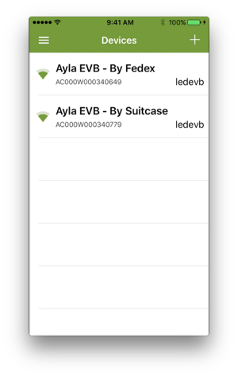
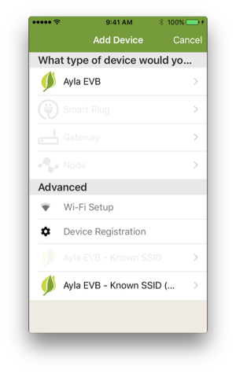
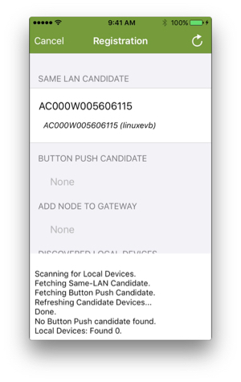
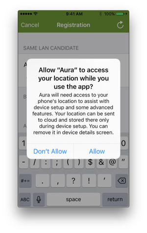
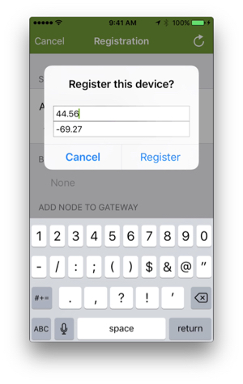
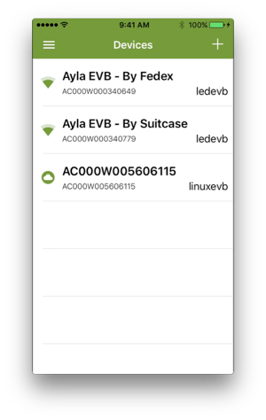

This page provides instructions for registering your RPi device with the Ayla Cloud. To learn more about the various ways to register a device, see [Glossary: Device Registration](/glossary/device-registration).

# Register the RPi device (Aura on iPhone)

<ol>
<li>Download the Aura mobile app onto your mobile device, and run it.</li>

<li>From Aura, log into your Ayla account.</li>

<li>Click + > Device Registration > Same LAN Candidate > Allow > Register:

</li>

<li>Return to the Aura Devices page to see your RPi device on the list.</li>
</ol>

